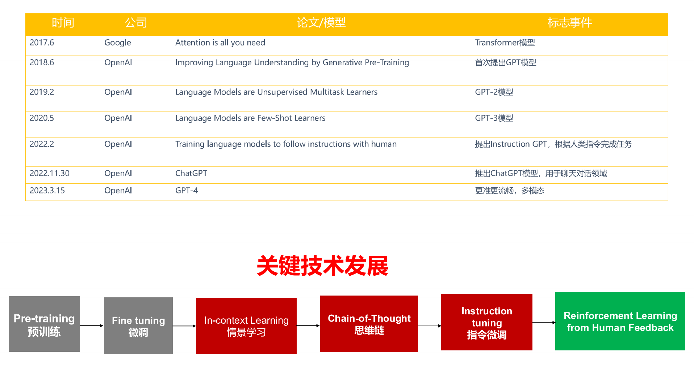
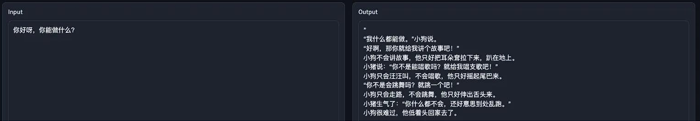
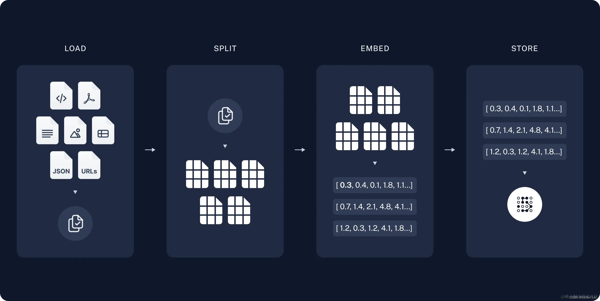
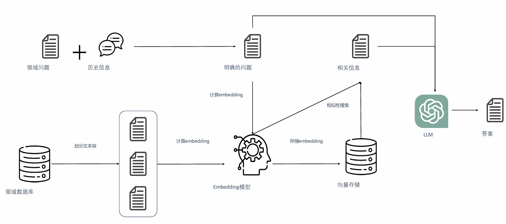
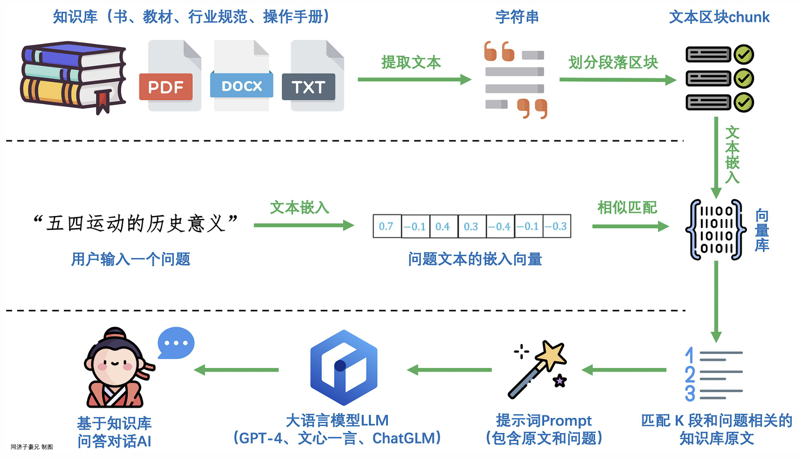
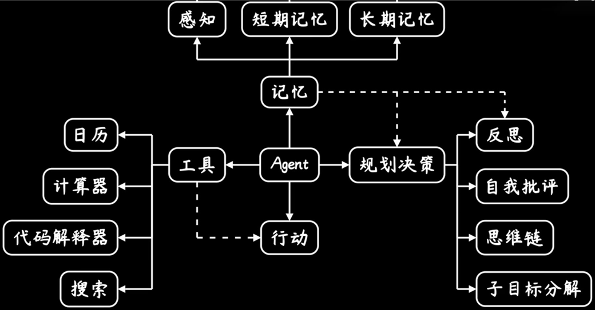

# 大模型与智能体的了解

**Large Model, LM**

---

## 大模型介绍

推荐视频：[AI+Web3: 从理论到实战的进阶之路 | OpenBuild](https://openbuild.xyz/learn/challenges/2054935307)

更详细内容请看博客：[LLM Agent智能体综述(万字长文) - 掘金](https://juejin.cn/post/7369767878781222931?searchId=2025030700354483C5A741AB762F8E5D26)

**大模型（Large Model）**，尤其是 **大语言模型（Large Language Model, LLM）**，是指参数数量在 **数十亿甚至数千亿级别** 的深度学习模型。这些模型通过海量数据的训练，能够理解和生成自然语言，并在多种任务中表现出色。

大模型的核心原理是基于 **深度学习** 和 **自监督学习**，通过大规模数据训练，学习语言的统计规律和语义关系。

1. 自监督学习
   - 自监督学习是一种无需人工标注数据的学习方法，模型通过预测输入数据的某一部分（如掩码词或后续词）来学习语言规律。
   - 大语言模型通常通过自监督学习在大量未标记文本上进行预训练。
2. 生成式模型
   - 生成式模型是指能够生成新数据的模型，例如根据上下文生成后续文本。
   - 大语言模型通常是生成式的，通过“文字接龙”的方式生成连贯的文本。
3. 预训练
   - 预训练是指在大规模通用数据上训练模型，使其学习语言的基本规律和知识。
   - 预训练后的模型可以通过微调适应特定任务，减少对标注数据的依赖。

### 大模型的智能涌现

**标度率（Scaling Law）**：随着模型规模的扩大，标度率揭示了模型的泛化性能和数据效率的提高。这意味着大模型可以更有效地学习任务知识和语言表示。

**涌现能力（Emergent Capability）**：涌现能力是大语言模型在训练过程中自然产生的任务执行能力。 随着模型规模的扩大，模型可以在更多任务和领域上实现更好的性能。

### 大模型的训练

#### 预训练 Pretraining

在深度学习中，需要大量的标注数据来进行**监督学习**。但是，获取足够的标注数据需要耗费大量的时间和人力，成本非常高，监督学习预训练并不实用。

预训练的目的是让神经网络在大规模无标注数据上进行**自监督学习**，从而捕捉数据中的一般特征。

在许多自然语言处理任务中，预训练模型（如 BERT和GPT）已经取得了显著的成功。

预训练后的模型 称为**基座（Base）模型**，只会词语接龙，不断的说下去。

#### 监督微调 Suprevised Fine Tuning

预训练模的通用表示可能无法直接解决特定任务，如文本分类、命名实体识别或情感分析等。

微调是指在一个预训练好的模型基础上，使用少量标注数据来训练模型，以适应特定的任务。

微调的过程 通常涉及到调整模型的部分参数，以使得模型能够更好地拟合任务的特定数据集。

微调大模型参考：[LLaMA-Factory/README_zh.md at main · hiyouga/LLaMA-Factory](https://github.com/hiyouga/LLaMA-Factory/blob/main/README_zh.md)

#### RLHF / DPO 

**基于人类反馈的强化学习 （Reinforcement learning from human  feedback）**

能让大模型变得更可用、实用、好用。尽 量与人类的价值取向、道德观念、社会常 识等保持一致，借以生成更精确、真实的 回答。能有效过滤有害、含歧视性、低质量的内容生成和输出。

### 本地部署大模型

1. Transformer
2. ollama
3. 调用大模型API

## 大模型的应用

目前，大型模型的应用可以分为以下几类：

- 问答应用：如ChatGPT等一系列网页交互式问答应用。
- RAG：基于知识库向量化检索的问答应用，如支持上传文档和图片以及网络检索的网页应用。 
- Agent：是前两者的线性变换，构成更加复杂，RAG或问答以及提示词工程都是其组成部分。 
- Multi-Agent：单个智能体完成的任务有限，可以根据人类社会群体组成，构建多个Agent组成，通过协调分配任务和Agent相互通信完成更为复杂的任务。

### 提示词工程 Prompt Engineering

进阶学习：[提示工程指南 | Prompt Engineering Guide](https://www.promptingguide.ai/zh)

**提示词工程（Prompt Engineering）** 是一种通过设计和优化输入提示词（Prompt）来引导大语言模型生成期望输出的技术。它在大模型的应用中扮演着重要角色，尤其是在少样本学习（Few-shot Learning）和零样本学习（Zero-shot Learning）场景下。

**提供清晰有效的提示词** 可以缩小大模型回答的范围，使得回答更精确和符合预期

- 明确问题：确保问题清晰明确，有针对性的范围，不含歧义
- 提供上下文：提供问题的相关上下文信息，例如问题的背景，相关细节，类似的例子等
- 明确期望：明确对答案的要求，例如字数，格式，语言，受众，包含内容等
- 提供反馈：通过提供反馈获取更多信息或修正回答质量 • 英文提示：相比中文，英文往往能获得更佳的回答

**情境学习（In Context Learning)** 

- Few-shot learning ，即可实现新任务未知样本的预测，通过给出新任务的少量样本示例 Zero-shot、One-shot、Few-shot。
- Few-shot learning 也称为 In Context Learning，在学习新任务时不执行梯度更新，即不改变模型的参数。
- 情景学习为 LLM 提供了输入和回答之间的对应关系以及对特定任务的背景知识。
- 给出几个样例，作为学习回答输出的模版，帮助模型更好的理解 Zero-shot One-shot 你的指令。

**思维链（Chain of Thought / CoT)** : 为了教会LLM 模型学会推理，给出一些示例，把得到最终答案的一步步的具体推理步骤说清楚

- Few-shot CoT Prompting：人工给出推理示例
- Zero-shot CoT Prompting：直接在问题上追加辅助推理Prompt，“Let’s think step by step”。

### 检索增强生成（Retrieval-Augmented Generation，RAG）

这是一种结合了 **信息检索** 和 **文本生成** 的技术，旨在提升大语言模型在生成任务中的准确性和可靠性。RAG 的核心思想是：在生成答案之前，先从外部知识库中检索相关信息，然后将检索到的信息与输入问题结合，生成最终的输出。这种方法特别适合需要依赖外部知识的任务，如问答系统、知识推理等。

典型RAG的重要组成：

- **索引**：用于从源引入数据并对其进行索引的管道。这通常发生在离线状态。
- **检索和生成**：实际的 RAG 链，它在运行时接受用户查询并从索引中检索相关数据，然后将其传递给模型。与问题组合为一个新的提示词，输入给LLM；

#### 索引

- **数据加载**：首先我们要从不同的数据格式中读取数据到向量数据库；
- **数据拆分**：从不同文件中读取的数据会被拆分为数据块；因为向量数据库会分别计算不同数据块与用户输入的向量相似度，如果数据块拆分过大或者一整块(不拆分)，则导致很多不相关的信息也会被检索到，如果数据块拆分的太细，则会导致我们读取到的信息不全，也不合适；因此数据拆分时一定要考虑到实际情况，具体问题具体分析，这样计算向量相似度才有意义；
- **数据存储**：我们说我们读取的文本数据会被`Embedding`模型经过向量化，转化为向量格式，然后存储到向量数据库中；这样我们才能进行后续的向量相似度计算；

#### 检索和生成

- **内容检索**：根据用户的输入，使用Retriever从向量数据库中检索相关拆分的结果；
- **内容生成**：ChatModel/LLM使用包含问题和检索信息的提示来生成答案；

## 智能体 Agent

AI Agent 是一个以大语言模型（LLM）为核心的程序，旨在实现用户设定的一些目标或任务。LLM获取反馈信息，并选择使用预设或新建的工具（函数），以迭代运行方式完成任务。Agent 拥有复杂的工作流程，模型本质上可以自我对话，而无需人类在每一部分驱动和交互。

Agent 通过自驱的定义工作流程并规划任务进行问题解决。

> 例如，我们要查询所在范围内10公里的所有商户的位置并且获得其分类统计可视化图表，按照Agent的设计思路，它会通过模型现有知识、向量数据库检索（Memory）、网络检索（Memory）等方法获取相关信息。具体来说：
>
> 1. 读取配置文件（基础信息）。 
> 2. 通过调用高德等地图API（工具），获取十公里内的所有POI（兴趣点）数据。 
> 3. 执行预定义或模型自己编写的可视化代码，在Python编辑器中运行，以获得可视化图表。

- 首先，Agents会将用户给定的一个大型任务，***根据可行性和现有资源分解为更小的，可实现，可管理的子目标***，从而能够有效的处理复杂的任务；
- **自我反思和自我优化**：Agents可以对过去自己的操作行为或者输出内容进行**自我批评和自我反思**，然后**从错误中总结经验，并在未来的输出和行为中进行优化**，从而**提高下一次结果的质量**；
- 通过**工具调用**的方式，可以有效地避免大模型的幻觉，将专业的事情交给专业的人去做(工具、函数、API)，模型则负责调度控制。
  - **工具支持**：使用`langchain`的工具调用思路，其本质就是将现有的一切功能通过API接口和函数的方式交给Agent使用；
  - **格式化参数提取**：通过提示词工程LLM解析用户输入，并提取出结构化参数信息，然后输入到对应的工具API中，得到API反馈的结果；
  - **提示词工程**：然后将API或函数返回的结果通过提示词工程与其他信息包装起来输入给LLM，LLM按照要求生成回复，如此循环迭代，直到得到结果；
- **短期记忆**，常见的提示词工程都属于短期记忆，包括某些设定，AI人设，输出格式，说话预期等；通过短期记忆，我们可以让AI能在这个Session中生成我们想要的回答，例如我们让Agent扮演某个角色，然后使用某种格式进行输出；提示词优化就是这个应用；
- **长期记忆**，也就是将短期记忆存储起来，来自其他数据库、用户输入、互联网爬取的文本图像数据通过`Embedding模型`向量化被存储到向量数据库中，然后每次模型调用时都会先去检索向量数据库，然后将(余弦)相似度最高的检索结果反馈，通过提示词工程包装，输入给LLM，得到较为精准的回答，从而实现长期的记忆  ；其主要的应用就是RAG。

