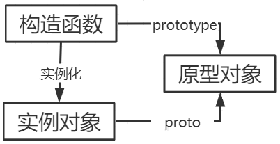
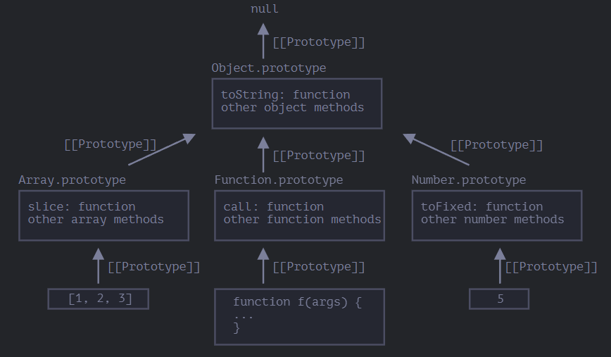
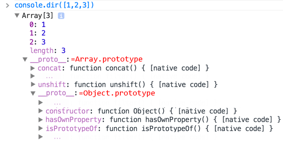
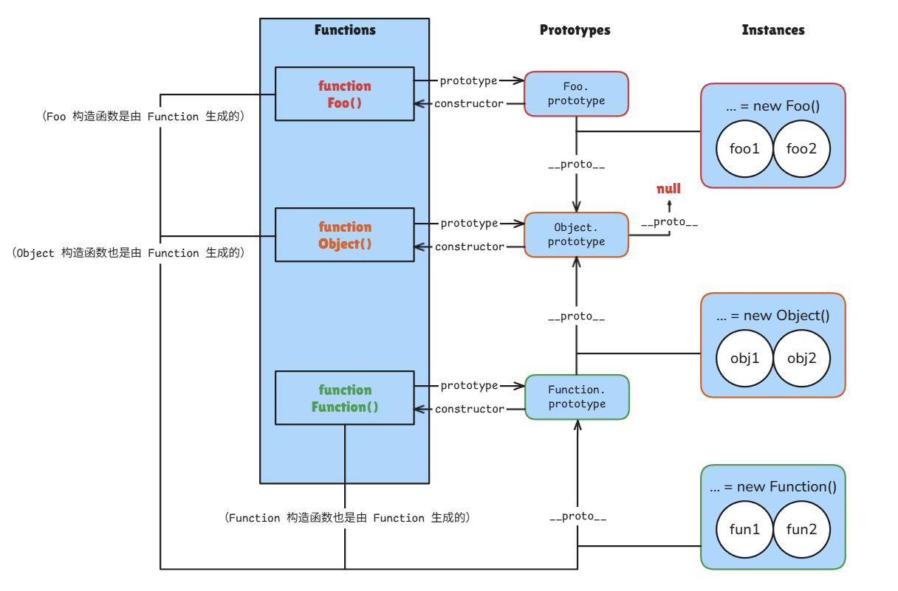

# Javascript 引用类型进阶知识

- Javascript 编程语言
  - Javascript 基础知识
  - Javascript 更多引用类型
  - Javascript 引用类型进阶知识
  - Javascript 函数进阶知识
  - Javascript 面向对象
  - Javascript 错误处理
  - Javascript 生成器 Generator
  - Javascript Promise与async
  - Javascript 模块 Module
- Javascript 浏览器

---


## 对象构造函数

### 构造函数定义

常规的 `{...}` 语法允许创建一个对象。但是我们经常需要创建很多类似的对象，这可以使用构造函数和 `"new"` 操作符来实现。

**构造函数**在技术上是常规函数，但它存在两个约定：

1. 它们的命名以大写字母开头。
2. 它们只能由 `"new"` 操作符来执行。

当使用 `new` 调用函数时，会发生以下步骤：

1. *创建空对象*：创建一个新的空对象 `{}`
2. *设置原型*：将新对象的 `[[Prototype]]` 指向构造函数的 `prototype` 属性
3. *绑定 this*：将 `this` 指向新创建的对象
4. *执行函数*：执行构造函数内部的代码（通常添加属性到 `this`，也可用函数表达式的方式将方法添加到 `this`）
5. *返回对象*：如果函数没有显式返回对象，则自动返回 `this`

```js
function User(name) {
  // this = {}; （隐式）
  // this.__proto__ = User.prototype; （隐式）
  
  this.name = name;
  this.isAdmin = false;
  this.sayHi = function() {
    alert( "My name is: " + this.name );
  };
  
  // return this; （隐式）
}

const user = new User("Jack");
console.log(user.name);    // "Jack"
console.log(user.isAdmin); // false
```

### 构造函数的返回值

构造函数返回值有特殊规则：

|    返回值类型    |            结果             |
| :--------------: | :-------------------------: |
|     无返回值     | 返回 `this`（新创建的对象） |
|     返回对象     |  返回该对象（替代 `this`）  |
| 返回原始数据类型 |     忽略，仍返回 `this`     |

### 构造函数的更多特性

1. **省略括号**：如果没有参数，我们可以省略 `new` 后的括号

   ```js
   let user = new User; // <-- 没有参数
   // 等同于
   let user = new User();

2. **`new.target` 属性**：用于检测函数是否通过 `new` 调用：

   ```javascript
   function User() {
     if (!new.target) {
       throw new Error("必须使用 new 调用构造函数");
     }
     this.name = "默认用户";
   }
   
   // User(); // 报错：必须使用 new 调用构造函数
   new User(); // 正确
   ```

   - 可以在此处使构造函数无论是否使用 `new` 都能工作：

     ```js
     function User(name) {
       if (!new.target) {
         return new User(name);
       }
       this.name = name;
     }

3. **`new function() { … }` 表达式**：封装一个立即调用的构造函数，用于创建一次性复杂对象，即每次调用都会产生一个立即销毁的对象。

   ```js
   const user = new function() {
     this.name = "John";
     this.getName = function() {
       return this.name; // 可自行改为更复杂的逻辑实现
     };
   };
   console.log(user.getName());
   ```

### 构造函数与普通函数的区别

根据 ECM-262 构造函数的定义，可以得到以下信息：

1. 一个函数对象是一个支持`[[Call]]`内部方法的对象，即普通函数调用 (`func()`)。
2. 一个构造函数是一个支持`[[Construct]]`内部方法的对象，即通过 `new` 调用 (`new func()`)。
3. 实现了`[[Construct]]`内部方法的对象一定支持`[[Call]]`内部方法，那么每个构造函数都是函数对象。

可知，关键在于是否实现了`[[Construct]]`内部方法。


## 对象属性配置

对象属性除了值(value)外，还有三个特殊特性(attributes)，称为"标志"：

1. **writable** - 如果为 `true`，属性值可修改，否则只读。
2. **enumerable** - 如果为 `true`，属性会在循环中列出，否则不列出。
3. **configurable** - 如果为 `true`，属性可删除且特性可修改。若改为 `false`后操作不可逆，属性不可被删除，属性修饰符都不能被修改(wirtable 、enumerable、configurable 都不再可被修改)，但属性值仍然可以被修改。

默认情况下，用普通方式创建的属性这三个标志都为 `true`。

### 获取属性标志

1. **获取单个属性**：`Object.getOwnPropertyDescriptor(obj, propertyName)` 方法允许查询有关属性的完整信息。

   ```js
   let user = {
     name: "John"
   };
   
   let descriptor = Object.getOwnPropertyDescriptor(user, 'name');
   
   alert( JSON.stringify(descriptor, null, 2 ) );
   /* 属性描述符：
   {
     "value": "John",
     "writable": true,
     "enumerable": true,
     "configurable": true
   }
   */

2. **获取所有属性描述符**：`Object.getOwnPropertyDescriptors(obj)` 方法一次获取所有属性描述符。

   - `Object.getOwnPropertyDescriptors` 返回包含 symbol 类型的和不可枚举的属性在内的 **所有** 属性描述符。

   ```js
   const object1 = {
     property1: 42,
     property2: 44,
   };
   
   const descriptors1 = Object.getOwnPropertyDescriptors(object1);
   
   console.log( JSON.stringify(descriptors1, null, 2 ) );
   /* 属性描述符：
   {
     "property1": {
       "value": 42,
       "writable": true,
       "enumerable": true,
       "configurable": true
     },
     "property2": {
       "value": 44,
       "writable": true,
       "enumerable": true,
       "configurable": true
     }
   }
   */

### 修改属性标志

1. **单个属性标注修改**：使用 `Object.defineProperty(obj, propertyName, descriptor)`

   - `obj`，`propertyName` ：要应用描述符的对象、属性。 
   - `descriptor`：要应用的属性描述符对象。 

   1. *如果属性不存在*： `defineProperty` 会使用给定的值和标志创建属性；在这种情况下，如果没有提供标志，则会假定它是 `false`。

      ```js
      // 创建了一个属性 name，该属性的所有标志都为 false：
      let user = {};
      
      Object.defineProperty(user, "name", {
        value: "John"
      });
      
      let descriptor = Object.getOwnPropertyDescriptor(user, 'name');
      
      alert( JSON.stringify(descriptor, null, 2 ) );
      /*{
        "value": "John",
        "writable": false,
        "enumerable": false,
        "configurable": false
      }*/
      ```

   2. *设置只读属性*：`writable` 设置为 `false`。

      - 若设置后仍进行修改操作，只在严格模式下会出现 Errors。在非严格模式下，违反标志的行为（flag-violating action）会被默默忽略。

      ```js
      let user = {
        name: "John"
      };
      
      Object.defineProperty(user, "name", {
        writable: false
      });
      
      user.name = "Pete"; // Error: Cannot assign to read only property 'name'

   3. *设置不可枚举属性*：`enumerable` 设置为 `false`。

      - 通常该标志用于一些内建方法，如 `toString`。设置该属性后，这些内建方法不会显示在 `for..in` 中。

      ```js
      let user = {
        name: "John",
        toString() {
          return this.name;
        }
      };
      
      Object.defineProperty(user, "toString", {
        enumerable: false
      });
      
      // 现在我们的 toString 消失了：
      for (let key in user) alert(key); // name

   4. *设置不可配置属性*：`configurable` 设置为 `false`，注意此操作不可逆。

      - 该标志有时会预设在内建对象和属性中。不可配置的属性不能被删除，它的特性不能被修改，我们无法通过 `defineProperty` 再把它改回来。但是仍然允许更改对象的值。

      ```js
      let user = {
        name: "John"
      };
      
      Object.defineProperty(user, "name", {
        configurable: false
      });
      
      // 下面的所有操作都不起作用：
      delete user.name;
      Object.defineProperty(user, "name", { value: "Pete" });
      ```

      > **注意**：对于不可配置的属性，有一个`例外`。我们可以将 `writable: true` 更改为 `false`，从而防止其值被修改（以添加另一层保护）。但无法反向行之。

      > **对象内的常量**：通过设置不可配置与只读属性，可以在对象内得到一个“永不可改”的`常量`，类似于 `const`。

2. **批量属性标注修改**：使用 `Object.defineProperties(obj, descriptors)`

   ```js
   let user = {
     name: "John",
     surname: "Smith"
   };
   
   Object.defineProperties(user, {
     name: { value: "John", writable: false },
     surname: { value: "Smith", writable: false },
     // ...
   });
   ```

### 对象限制方法

Object 提供了一些静态方法，可以快捷**给对象添加限制**：

1. `Object.preventExtensions(obj)` - 禁止添加新属性
2. `Object.seal(obj)` - 禁止添加/删除属性，设置所有属性 `configurable: false`
3. `Object.freeze(obj)` - 禁止添加/删除/修改属性，设置所有属性 `configurable: false, writable: false`

**对应的检测方法**：

1. `Object.isExtensible(obj)`
2. `Object.isSealed(obj)`
3. `Object.isFrozen(obj)`

### 访问器(getter/setter)的描述符

- **`get`** —— 一个没有参数的函数，在读取属性时工作，
- **`set`** —— 带有一个参数的函数，当属性被设置时调用，
- **`enumerable`** —— 与数据属性的相同，
- **`configurable`** —— 与数据属性的相同。

没有 `value` 和 `writable`。

要使用 `defineProperty` 创建一个 `fullName` 访问器，我们可以使用 `get` 和 `set` 来传递描述符：

```js
let user = {
  name: "John",
  surname: "Smith"
};

Object.defineProperty(user, 'fullName', {
  get() {
    return `${this.name} ${this.surname}`;
  },
  set(value) {
    [this.name, this.surname] = value.split(" ");
  }
});

alert(user.fullName); // John Smith

for(let key in user) alert(key); // name, surname
```

> **注意**：一个属性要么是访问器（具有 `get/set` 方法），要么是数据属性（具有 `value`），但不能两者都是。

### 构造函数内设置属性修饰符

在构造函数内调用 `Object.defineProperty(this, ...)`即可配置属性修饰符，注意第一个参数设置为 this。

```js
function User(name, birthday) {
  this.name = name;
  this.birthday = birthday;

  // 年龄是根据当前日期和生日计算得出的
  Object.defineProperty(this, "age", {
    get() {
      let todayYear = new Date().getFullYear();
      return todayYear - this.birthday.getFullYear();
    }
  });
}

let john = new User("John", new Date(1992, 6, 1));
```


## 原型与继承

### 对原型的理解

每个 JavaScript 对象都有一个隐的内部属性 `[[Prototype]]`，这是规范中的正式命名。这个隐藏属性 `[[Prototype]]`被称为“**原型**”。

#### prototype

在 JavaScript 中是使用构造函数来新建一个对象的，每一个构造函数的内部都有一个`[[Prototype]]`属性，它的属性值是一个对象，这个对象包含了可以由该构造函数的所有实例共享的属性和方法，并存有继承的原型。

浏览器中能通过在构造函数上用点符号访问到该属性，如：`Func.prototype`。

> 尝试打印 `Array.prototype` ，结果如下：
>
> ```js
> {
>   concat: concat(),
>   keys : keys(),
>   // ... 其余 Array 自带的方法
>   constructor: Array()  // 构造器
>   [[Prototype]]: Object // 原型
> }
> ```

#### proto

当使用构造函数新建一个对象后，在这个对象的内部将包含一个对应的隐藏属性指向构造函数的`[[Prototype]]`属性。

浏览器中实现了 `__proto__` 属性来记录对象的原型，但该方法已经被认为已经过时且不推荐使用，出于历史原因而能继续使用。

> **两者的区别**：`__proto__`是挂在每一个通过构造函数生成的对象里，而`prototype`是挂在函数上，而且 `prototype` 中通常也含有一个 `__proto__`。

实例对象、构造函数与原型对象组成三角关系。



#### 设置 [[Prototype]] 的方式

1. **历史方法**：

     - 使用特殊的名字 `__proto__`，可以通过点符号访问该对象，或设置

       ```js
       let animal = {
         eats: true
       };
       let rabbit = {
         jumps: true
       };
       rabbit.__proto__ = animal; // (*)
       ```

       ```js
       let animal = {
           eats: true
       };
       let rabbit = {
           jumps: true
           __proto__ : animal; // (*)
       };
       ```


2. **现代的获取/设置原型的方法**：

     - `Object.getPrototypeOf(obj)` —— 返回对象 `obj` 的 `[[Prototype]]`。

     - `Object.setPrototypeOf(obj, proto)` —— 将对象 `obj` 的 `[[Prototype]]` 设置为 `proto`。

     - `Object.create(proto, [descriptors])` —— 利用给定的 `proto` 作为 `[[Prototype]]` 和可选的属性描述来创建一个空对象。
     
       ```js
       let animal = {
         eats: true
       };
       
       // 创建一个以 animal 为原型的新对象
       let rabbit = Object.create(animal); // 与 {__proto__: animal} 相同
       
       alert(rabbit.eats); // true
       
       alert(Object.getPrototypeOf(rabbit) === animal); // true
       
       Object.setPrototypeOf(rabbit, {}); // 将 rabbit 的原型修改为 {}
       ```
     
       我们可以使用 `Object.create` 来实现比复制 `for..in` 循环中的属性更强大的对象克隆方式：
     
       ```js
       let clone = Object.create(
         Object.getPrototypeOf(obj),
         Object.getOwnPropertyDescriptors(obj)
       );


请注意，`__proto__` 与内部的 `[[Prototype]]` **不一样**。`__proto__` 是 `[[Prototype]]` 的 getter/setter。


### 对原型链的理解

当访问一个对象的属性时，如果这个对象内部不存在这个属性，那么它就会去它的原型对象里找这个属性，这个原型对象又会有自己的原型，于是就这样一直找下去，也就是原型链的概念。





原型链的尽头是`Object.prototype`，在 `Object.prototype` 上方的链中没有更多的 `[[Prototype]]`。

```js
alert(Object.prototype.__proto__); // null
```

`Object.prototype`包含方法`toString()`等方法，这就是新建的对象都能使用 `toString()` 等方法的原因。

JavaScript 对象是通过引用来传递的，创建的每个新对象实体中并没有一份属于自己的原型副本。当修改原型时，与之相关的对象也会继承这一改变。

> **举例说明**
>
> ```js
> let animal = {
>  eats: true
>  walk() {
>      alert("Animal walk");
>  }
> };
> 
> let rabbit = {
>   jumps: true,
>   __proto__: animal,
> };
> 
> let longEar = {
> earLength: 10,
> __proto__: rabbit,
> };
> 
> // 现在这两个属性我们都能在 rabbit 中找到：
> alert( longEar.eats ); // true
> alert( longEar.jumps ); // true
> longEar.walk(); // Animal walk
> ```
>
> 当 `alert` 试图读取 `longEar.eats` `(**)` 时，因为它不存在于 `longEar` 中，所以 JavaScript 会顺着 `[[Prototype]]` 引用，先在`rabbit`，没找到则又在`animal` 中查找（自下而上）。

#### 重写属性与方法

写入/删除操作总是作用于**操作发生的对象本身**，不会影响原型。

方法中的 `this` 始终指向**调用该方法的对象**，无论方法是在对象本身还是原型中定义的。方法是共享的，但对象状态不是。

```javascript
let animal = {
  walk: true,
  isWalk() {
    console.log(this.walk ? "walk" : "stay");
  }
};

let rabbit = Object.create(animal);

rabbit.isWalk = function() {
  console.log(this.walk ? "rabbit walk" : "rabbit stay");
};

rabbit.isWalk(); // "rabbit walk"
animal.isWalk(); // "walk"

rabbit.walk = false;
rabbit.isWalk(); // "rabbit stay"
```

访问器（accessor）属性是一个例外，因为赋值（assignment）操作是由 setter 函数处理的。因此，写入此类属性实际上与调用函数相同。

```js
let user = {
  name: "John",
  surname: "Smith",

  set fullName(value) {
    [this.name, this.surname] = value.split(" ");
  },

  get fullName() {
    return `${this.name} ${this.surname}`;
  }
};

let admin = {
  __proto__: user,
  isAdmin: true
};

alert(admin.fullName); // John Smith

admin.fullName = "Alice Cooper";

alert(admin.fullName); // Alice Cooper，admin 的内容被修改了
alert(user.fullName);  // John Smith，user 的内容被保护了
```

#### for…in 循环

`for...in` 循环会遍历对象自身及其原型链中的所有可枚举属性：

```js
let animal = {
  eats: true
};

let rabbit = Object.create(animal, {
  jumps: {
    value: true,
    enumerable: true
  }
});

for (let prop in rabbit) {
  console.log(prop); // jumps, eats
}
```

使用 `hasOwnProperty` 可以区分自有属性和继承属性：

```javascript
for (let prop in rabbit) {
  if (rabbit.hasOwnProperty(prop)) {
    console.log(`Own: ${prop}`); // Own: jumps
  } else {
    console.log(`Inherited: ${prop}`); // Inherited: eats
  }
}
```

方法 `hasOwnProperty` 是 `Object.prototype.hasOwnProperty` 提供的，但是它没有像其他属性那样出现在 `for..in` 循环中，因为它是它是不可枚举的，具有 `enumerable:false` 标志。

### Func.prototype 的理解

`prototype.constructor` 属性是一个容易被忽视但非常重要的设计。

其主要作用是让对象能够知道自己是哪个构造函数创建的，从而维持构造函数与实例之间的关系链。

#### prototype 的修改

如开头所诉，函数有一个特殊的 `prototype` 属性，当使用 `new` 操作符调用函数时，新对象的 `[[Prototype]]` 会被设置为该函数的 `prototype` 属性。

可以如下操作，修改 Rabbit 的 `prototype` 属性，使得新对象的原型变为 animal。

```javascript
let animal = {
  eats: true
};

function Rabbit(name) {
  this.name = name;
}

Rabbit.prototype = animal;

let whiteRabbit = new Rabbit("White Rabbit"); // rabbit.__proto__ = animal
console.log(whiteRabbit.eats); // true
```

但若如上直接替换整个 `prototype`，会导致原 `prototype` 带有的构造器(`constructor`)信息丢失，容易出错。

因此，为了确保正确的 `"constructor"`，我们可以选择添加/删除属性到默认 `"prototype"`，而不是将其整个覆盖：

```js
Rabbit.prototype.eats = true;
```

或者，也可以手动重新创建 `constructor` 属性：

```js
Rabbit.prototype = {
  eats: true,
  constructor: Rabbit
};
```

#### prototype 的构造器属性

每个函数都有 `"prototype"` 属性，即使我们没有提供它。默认的 `"prototype"` 是一个只有属性 `constructor` 的对象，属性 `constructor` 指向函数自身。

```js
// 默认： Rabbit.prototype = { constructor: Rabbit }
function Rabbit() {}
Rabbit.prototype.constructor == Rabbit; // true

let rabbit = new Rabbit(); // 继承自 {constructor: Rabbit}
rabbit.constructor == Rabbit; // true (from prototype)
```

同时，构造函数支持动态引用：

```js
let rabbit2 = new rabbit.constructor(); // 从上例中的 rabbit 直接获取构造器制作新对象。
```

### 基本数据类型

基本数据类型并不是对象。但是如果我们试图访问它们的属性，那么临时包装器对象将会通过内建的构造器 `String`、`Number` 和 `Boolean` 被创建。它们提供给我们操作字符串、数字和布尔值的方法然后消失。

这些对象的方法也驻留在它们的 prototype 中，可以通过 `String.prototype`、`Number.prototype` 和 `Boolean.prototype` 进行获取。

特殊值 `null` 和 `undefined` 没有对象包装器，所以它们没有方法和属性。并且它们也没有相应的原型。

### 更改原生原型

原生的原型是可以被修改的。

例如，我们向 `String.prototype` 中添加一个方法，这个方法将对所有的字符串都是可用的：

```js
String.prototype.show = function() {
  alert(this);
};

"BOOM!".show(); // BOOM!
```

在开发的过程中，我们可能会想要一些新的内建方法，并且想把它们添加到原生原型中。但这通常是一个很不好的想法。

原型是全局的，所以很容易造成冲突。如果有两个库都添加了 `String.prototype.show` 方法，那么其中的一个方法将被另一个覆盖。

**在现代编程中，只有一种情况下允许修改原生原型，那就是 Polyfilling。**

`Polyfilling` 是一个术语，表示某个方法在 JavaScript 规范中已存在，但是特定的 JavaScript 引擎尚不支持该方法，那么我们可以通过手动实现它，并用以填充内建原型。

### 从原型中借用

一些原生原型的方法通常会被借用。方法借用很灵活，它允许在需要时混合来自不同对象的方法。

例如，如果我们要创建类数组对象，则可能需要向其中复制一些 `Array` 方法。

```js
let obj = {
  0: "Hello",
  1: "world!",
  length: 2,
};

obj.join = Array.prototype.join;

alert( obj.join(',') ); // Hello,world!
```

上面这段代码有效，是因为内建的方法 `join` 的内部算法只关心正确的索引和 `length` 属性。它不会检查这个对象是否是真正的数组。许多内建方法就是这样。

另一种方式是通过将 `obj.__proto__` 设置为 `Array.prototype`，这样 `Array` 中的所有方法都自动地可以在 `obj` 中使用了。

但是如果 `obj` 已经从另一个对象进行了继承，那么这种方法就不可行了（译注：因为这样会覆盖掉已有的继承。此处 `obj` 其实已经从 `Object` 进行了继承，但是 `Array` 也继承自 `Object`，所以此处的方法借用不会影响 `obj` 对原有继承的继承，因为 `obj` 通过原型链依旧继承了 `Object`）。

### 理解图

最后附上我画的原型理解图。如果你能看懂这幅图，则已经算是掌握了原型链的概念。




## 解构赋值

解构赋值（Destructuring Assignment）是 ES6 引入的一种强大语法，它允许我们从数组或对象中提取数据，并赋值给变量。这种语法让代码更简洁、更易读，特别是在处理复杂数据结构时。

### 数组解构

1. **基本用法**：用以下形式使得拆解信息更加简洁易读。

   ```js
   let arr = ["John", "Smith"];
   let [firstName, surname] = arr;
   
   console.log(firstName); // "John"
   console.log(surname);  // "Smith"
   
   // 等价于
   let firstName = arr[0];
   let surname = arr[1];

2. **跳过元素**：通过添加额外的逗号来丢弃数组中不想要的元素

   ```js
   // 不需要第二个元素和第三个之后的元素
   let [firstName, , title] = ["1", "2", "3", "4"];
   console.log(title); // "3"

3. **与 split 函数结合**：从字符串中分割出想要的信息

   ```js
   let user = {};
   [user.name, user.surname] = "John Smith".split(' ');
   
   alert(user.name); // John
   alert(user.surname); // Smith

4. **等号右侧可以是任何可迭代对象**：通过迭代右侧的值来完成工作的，这是一种用于对在 `=` 右侧的值上调用 `for..of` 并进行赋值的操作的语法糖

   ```js
   let [a, b, c] = "abc"; // ["a", "b", "c"]
   let [one, two, three] = new Set([1, 2, 3]);

5. **与 .entries() 方法进行循环操作**：遍历一个对象的“键—值”对

   ```js
   let user = {
     name: "John",
     age: 30
   };
   
   for (let [key, value] of Object.entries(user)) {
     alert(`${key}:${value}`); // name:John, age:30
   }

6. **交换变量**：创建一个由两个变量组成的临时数组，并且立即以颠倒的顺序对其进行了解构赋值

   ```js
   let guest = "Jane";
   let admin = "Pete";
   
   [guest, admin] = [admin, guest];
   
   alert(`${guest}${admin}`); // Pete Jane

7. **剩余模式**：若数组比左边的列表长，那么其余项会被省略。若想收集其余项 ,可用 `"..."` 加一个参数以获取其余数组项

   ```js
   let [name1, name2, ...rest] = ["1", "2", "3", "4"];
   
   // rest 是包含从第三项开始的其余数组项的数组
   alert(rest); // ['3', '4']

8. **默认值**：如果数组比左边的变量列表短，那缺少对应值的变量都会被赋为 `undefined`。可以使用 `=` 来提供一个默认值给未赋值的变量。

   ```js
   let [name = "Guest", surname = "Anonymous"] = ["Julius"];
   
   alert(name);    // Julius（来自数组的值）
   alert(surname); // Anonymous（默认值被使用）

### 对象解构

1. **基本用法**：与数组解构类似

   ```js
   let options = {
     width: 100,
     height: 200
   };
   
   let {width, height} = options;

2. **属性重命名**：等号左侧的模式（pattern）可以指定属性和变量之间的映射关系

   ```js
   let options = {
     title: "Menu",
     width: 100,
     height: 200
   };
   
   // { 原属性名: 新变量名 }
   let {width: w, height: h, title} = options;
   
   console.log(title); // "Menu"
   console.log(w);     // 100
   console.log(h);     // 200

3. **剩余模式**：与数组解构类似

   ```js
   let options = {
     title: "Menu",
     height: 200,
     width: 100
   };
   
   let {title, ...rest} = options;
   
   console.log(rest); // {height: 200, width: 100}

4. **默认值**：与数组解构类似

   ```js
   let options = {
     title: "Menu"
   };
   
   let {width = 100, height = 200, title} = options;
   
   console.log(width);  // 100
   console.log(height); // 200
   console.log(title);  // "Menu"
   ```

### 嵌套解构

如果一个对象或数组嵌套了其他的对象和数组，我们可以在等号左侧使用更复杂的模式（pattern）来提取更深层的数据。

```js
let options = {
  size: {
    width: 100,
    height: 200
  },
  items: ["Cake", "Donut"],
  extra: true
};

let {
  size: {
    width,
    height
  },
  items: [item1, item2],
  title = "Menu", // 默认值
  ...rest // 剩余模式
} = options;

console.log(title);  // "Menu"
console.log(width);  // 100
console.log(height); // 200
console.log(item1);  // "Cake"
console.log(item2);  // "Donut"
console.log(rest);   // {extra: true}
```

### 智能函数参数

有时，一个函数有很多参数，其中大部分的参数都是可选的。参数非常多的时候，传入参数的可读性会变得很差。

在实际开发中，记忆如此多的参数的位置是一个很大的负担。

我们可以用一个**对象来传递所有参数**，而函数负责把这个对象解构成各个参数。

```js
function showMenu({
  title = "Untitled",
  width: w = 100,
  height: h = 200,
  items: [item1, item2]
}) {
  console.log(`${title} ${w}x${h}`);
  console.log(item1, item2);
}

showMenu({
  title: "My Menu",
  items: ["Item1", "Item2"]
});
```


## 类型检测

### 自动获取类型

1. **typeof 运算符** （基本类型适用）

   `typeof` 是最基础的类型检测方法，返回一个表示数据类型的字符串。

   ```javascript
   typeof 2;               // "number"
   typeof true;            // "boolean"
   typeof 'str';           // "string"
   typeof [];              // "object"    
   typeof function(){};    // "function"
   typeof {};              // "object"
   typeof undefined;       // "undefined"
   typeof null;            // "object"
   ```

   - 对于基本类型（除 null 外）能正确判断
   - 引用类型中，数组和对象都返回 "object"
   - 函数返回 "function"
   - null 被错误判断为 "object"（这是历史遗留问题）

   *适用场景*：快速判断基本数据类型，特别是检查变量是否未定义（undefined）

2. **Object.prototype.toString.call() 方法** （最准确且方便的方法）

   这是最准确的数据类型检测方法，能准确判断所有数据类型，调用 Object 的原型方法 `toString`。

   ```javascript
   const toString = Object.prototype.toString;
   
   toString.call(2);          // "[object Number]"  (自动装箱)
   toString.call(true);       // "[object Boolean]"
   toString.call('str');      // "[object String]"
   toString.call([]);         // "[object Array]"
   toString.call(function(){}); // "[object Function]"
   toString.call({});         // "[object Object]"
   toString.call(undefined);  // "[object Undefined]"
   toString.call(null);       // "[object Null]"
   ```

   *适用场景*：需要精确判断数据类型的所有情况

   > 为什么直接调用 obj.toString() 不行？因为 Array、Function 等类型作为 Object 的实例，都重写了 toString 方法，只有通过 call 调用 Object 的原型方法，才能获得准确的类型信息。
   >
   > ```javascript
   > [1, 2, 3].toString();       // "1,2,3"
   > function fn() {}.toString(); // "function fn() {}"
   > ```

3. **constructor 属性** （ `null` 和 `undefined` 不适用 ）

   通过访问对象的 `constructor` 属性可以判断其构造函数。

   ```javascript
   (2).constructor === Number;     // true  (自动装箱)
   (true).constructor === Boolean; // true
   ('str').constructor === String; // true
   ([]).constructor === Array;     // true
   (function() {}).constructor === Function; // true
   ({}).constructor === Object;    // true
   ```

   - 对基本类型和引用类型都有效。
   - 但当原型被修改时会出现问题。
   - null 和 undefined 没有对应构造函数，所以不适用。

   *适用场景*：在确保原型未被修改的情况下判断对象类型。

4. **proto 属性检测**（不推荐）

   `__proto__` 是访问对象内部 `[[Prototype]]` 的非标准方式，虽然被大多数浏览器实现，但并非 ECMAScript 标准。

   ```js
   // 基本类型（不可用）
   (2).__proto__ === Number.prototype;        // true（自动装箱）
   true.__proto__ === Boolean.prototype;      // true
   'str'.__proto__ === String.prototype;      // true
   // 引用类型
   [].__proto__ === Array.prototype;          // true
   ({}).__proto__ === Object.prototype;       // true
   (function(){}).__proto__ === Function.prototype; // true
   // 特殊值
   (undefined).__proto__;                     // TypeError
   (null).__proto__;                          // TypeError
   ```

### 精确判断类型

1. **instanceof 运算符** （基本类型不适用）

   `instanceof` 用于检测构造函数的 `prototype` 属性是否出现在对象的原型链上。

   ```javascript
   2 instanceof Number;              // false  (非自动装箱)
   true instanceof Boolean;          // false 
   'str' instanceof String;          // false 
   [] instanceof Array;              // true
   function(){} instanceof Function; // true
   {} instanceof Object;             // true
   ```

   - 只能正确判断引用数据类型
   - 对基本数据类型无效（会返回 false）
   - 检查的是原型链，因此所有对象最终都会是 Object 的实例

   *适用场景*：判断对象是否属于某个特定类型或其子类型

2. **isPrototypeOf 方法检测** （需手动装箱）

   检测整个原型链而不仅是直接原型，检查对象是否存在于目标对象的原型链上，是标准 ECMAScript 方法。

   ```js
   // 基本类型（需显式装箱）
   Number.prototype.isPrototypeOf(2);         // false
   Number.prototype.isPrototypeOf(new Number(2)); // true
   Boolean.prototype.isPrototypeOf(true);     // false
   String.prototype.isPrototypeOf('str');     // false
   // 引用类型
   Array.prototype.isPrototypeOf([]);        // true
   Object.prototype.isPrototypeOf({});       // true
   Function.prototype.isPrototypeOf(function(){}); // true
   Date.prototype.isPrototypeOf(new Date());  // true
   RegExp.prototype.isPrototypeOf(/regex/);   // true
   // 特殊值
   Object.prototype.isPrototypeOf(undefined); // false
   Object.prototype.isPrototypeOf(null);      // false
   ```

3. **Object.getPrototypeOf** （无法获取 `null` 和 `undefined` 的原型）

   `Object.getPrototypeOf()` 是 ES5 引入的标准方法，用于获取指定对象的原型（即内部 `[[Prototype]]` 属性的值）。

   ```js
   // 基本类型（自动装箱）
   Object.getPrototypeOf(2) === Number.prototype;         // true
   Object.getPrototypeOf(true) === Boolean.prototype;     // true
   Object.getPrototypeOf('str') === String.prototype;     // true
   // 引用类型
   Object.getPrototypeOf([]) === Array.prototype;         // true
   Object.getPrototypeOf({}) === Object.prototype;        // true
   Object.getPrototypeOf(function(){}) === Function.prototype; // true
   // 特殊值
   Object.getPrototypeOf(null);      // TypeError
   Object.getPrototypeOf(undefined); // TypeError
   ```

4. **Array.isArray()** 数组检测的专门方法

   ```js
   Array.isArray([]);      // true
   ```


## 对象克隆

1. **浅拷贝 (Shallow Copy)**：浅拷贝只复制对象的第一层属性，如果属性值是引用类型，则复制的是引用而非实际对象。

   1. **Object.assign()**

      ```js
      const original = { a: 1, b: { c: 2 } };
      const copy = Object.assign({}, original);
      ```

   2. **扩展运算符 (ES6)**

      ```js
      const original = { a: 1, b: { c: 2 } };
      const copy = { ...original };
      ```

   3. **Array.prototype.slice()**：仅支持数组

      ```js
      const originalArr = [1, 2, { a: 3 }];
      const copyArr = originalArr.slice();
      ```

   4. **Array.from() **：仅支持数组

      ```js
      const copyArr = Array.from(originalArr);
      ```

   5. **基础版手动实现**：仅支持对象或数组

      ```js
      function shallowCopy(obj) {
        const result = Array.isArray(obj) ? [] : {};
        for (let key in obj) {
          if (obj.hasOwnProperty(key)) {
            result[key] = obj[key];
          }
        }
        return result;
      }
      ```

2. **深拷贝(Deep Copy)**：深拷贝会递归复制对象的所有层级，创建完全独立的副本。

   1. **JSON 库拷贝**：便捷实现深拷贝，但不能复制函数、RegExp、Date等特殊对象，会忽略Symbol键，循环引用会报错。

      ```js
      const original = { a: 1, b: { c: 2 } };
      const copy = JSON.parse(JSON.stringify(original));
      ```

   2. **第三方库**，如 `lodash` 的`_.cloneDeep()`

      ```js
      const _ = require('lodash');
      const copy = _.cloneDeep(original);
      ```

   3. **基础递归实现**：此版本只能处理 Object 对象，不能处理循环引用，丢失了属性名为Symbol类型的属性，丢失了不可枚举的属性。

      ```js
      function deepClone(target) {
          if (typeof target === 'object' && target) {
              let cloneObj = {}
              for (const key in target) {
                  const val = target[key]
                  if (typeof val === 'object' && val) {
                      cloneObj[key] = deepClone(val) // 是对象就再次调用该函数递归
                  } else {
                      cloneObj[key] = val // 基本类型的话直接复制值
                  }
              }
              return cloneObj
          } else {
              return target;
          }
      }
      const clonedObj = deepClone(obj)
      ```

   4. **改进版完整实现**：

      - 通过使用`WeakMap`来跟踪已经拷贝过的对象，可以避免无限递归的问题。
      - 将 `Date`、`RegExp`、`Map`、`Set` 等引用类型考虑。
      - 使用 `Reflect`读取 `Symbol`类型 与 非枚举类型 的属性。
      - 保留 `getter`/`setter`
      - 保留属性配置
      - 保持原型链

      ```js
      function deepClone(obj, hash = new WeakMap()) {
        // 处理基本类型和null/undefined
        if (obj === null || typeof obj !== 'object') return obj;
        
        // 处理特殊对象
        if (obj instanceof Date) return new Date(obj);
        if (obj instanceof RegExp) return new RegExp(obj);
        if (obj instanceof Map) return new Map(Array.from(obj, ([k, v]) => [deepClone(k), deepClone(v)]));
        if (obj instanceof Set) return new Set(Array.from(obj, v => deepClone(v)));
        
        // 处理循环引用
        if (hash.has(obj)) return hash.get(obj);
        
        // 保持原型链
        const clone = new obj.constructor();
        hash.set(obj, clone);
        
        // 获取所有属性键（包括Symbol和非枚举属性）
        const allKeys = Reflect.ownKeys(obj);
        
        for (const key of allKeys) {
          // 获取属性描述符
          const descriptor = Object.getOwnPropertyDescriptor(obj, key);
          
          if (descriptor) {
            // 处理访问器属性（getter/setter）
            if (descriptor.get || descriptor.set) {
              Object.defineProperty(clone, key, {
                enumerable: descriptor.enumerable,
                configurable: descriptor.configurable,
                get: descriptor.get,
                set: descriptor.set
              });
            } 
            // 处理数据属性
            else {
              Object.defineProperty(clone, key, {
                value: deepClone(obj[key], hash),
                enumerable: descriptor.enumerable,
                writable: descriptor.writable,
                configurable: descriptor.configurable
              });
            }
          }
        }
        
        return clone;
      }
      ```
