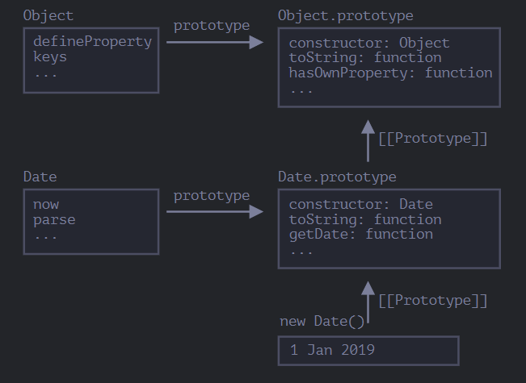

# Javascript 面向对象

- Javascript 编程语言
  - Javascript 基础知识
  - Javascript 更多引用类型
  - Javascript 引用类型进阶知识
  - Javascript 函数进阶知识
  - Javascript 面向对象
  - Javascript 错误处理
  - Javascript 生成器 Generator
  - Javascript Promise与async
  - Javascript 模块 Module
- Javascript 浏览器

---


## 简介

JavaScript 是一种基于原型的面向对象语言，虽然与传统的基于类的面向对象语言(如 Java、C++)有所不同，但它同样支持面向对象编程(OOP)的所有核心概念：**封装**、**继承**和**多态**。

但在现代 JavaScript 中，还有一个更高级的“**类（class）**”构造方式。


## 类 class

在 JavaScript 中，class 语法是 ES6（ECMAScript 2015）引入的，用于创建对象的模板和实现继承；是一种更接近其他面向对象编程语言（如 Java 和 C++）的定义类和继承的方式。

**注意**，class 语法的底层实现原理仍然基于 JavaScript 的原型链机制。

```js
// 基本语法
class Person {
    // 类字段
    name = "匿名用户";
    
    // 构造函数
    constructor(name, age) {
        this.name = name;
        this.age = age;
    }
    
    // 类方法
    greet() {
        console.log(`你好，我是${this.name}，今年${this.age}岁`);
    }
    /*...*/ 
}

const person1 = new Person("张三", 25);
person1.greet(); // 输出: 你好，我是张三，今年25岁
```

- `constructor`：构造函数，用于初始化对象
- `method`：类的方法
- `字段`：类的属性（ES2022 正式支持类字段）

**实际上，JavaScript 引擎会做以下几件事**：

1. class 是一个特殊的函数，如上例：创建一个名为 `Person` 的函数，函数的代码来自于 `constructor` 方法；该函数对象内会包含一个内部属性`[[IsClassConstructor]]` 设为 `true`，标记为类构造函数。

   ```js
   alert(typeof Person); // function
   
   alert(MyClass === MyClass.prototype.constructor); // true
   ```

2. class 的方法将被放在原型 `Person.prototype `上；

   ```js
   alert(Person.prototype.greet); // greet 方法的代码

3. 当 `new Person` 对象被创建后，当我们调用其方法时，它会从原型中获取对应的方法，正如 `F.prototype` 的操作。

   ```js
   console.log(person1)
   
   /* 输出内容：
   ▽ Person {
   	name: "张三"
   	age: 25
   	▽ [[Prototype]]: Object {
   		constructor: class Person
   		greet: ƒ greet()
         }
     }
   */
   ```

**类的特性**：

1. 类对象跟构造函数一样，必须使用 `new` 的方式调用才能正常工作。

2. 类总是使用 `use strict`。 在类构造中的所有代码都将自动进入严格模式。

3. 类方法不可枚举。 类定义将 `"prototype"` 中的所有方法的 `enumerable` 标志设置为 `false`。

4. 类的声明不同于函数声明，类声明在作用域内没有提升。

5. 像对象字面量，类可能包括 `getters`/`setters`。

   ```js
   class User {
     name = "匿名"
     constructor(name) {
       this.name = name; // 调用 setter
     }
   
     get name() {
       return this._name;
     }
   
     set name(value) {
       if (value.length < 4) {
         alert("Name is too short.");
         return;
       }
       this._name = value;
     }
   }

6. 像对象字面量，类可能包括计算属性名称。

   ```js
   class User {
     ['say' + 'Hi']() {}
   }
   new User().sayHi( /*...*/ );
   
7. 像函数一样，类可以在另外一个表达式中被定义，被传递，被返回，被赋值等。

   ```js
   let User = class { /*...*/ };

**从本质上讲，类声明大致相当于以下代码**：

```javascript
const Person = (function() {
  'use strict';
  
  // 构造函数
  const Person = function(name, age) {
    if (!new.target) {
      throw new TypeError("Class constructor Person cannot be invoked without 'new'");
    }
    this.name = name;
    this.age = age;
  };
  
  // 方法定义
  Object.defineProperty(Person.prototype, 'greet', {
    value: function() {
      console.log(`Hello, ${this.name}`);
    },
    enumerable: false,
    configurable: true,
    writable: true
  });
  
  return Person;
})();
```


## 类继承

类继承是面向对象编程的核心概念之一，它允许一个类（子类）继承另一个类（父类）的属性和方法。基于原型继承，提供了更清晰、更易用的语法。

### 关键字 extends

类通过 `extends` 关键字实现类继承，用于创建一个类作为另一个类的子类。

```js
class Animal {
  name = "未知动物";
    
  constructor(name) {
    this.name = name;
    this.speed = 0;
  }

  run(speed) {
    console.log(`${this.name} 用速度 ${this.speed} 进行跑步.`);
  }
}

class Rabbit extends Animal {
  hide() {
    this.speed = 0;
    console.log(`${this.name} 躲起来了!`);
  }
}

const rabbit = new Rabbit("小白兔");
rabbit.run(5);  // White Rabbit runs with speed 5.
rabbit.hide();  // White Rabbit hides!
```

实际上，继承的机制是：

- `Rabbit.prototype.[[Prototype]]` 被设置为 `Animal.prototype`
- 如果在 `Rabbit` 实例上找不到方法，JavaScript 会沿着原型链向上查找
- 子类默认会继承父类的构造函数

### 方法与字段重写

子类可以重写父类的方法与字段，其与父类的方法或字段同名，则将替换父类的方法或字段。

```javascript
class Rabbit extends Animal {
  name = "兔子";
    
  stop() {
    console.log(`${this.name} stops abruptly!`);
  }
}
```

**但方法与字段被重写后，行为有所不同**：

1. 在父类构造器中调用被重写的方法时，会调用子类重写后的版本。
   - 方法的调用是动态绑定的（运行时确定）
2. 在父类构造器中访问被重写的字段时，父类构造器总是使用它自己定义的字段值，而不是子类重写的字段值。
   - 字段的访问是静态绑定的（编译时确定）
   - 在父类构造器执行时，子类的字段还未初始化

在 JavaScript 的类中，**字段（class fields）** 的初始化顺序如下：

1. 父类字段初始化；
2. 父类构造器执行；
3. 子类字段初始化；
4. 子类构造器执行。

```js
class Parent {
    value = 1; // 父类字段

    constructor() {
        console.log("Parent 构造器看到的 value:", this.value); // 1
        this.method(); // 调用子类重写的方法
    }
    
    method() {
        console.log("Parent 的方法");
    }
}

class Child extends Parent {
    value = 2; // 子类重写字段

    constructor() {
        super(); // 调用父类构造器
        console.log("Child 构造器看到的 value:", this.value); // 2
    }
    
    method() {
        console.log("Child 重写的方法，看到的 value：", this.value);
    }
}

new Child();

/* 输出：
Parent 构造器看到的 value: 1
Child 重写的方法，看到的 value： 1
Child 构造器看到的 value: 2
*/
```

### 关键字 super

**super** 主要用于在子类中访问父类的成员。

通常，我们不希望完全替换父类的方法，而是在父类方法的基础上进行调整或扩展其功能，这就需要用到 `super`。

- 执行 `super.method(...)` 来调用一个父类方法。
- 在子类的 constructor 中执行 `super(...)` 来调用一个父类 `constructor`（只能在子类的 constructor 中）。

```js
class Animal {
    constructor(name) {
        this.speed = 0;
        this.name = name;
    }

    run(speed) {
        console.log(`${this.name} 用速度 ${this.speed} 进行跑步.`);
    }

    stop() {
        this.speed = 0;
        alert(`${this.name} 停下来了.`);
    }

}

class Rabbit extends Animal {
    hide() {
        super.stop(); // 调用父类的 stop
        alert(`${this.name} 躲起来了!`);
    }
}

let rabbit = new Rabbit("小白兔");

rabbit.run(5); // 小白兔用速度 5 进行跑步.
rabbit.stop(); // 小白兔停下来了. 小白兔躲起来了!
```

**注意**：

1. 箭头函数没有 `super`。如果被访问，它会从外部函数获取。
2. 静态方法中不能使用 `super`。

### 重写 constructor

如果子类没有定义构造函数，会自动生成一个空 `constructor`：调用了父类的 `constructor`，并传递了所有的参数。

```js
class Rabbit extends Animal {
  // 为没有自己的 constructor 的扩展类生成的
  constructor(...args) {
    super(...args);
  }
}
```

如果子类存在构造函数，那么该构造函数必须调用 `super(...)`，且一定要在使用 `this` 之前调用。否则其不会正常工作。

```js
class Rabbit extends Animal {
  constructor(name, earLength) {
      super(name);
      this.earLength = earLength;
  }
  // ...
}
```

在 JavaScript 中，继承类的构造函数称为**派生构造器（derived constructor）**，其函数对象内具有特殊的内部属性 `[[ConstructorKind]]:"derived"`。

该标签会影响它的 `new` 行为：

- 当通过 `new` 执行一个常规函数时，它将创建一个空对象，并将这个空对象赋值给 `this`。
- 但是当继承的 constructor 执行时，它不会执行此操作。它期望父类的 constructor 来完成这项工作。


## super 的底层机制 [[HomeObject]]

### super 的实现探讨

在 JavaScript 中，当我们尝试使用 `super` 访问父类方法时，表面上看似乎可以直接通过 `this.__proto__` 来实现，但实际上这种方法存在严重缺陷。

例如，如下代码存在问题：

```js
let animal = {
  name: "Animal",
  eat() {
    console.log(`${this.name} eats.`);
  }
};

let rabbit = {
  __proto__: animal,
  name: "Rabbit",
  eat() {
    // 模拟 super.eat()
    this.__proto__.eat.call(this);
  }
};

let longEar = {
  __proto__: rabbit,
  name: "Long Ear",
  eat() {
    this.__proto__.eat.call(this);
  }
};

longEar.eat(); // 报错: 最大调用栈大小超出
```

问题在于：

1. `longEar.eat()` 调用 `rabbit.eat()`
2. `rabbit.eat()` 又调用 `rabbit.eat()`（因为 `this` 仍然是 `longEar`，`this.__proto__` 还是 `rabbit`）
3. 这样就形成了无限递归调用

### [[HomeObject]]

为了提供解决方法，JavaScript 为函数添加了一个特殊的内部属性：`[[HomeObject]]`。

1. 当一个方法被定义时（使用 `method()` 语法），该方法对象的内部会用 `[[HomeObject]]` 记住自己所属的对象。
2. 当使用`super.method()`时，引擎会：
   - 从 `[[HomeObject]]` 获取当前对象的原型
   - 从原型中查找对应的方法

那么，`super` 就可以用该属性来访问父原型及其方法。

注意，super 的调用只能在存在`[[HomeObject]]`的方法内才能生效。

```js
let animal = {
  name: "Animal",
  eat() {  // animal.eat.[[HomeObject]] = animal
    console.log(`${this.name} eats.`);
  }
};

let rabbit = {
  __proto__: animal,
  name: "Rabbit",
  eat() {  // rabbit.eat.[[HomeObject]] = rabbit
    super.eat();
  }
};

let longEar = {
  __proto__: rabbit,
  name: "Long Ear",
  eat() {  // longEar.eat.[[HomeObject]] = longEar
    super.eat();
  }
};

longEar.eat(); // 正确输出: "Long Ear eats."
```

### 类方法并不是“自由”的

之前学习所知，函数通常都是“自由”的，并没有绑定到 JavaScript 中的对象。正因如此，它们可以在对象之间复制，并用另外一个 `this` 调用它。

但类方法与它内部存在的`[[HomeObject]]`是绑定的，不可更改。`[[HomeObject]]` 一旦设置就无法更改。

在 JavaScript 语言中 `[[HomeObject]]` 仅被用于 `super`。所以，如果一个方法不使用 `super`，那么我们仍然可以视它为自由的并且可在对象之间复制。

但若使用 `super`，则会导致出现一些奇怪的错误。

```js
let animal = {
  sayHi() {
    console.log("I'm an animal");
  }
};

let rabbit = {
  __proto__: animal,
  sayHi() {
    super.sayHi();
  }
};

let plant = {
  sayHi() {
    console.log("I'm a plant");
  }
};

let tree = {
  __proto__: plant,
  sayHi: rabbit.sayHi
};

tree.sayHi(); // 输出: "I'm an animal" (而不是 "I'm a plant")
```


## 静态成员

静态属性和方法是可被继承的，所以静态方法中可以使用 `super` 访问父类的静态成员。

适合将工具函数、工厂方法、配置信息等设计为静态成员。

### 静态方法

静态方法是直接绑定到类本身而不是类实例的方法。在类声明中，使用 `static` 关键字定义：

```js 
class User {
  static staticMethod() {
    console.log(this === User); // true
  }
}

User.staticMethod(); // 输出: true

// 这实际上跟直接将其作为属性赋值的作用相同
User.staticMethod = function() {/*...*/};
```

静态方法调用时， `this` 的值是类构造器自身（“点符号前面的对象”规则）。

> 应用场景举例：
>
> 1. 实现比较函数
> 2. 实现静态工厂
>
> ```js
> class Article {
>   constructor(title, date) {
>     this.title = title;
>     this.date = date;
>   }
> 
>   // 静态方法：比较两篇文章日期
>   static compare(articleA, articleB) {
>     return articleA.date - articleB.date;
>   }
> 
>   // 静态工厂方法
>   static createToday(title) {
>     return new Article(title, new Date());
>   }
> }
> 
> // 使用静态方法排序
> let articles = [
>   new Article("HTML", new Date(2019, 1, 1)),
>   new Article("CSS", new Date(2019, 0, 1)),
>   new Article("JavaScript", new Date(2019, 11, 1))
> ];
> 
> articles.sort(Article.compare);
> console.log(articles[0].title); // 输出: "CSS"
> 
> // 使用静态工厂方法
> let todayArticle = Article.createToday("Today's News");

### 静态属性

它们看起来就像常规的类属性，但前面加有 `static`：

```js
class User {}
User.staticProperty = "value";

// 等同于
class User {
  static staticProperty = "value";
}
```


## 私有与受保护成员

在面向对象编程中，封装是核心原则之一：

1. **公共(Public)**：完全开放的访问，构成了外部接口。
2. **受保护(Protected)**：类内部及其子类可访问。
3. **私有(Private)**：仅类内部可访问，用于内部接口。

在 JavaScript 的类中，支持公共、私有两种成员。

### 受保护成员

JavaScript 使用 `_` 前缀约定来表示受保护成员。这不是在语言级别强制实施的，但是程序员之间有一个众所周知的约定，即不应该从外部访问此类型的属性和方法。

利用该思想，可以做一个只读的属性，只设置 getter 来读取数据。

```js
class CoffeeMachine {
    // ...
    constructor(power) {
        this._power = power;
    }
    get power() {
        return this._power;
    }
}

// 创建咖啡机
let coffeeMachine = new CoffeeMachine(100);
alert(coffeeMachine.power); // 功率是：100W
coffeeMachine.power = 25; // Error（没有 setter）
```

### 私有成员

ES2022正式引入了私有字段语法，使用 `#` 作为成员的前缀即可定义私有成员。

使用 `#` 开头的私有成员，会受到语言级别的保护，无法从外部或从继承的类中访问它。

若想使用封闭字段，必须先在类的最顶层声明。

```js
class CoffeeMachine {
    #waterLimit = 200;
    #power;  // 必须先声明私有字段
    constructor(power) {
        this.#power = power;
    }
}

let coffeeMachine = new CoffeeMachine(100);
console.log(coffeeMachine.power);  // Error
console.log(coffeeMachine.#power); // Error
coffeeMachine.waterLimit = 25;     // Error
coffeeMachine.#waterLimit = 25;    // Error
```


## 拓展内建类

JavaScript 允许开发者扩展内置类（如 Array、Map、Set 等），这是面向对象编程中强大的特性。通过扩展内置类，我们可以添加自定义方法或修改现有行为。

比如，我们可以继承 Array 对象，将其进行增强：

```js
class EnhancedArray extends Array {
  // 添加自定义方法
  isEmpty() {
    return this.length === 0;
  }
  
  // 覆盖原生方法
  toString() {
    return `[${super.join(', ')}]`;
  }
}

const myArray = new EnhancedArray(1, 2, 3);
console.log(myArray.isEmpty()); // false
console.log(myArray.toString()); // "[1, 2, 3]"
```

### Symbol.species 机制

`Symbol.species` 是构造函数内的一个特殊静态属性，用于指定派生对象在调用特定方法（如 map、filter、slice 等）时应该使用的构造函数。

当内置方法需要创建新实例时：

1. 检查 `this.constructor[Symbol.species]` 是否存在
2. 如果存在，使用它作为构造函数
3. 否则，使用默认构造函数

如上例，在使用 `EnhancedArray` 继承得来的非静态内建方法如 `filter`，`map` 等 —— 返回的正是子类 `EnhancedArray` 的新对象。它们内部使用了对象的 `constructor` 属性来实现这一功能。

当然，我们可以自己设置这个属性，以控制这些内建方法使用哪一个构造函数。只需要给这个类添加一个特殊的静态 getter `Symbol.species`：

```js
class EnhancedArray extends Array {
    isEmpty() {
        return this.length === 0;
    }

    // 内建方法将使用这个作为 constructor
    static get [Symbol.species]() {
        return Array;
    }
}

let arr = new EnhancedArray(1, 2, 10, 50);
alert(arr.isEmpty()); // false

// filter 使用 arr.constructor[Symbol.species] 作为 constructor 创建新数组
let filteredArr = arr.filter(item => item >= 10);

// filteredArr 不是 PowerArray，而是 Array
alert(filteredArr.isEmpty()); // Error: filteredArr.isEmpty is not a function
```

通常，当一个类继承另一个类时，静态方法和非静态方法都会被继承。

但内建类之间**不会继承静态方法**，只继承非静态方法。

例如，`Date` 继承自 `Object`，所以它的实例都有来自 `Object.prototype` 的方法。但 `Date.[[Prototype]]` 并不指向 `Object`，所以它们没有例如或 `Date.keys()` 这种来自 `Object` 的静态方法。




## Mixin 模式

在 JavaScript 中，我们只能继承单个对象，因为每个对象只能有一个 `[[Prototype]]`。而`Mixin` 提供了一种灵活的方式来共享功能而不使用传统的继承链，突破了单继承限制。

**Mixin（混入）**是一种软件设计模式，允许开发者将多个对象的属性和方法"混合"到一个类中，实现类似多重继承的效果。

### 基础实现方式

#### 对象混入式（浅拷贝）

例如，我们将以下的 `User` 类与对象 `say` 用浅拷贝的形式进行对象混入：

```js
let sayHiMixin = {
    sayHi() {
        alert(`Hello ${this.name}`);
    },
    sayBye() {
        alert(`Bye ${this.name}`);
    }
};

// 用法：
class User {
    constructor(name) {
        this.name = name;
    }
}

// 拷贝方法
Object.assign(User.prototype, sayHiMixin);

// 现在 User 可以打招呼了
new User("Dude").sayHi(); // Hello Dude!
```

#### 函数式 Mixin（更灵活）

函数式 Mixin 本质上是**一个返回类的函数**，它接受一个基类作为输入，返回一个扩展后的新类。可以链式调用组合多个Mixin，且不会修改原有原型链。

```JS
function timestampsMixin(BaseClass) {
  return class extends BaseClass {
    createdAt = new Date();
    updatedAt = new Date();
    
    update() {
      this.updatedAt = new Date();
      super.update?.();
    }
  };
}

class Document {}
const TimestampedDocument = timestampsMixin(Document);

const doc = new TimestampedDocument();
console.log(doc.createdAt); // 当前时间
```

#### 混入继承链式 Mixin

通过原型链（`__proto__` 或 `Object.setPrototypeOf`）将多个 Mixin 连接起来，形成一条继承链，从而实现方法的层级查找和复用。

```js
// 基础 Mixin
const baseMixin = {
  baseMethod() {
    console.log('Base mixin method');
  }
};

// 扩展 Mixin
const extendedMixin = {
  __proto__: baseMixin,  // 继承自 baseMixin
  
  extendedMethod() {
    super.baseMethod();  // 可以调用父 Mixin 的方法
    console.log('Extended mixin method');
  }
};

// 应用到类
class MyClass {}

Object.assign(MyClass.prototype, extendedMixin);

const instance = new MyClass();
instance.extendedMethod();
// 输出:
// Base mixin method
// Extended mixin method
