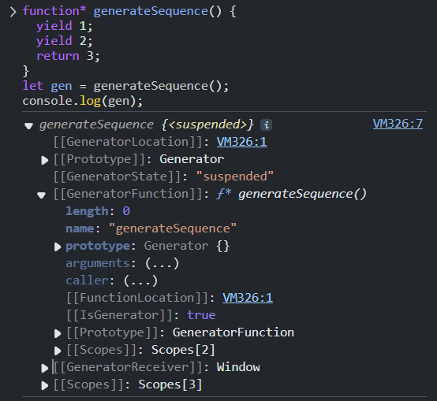

# Javascript 生成器 Generator

- Javascript 编程语言
  - Javascript 基础知识
  - Javascript 更多引用类型
  - Javascript 引用类型进阶知识
  - Javascript 函数进阶知识
  - Javascript 面向对象
  - Javascript 错误处理
  - Javascript 生成器 Generator
  - Javascript Promise与async
  - Javascript 模块 Module
- Javascript 浏览器

---


`Generator`（生成器）是 ES6 引入的一种特殊函数，它可以暂停和恢复执行，能够更灵活地控制函数的执行流程。

`Generator` 被添加到 JavaScript 语言中是有对 `iterator` 的考量的，以便更容易地实现 `Symbol.iterator`。


## 基本概念

常规函数只会返回一个单一值（或者不返回任何值），而 `generator` 可以按需一个接一个地返回“`yield`”多个值。它们可与**可迭代对象**完美配合使用，从而可以轻松地创建数据流。

使用语法 `function*` ，可以创建一个 `generator`：

```js
function* generateSequence() {
  yield 1;
  yield 2;
  return 3;
}

let generator = generateSequence();
alert(generator); // [object Generator]

for (let i = 0; i < 3; i++){
    console.log(generator.next());
}
/* 打印内容：
 {value: 1, done: false}
 {value: 2, done: false}
 {value: 3, done: true}
*/
```

- `generator` 被调用时，会返回一个特殊对象 `[object Generator]`，用来管理执行流程；
- `yield`关键字会阻塞函数体内的执行；
- `next()`是`generator` 调用的主要方法。

### next() 方法

每次调用 `next()` 都会返回一个包含两个属性的对象：

- `value`: 产出的值。（`value` 可以被省略，默认为 `undefined`）
- `done`: 生成器是否已完成执行。

当 `next()` 被调用时，函数体内代码会执行，直到遇到最近的 `yield <value>` 语句时，会暂停函数执行，并将 `yield` 的 `value` 传入结果对象内，返回到外部代码；

`next()`执行遇到 `return` 时，程序结束，返回对象的 `done` 值变为 `true`；之后再调用则只会返回 `{value: undefined, done: true}`。

### yield 表达式

`yield` 关键字用于暂停和恢复 Generator 函数的执行：

- 遇到 `yield` 表达式时，函数执行暂停
- 调用 `next()` 方法时，函数从暂停处继续执行
- `yield` 表达式的值是下一次调用 `next()` 方法时传入的参数

### return() 方法

终止 Generator 函数的执行，可以指定返回值。

```javascript
function* gen() {
  yield 1;
  yield 2;
}

const g = gen();
g.next();       // { value: 1, done: false }
g.return('foo'); // { value: "foo", done: true }
g.next();       // { value: undefined, done: true }
```

### 可迭代性

Generator 对象是可迭代的，可以使用 `for...of` 循环。

注意：`for...of` 循环会忽略 `return` 语句返回的值，

```javascript
function* generateSequence() {
  yield 1;
  yield 2;
  return 3;
}

for (const value of generateSequence()) {
  console.log(value); // 1, 2  (不会显示 3)
}
```

也可以手动调用 `next()` 方法进行迭代，

```js
let gen = generateSequence();
let result;
while (!(result = gen.next()).done) {
    console.log(result.value); // 1, 2
}
```

因为 `generator` 是可迭代的，我们可以使用 iterator 的所有相关功能，例如：spread 语法 `...`：

```js
console.log( [ ...gen ] ); // [1, 2]
```


## 高级特性

### 双向通信

`yield` 不仅向外返回值，还能传递外部传入的值到 generator 内。

可先调用`generator.next().value` 查看 `yield` 返回值 ，再根据返回值调用 `generator.next(arg)`，将参数 `arg` 传入内部，`arg` 会变成 `yield` 的结果。

```javascript
function* gen() {
  const result = yield "2 + 2 = ?";
  console.log(result); // 4
  
  console.log( yield "3 * 3 = ?" ); // 9
}

const generator = gen();
console.log( generator.next().value );  // "2 + 2 = ?"
console.log( generator.next(4).value ); // "3 * 3 = ?"
console.log( generator.next(9).done );  // true

/* 整体流程：
  2 + 2 = ?
  4
  3 * 3 = ?
  9
  true
*/
```

### generator 组合

**generator 组合（composition）**允许透明地（transparently）将 generator 彼此**嵌入（embed）**到一起。

这是将一个 generator 流插入到另一个 generator 流的自然的方式，它不需要使用额外的内存来存储中间结果。

使用 `yield*` 指令将执行 **委托** 给另一个 generator，这样可以组合多个 generator 生成器，让代码更清晰。

```js
// 示例为
function* generateSequence(start, end) {
  for (let i = start; i <= end; i++) yield i;
}

function* generateCodes() {
  // 0..9
  yield* generateSequence(48, 57);
    
  // A..Z
  yield* generateSequence(65, 90);
}

for (const code of generateCodes()) {
    console.log(String.fromCharCode(code));
}
```

### 错误处理

用 `throw(err)` 方法可向 Generator 函数内部抛出一个错误，`err` 将被抛到对应的 `yield` 所在的那一行。

```javascript
function* gen() {
  try {
    yield 1;
  } catch (e) {
    console.log('Error caught:', e); // Error caught: Error: Something went wrong
  }
}

const g = gen();
console.log( g.next().value ); // 1
g.throw(new Error('Something went wrong'));
```


## 具体使用

### 实现迭代器对象

可以用 `Generator` 实现之前 `Symbol.iterator` 的效果，代码量大大减小：

```js
function range(from, to) {
  return {
    from,
    to,

    // [Symbol.iterator]: function*() 的简写形式
    *[Symbol.iterator]() {
      for (let value = this.from; value <= this.to; value++)
        yield value;
    },
  };
}

console.log([...range(1, 5)]); // 1,2,3,4,5
```

### 异步 generator

对于大多数的实际应用程序，当我们想创建一个异步生成一系列值的对象时，我们都可以使用异步 generator。

在 `function*` 前面加上 `async`，即可使 generator 变为异步的。

之后，可以用 `for await ... of` 语法循环读取迭代对象。

```js
async function* generateSequence(start, end) {
  for (let i = start; i <= end; i++) {
    await new Promise(resolve => setTimeout(resolve, 1000));
    yield i;
  }
}

(async () => {
  let generator = generateSequence(1, 5);
  for await (let value of generator) {
    alert(value); // 1，然后 2，然后 3，然后 4，然后 5（在每个 alert 之间有延迟）
  }
})();
```

在一个常规的 generator 中，我们使用 `result = generator.next()` 来获得值。但在一个异步 generator 中，我们应该添加 `await` 关键字，像这样：

```js
result = await generator.next(); // result = {value: ..., done: true/false}
```

### 循环状态机

可以在 generator 内制作一个无限循环，实现循环状态机。

```javascript
function* trafficLight() {
    while (true) {
        yield '🟢 Green (Go)';
        yield '🟡 Yellow (Wait)';
        yield '🔴 Red (Stop)';
    }
}

const light = trafficLight();
console.log(light.next().value); // 🟢 Green (Go)
console.log(light.next().value); // 🟡 Yellow (Wait)
console.log(light.next().value); // 🔴 Red (Stop)
console.log(light.next().value); // 🟢 Green (Go) (循环)
```

## 内部属性

经过之前对引用类型的了解可知，Generator 也是一种特殊的对象。使用 console.log 可以查看 Generator 返回的对象属性。



- `GeneratorLocation` ：（仅在开发工具中显示）生成器函数在代码中的位置信息（如行号、列号）
- `GeneratorState`：表示生成器的当前状态，可能的值：
  - `"suspended"`：暂停中（等待 `next()` 调用）。
  - `"closed"`：已结束（执行到 `return` 或报错）。
  - `"executing"`：正在执行（极少见）。
- `GeneratorFunction`：指向生成器的原始函数
- `GeneratorReceiver`：生成器的 `this` 绑定
