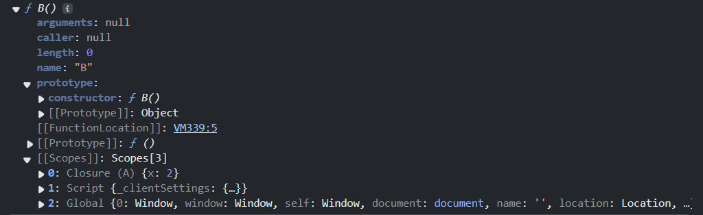
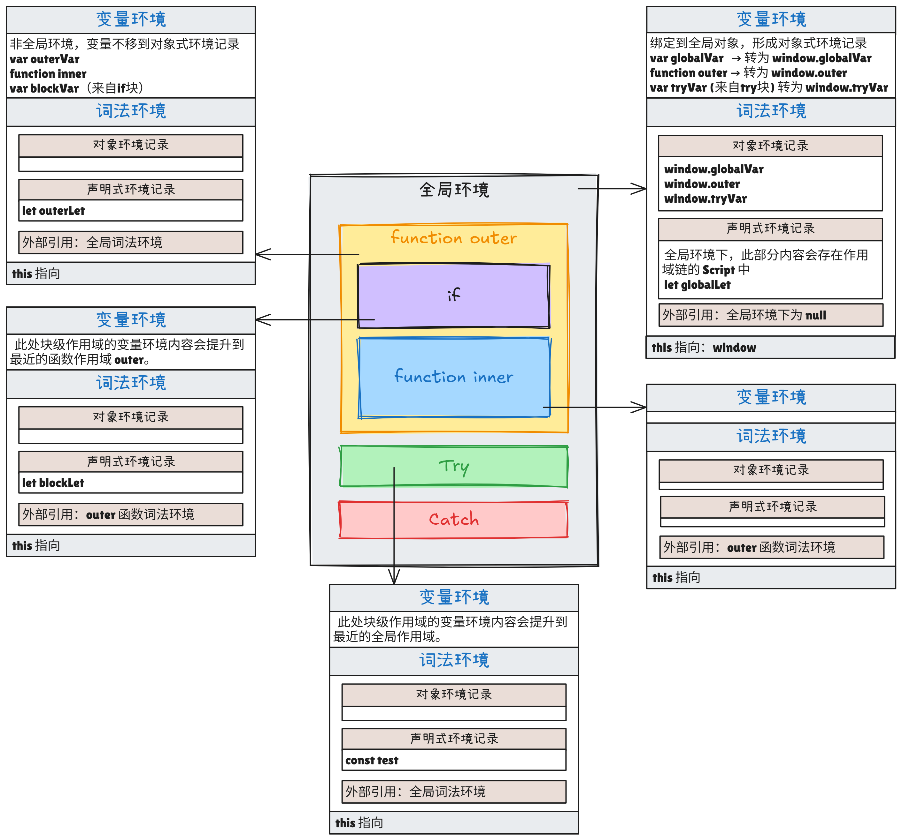
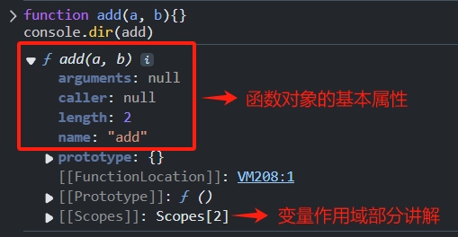

# Javascript 函数进阶及变量作用域

- Javascript 编程语言
  - Javascript 基础知识
  - Javascript 更多引用类型
  - Javascript 引用类型进阶知识
  - Javascript 函数进阶知识
  - Javascript 面向对象
  - Javascript 错误处理
  - Javascript 生成器 Generator
  - Javascript Promise与async
  - Javascript 模块 Module
- Javascript 浏览器

---


函数是 JavaScript 中的基本构建块之一，它允许我们将代码封装为可重用的单元。

在基础篇我们介绍了函数的基本定义方式与参数传值，接下来将更详细介绍函数的相关知识，同时进阶了解变量作用域。


## 变量作用域及闭包

### 作用域初步介绍

根据变量的声明位置不同，作用域也不同。变量一定属于某个作用域。

JavaScript 中主要有三种作用域：**全局作用域**、**函数作用域**和**块作用域**。

在 JavaScript 中，作用域的底层实现主要由以下四部分组成：**词法环境**、**变量环境**、**执行上下文**、**作用域链**。

查找变量时（`let` 或 `const`，`var` 和`声明函数`属于特殊情况），会从当前作用域开始，逐级向上查找，直到找到为止。

1. **局部变量**：函数内部声明的变量，仅在函数内部可见

   ```javascript
   function showMessage() {
     let message = "Hello"; // 局部变量
     alert(message);
   }
   ```

2. **外部变量**：函数可以访问和修改外部变量

   ```javascript
   let userName = 'John';
   function showMessage() {
     userName = "Bob"; // 修改外部变量
     alert(userName);
   }
   ```

3. **变量遮蔽**：当局部变量与外部变量同名时，优先使用局部变量。但 var 定义的变量之后会泄露。

   ```javascript
   let x = 1;
   {
     let x = 2; // 合法遮蔽
   }
   console.log(x); // 1（外部不受影响）
   ```
   
4. **全局变量**：在任何函数之外声明的变量，所有函数都可访问

   - 应尽量减少全局变量的使用，现代代码通常将变量限制在函数作用域内


### 执行上下文（Execution Context）

执行上下文是 JavaScript 在代码执行阶段的抽象环境，为即将到来的代码执行做准备。每个函数调用都会创建一个新的执行上下文。

#### 执行上下文的内容

- **变量环境（Variable Environment）**：`var` 和`函数`声明。
- **词法环境（Lexical Environment）**：`let`、`const` 等声明。
- **this 绑定**：
  - 全局上下文：`this` 指向 `window`（浏览器）或 `global`（Node.js）。
  - 函数上下文：取决于调用方式（默认绑定、隐式绑定、显式绑定、`new` 绑定等）。

#### 执行上下文的种类

- **全局执行上下文（Global Execution Context）**
  - 代码首次运行时创建，只有一个全局上下文。
  - 全局变量和函数（非块级作用域）存储在此。
- **函数执行上下文（Function Execution Context）**
  - 每次调用函数时创建，可以有多个。
  - 包含函数的局部变量、参数、`this` 绑定等。
- **Eval 执行上下文（Eval Execution Context）**（极少使用）
  - `eval()` 内部的代码会创建自己的执行上下文。
  - 严格模式下，`eval` 有自己的作用域，不影响外部变量。

#### 执行上下文的生命周期

1. **创建阶段（Creation Phase）**
   - 确定 `this` 绑定（`ThisBinding`）；
   - 创建 `词法环境`和 `变量环境`；
   - 初始化变量和函数声明（`变量提升`）。
2. **执行阶段（Execution Phase）**：逐行执行代码，赋值变量，调用函数等。

#### 调用栈（Call Stack）

JavaScript 的执行机制基于调用栈。

调用栈是一个后进先出（LIFO）的数据结构，用于管理函数的调用顺序。

每当调用一个函数时，都会创建一个新的执行上下文并将其压入调用栈的顶部。函数执行完毕后，该执行上下文会被从栈顶弹出。

> ```javascript
> function bar() {/*...*/}
> 
> function foo() {
>   bar();
> }
> 
> foo();
> ```
>
> 在这个例子中，调用栈的变化如下：
>
> 1. 全局执行上下文被创建并压入栈顶。
> 2. `foo` 函数被调用，创建一个新的执行上下文并压入栈顶。
> 3. `bar` 函数被调用，创建一个新的执行上下文并压入栈顶。
> 4. `bar` 函数执行完毕，其执行上下文从栈顶弹出。
> 5. `foo` 函数执行完毕，其执行上下文从栈顶弹出。
> 6. 全局执行上下文继续执行，直到程序结束。


### 变量环境

变量环境是词法环境的一种特殊形式，**仅用于存储 `var` 声明的变量和函数声明**（在 ES3 中引入，ES6 后与词法环境分离）。

**注意**，严格模式下 变量环境 会归并到 词法环境，除了变量提升特性会保留外，其他方面与普通的变量一致。

**与词法环境的区别**：

- 在全局或函数执行上下文中，变量环境初始化时记录 `var` 和 `function` 声明，而词法环境记录 `let`、`const`、`class` 等声明。
- 变量环境在函数执行期间不变，而词法环境可能变化（如 `let` 的暂时性死区）。

**变量环境的位置**：

- 在 *全局作用域* 中，变量环境会绑定到 全局对象（如 `window`），形成词法环境中的对象式环境记录。
- 在 *函数作用域* 中，变量环境仍然存在，但不再绑定到全局对象，而是存储在词法环境中声明式环境记录中。

#### 变量环境的变量提升（Hoisting）

变量提升是指 JavaScript 引擎在编译阶段将变量和函数的声明提升到其所在作用域的顶部。

1. **完全提升**：声明和赋值都会被提升
   - `function` 声明（可以在声明前调用）。
2. **部分提升**：只有声明会被提升，而赋值不会被提升
   - `var` 变量（初始化为 `undefined`）。
   - `var` + 函数表达式（初始化为 `undefined`，调用会报错）。

注意，`var变量`和`声明函数`的提升**无视块级作用域**，只关注函数作用域或全局作用域。变量会被提升到 **最近的函数作用域顶部**（或全局作用域）。

```js
console.log(a)  // undefined，只有变量声明提升
foo();          // "Hello"，函数声明整体提升
bar();          // ❌TypeError。变量名提升，但函数体不提升
console.log(b); // undefined，无视块级作用域，提升到全局环境
console.log(c); // ❌ReferenceError，变量声明在最近函数作用域提升，而不是全局作用域

var a = 10;

function foo() {
  console.log("Hello");
}

var bar = function() {
  console.log("World");
};

if(false){
  if (true) {
    var b = 10;
  }
}

function test(){
    console.log(c); // undefined，变量声明提升到当前函数作用域
    var c = 10;
}

console.log(b); // 10，无视块级作用域
console.log(c); // ❌ReferenceError，c 不在全局作用域
```


### 词法环境

在 JavaScript 中，**词法环境（Lexical Environment）** 是 ECMAScript 规范（如 ES6+）中定义的一个核心概念，用于描述变量和函数在代码中的可访问性（作用域）及其存储机制。

在 JavaScript 中的每个函数、代码块 `{...}` 及整个脚本，都存在一个被称为 **词法环境** 的内部关联对象。

#### 词法环境对象的组成

1. **环境记录（Environment Record）** : 存储所有局部变量作为其属性
   - *声明式环境记录（Declarative Environment Record）*：变量存储在词法环境中，不绑定到全局对象。存储以下内容：
     -  `let`、`const`声明的变量；
     - 类 class 的声明；
     - 块级作用域下`函数声明`；
     - 函数作用域下的`var`。
   - *对象式环境记录（Object Environment Record）*：变量存储在一个实际对象（如 `window`）中，可通过对象属性访问。存储以下内容：
     - 全局作用域下的 `var` 声明；
     - 全局作用域下的`函数声明`；
     -  `with` 语句中的变量（已弃用，不推荐使用）。
   - *模块环境记录（Module Environment Record）*：模块顶级作用域的变量默认是 `let/const` 行为（不绑定到 `window`）（此部分本章不会介绍，若感兴趣请自行搜索）存储以下内容：
     - 用来存储 `ES6` 模块作用域内的变量（类似严格模式的块级作用域）；
     - 允许 `import` 和 `export` 声明。
2. **外部词法环境引用（Outer Lexical Environment）** ，与外部代码相关联，指向父级词法环境，形成嵌套的作用域链。底层实现为函数对象内的 `[[Environment]]` 的隐藏属性，该属性保存了对创建该函数的词法环境的引用。

变量本质上是环境记录对象的属性。当我们访问或修改变量时，实际上是在操作词法环境的属性。

#### 词法环境的创建时机

- **全局环境**（Global Lexical Environment）：在整个脚本刚开始加载时，会自动创建一个全局词法环境，此时外部引用为 `null`。
- **函数环境**（Function Lexical Environment）：在一个函数运行时，在调用刚开始时，会自动创建一个新的词法环境，用于存储该调用的局部变量和参数。
  - 若该函数在全局环境中创建，则外部引用为全局环境；
  - 若在其他代码块级函数中创建，则外部引用为该块级环境。
- **块级环境**（Block Lexical Environment）：`{}` 块中使用 `let`/`const` 时会创建临时词法环境（如 `if`、`for`）。

#### 词法环境的作用域链

作用域链是通过词法环境的外部引用嵌套引用隐式实现的，是一个抽象的定义。

作用域链是运行时基于词法环境嵌套关系的动态查找路径，而一个非静态存储的结构。

在访问变量时，JavaScript 会按照从内到外的顺序依次搜索词法环境，直到找到目标变量或到达全局词法环境：

1. 检查当前词法环境的环境记录。
2. 若未找到，沿外部引用逐级向上查找（作用域链）。
3. 到达全局环境仍未找到则报错（如 `ReferenceError`）。

#### let / const 的变量提升

之前提到`let`/`const`声明的变量不会在作用域中被提升，按表象来说这句话没有错。

但实际上，`let` 和 `const`实际上会被提升，但由于“暂时性死区”的存在，不能在声明之前使用他们。

**暂时性死区（Temporal Dead Zone, TDZ）的定义**：指从代码块（或作用域）开始执行，到 `let`、`const` 或 `class` 声明语句实际执行完成之间的时间段。在此期间，访问这些变量会触发 `ReferenceError`，即使变量在作用域内已提升。

**暂时性死区（TDZ）** 的机制：

1. 编译阶段：变量被“提升”并记录在词法环境中，但标记为未初始化。
2. 执行阶段：在声明语句执行前，访问变量会触发 TDZ 错误。
3. 声明语句执行后：变量被初始化，可正常访问。


### 闭包

首先，开门见山，**一个函数返回函数则会形成闭包**。

**闭包** 是指一个函数可以记住其外部变量并可以访问这些变量。

换句话说，闭包是一个 **“函数 + 词法作用域”** 的组合。

#### 闭包的基本特性

1. **访问外部变量**：闭包允许内部函数访问外部函数的局部变量。
2. **变量的持久性**：即使外部函数已经执行完毕，闭包中的内部函数仍然可以访问外部函数中的变量。

JavaScript 中的函数会自动通过隐藏的 `[[Environment]]` 属性记住创建它们的位置，所以它们都可以访问外部变量。

> 举个例子，我们做一个计时器，如下：
>
> ```js
> function makeCounter() {
>     let count = 0;
> 
>     return function() {
>         return count++;
>     };
> }
> 
> let counter = makeCounter();
> ```
>
> 所有函数都带有名为 `[[Environment]]` 的隐藏属性，该属性保存了对创建该函数的词法环境的引用。函数在创建时会记住其所属的词法环境，从而能够访问外部变量。
>
> 当调用 `makeCounter()` 时，会创建一个新的词法环境，用于存储 `makeCounter` 函数运行时的变量。在这个例子中，`makeCounter()` 内部存在两层嵌套的词法环境：一层是记录了 `count` 变量的词法环境，另一层则是外部的全局词法环境。
>
> `counter` 被赋值了返回的函数。因此，`counter.[[Environment]]` 有对 `{count: 0}` 词法环境的引用。
>
> 当调用 `counter()` 时，会为该调用创建一个新的词法环境。之后，`counter` 在查找 `count` 变量时，它会先搜索自己的词法环境（此时为空），然后搜索外部的 `makeCounter()` 的词法环境，这时则可找到 `count` 变量，对其进行加法操作。
>
> 通过多次调用 `counter()`，`count` 变量的值会不断递增，这正是闭包的典型表现。

可阅读我的另一篇文章，查看闭包的应用场景：[一文搞懂到底什么是闭包](https://juejin.cn/post/7484633985453981722)。


### 垃圾收集

通常，函数调用完成后，会将词法环境和其中的所有变量从内存中删除。

JavaScript 中的任何其他对象一样，词法环境仅在可达时才会被保留在内存中。

如果从代码中可以明显看出有未使用的外部变量，那么就会将其删除。


### 查看函数属性的具体实现

**如下例**：在浏览器控制台中，我们创建一个函数 A ，返回一个函数 B，创建以下词法环境：


使用 `console.dir` 查看 `A` 返回的函数`B`，输出以下内容：



```js
▼ ƒ B()
  // ...
  [[FunctionLocation]]:    // 函数定义位置（浏览器环境）
  [[Scopes]]: Scopes[2]    // 闭包作用域链
    ▼ 0: Closure (A)       // 闭包作用域（来自函数 A）
        x: 2               // 闭包保存的变量 x
    ▼ 1: Script            // V8 引擎实现的独立脚本或模块作用域标识，记录全局声明式
    ▼ 2: Global            // 全局作用域
        y: 3               // 全局变量 y
        A: ƒ A()           // 全局函数 A
        window: Window     // 浏览器全局对象
```

可以看到，函数对象内记录了一些基本的属性。其中，`[[Scopes]]`属性是V8 引擎在开发者工具（如 `console.dir`）中暴露的内部属性，用于可视化函数的作用域链。

在全局作用域中，用 `let`/`const` 声明的变量会出现在 `[[Scopes]]` 的 `Script` 中

`[[Scopes]]`本质上是 `[[Environment]]` 的 **运行时展开结果**，显示函数实际能访问的所有作用域层级（包括闭包和全局作用域）。

### 综合示例

看懂这部分，则你的变量作用域部分就通关了！

```js
// 可尝试在浏览器控制台下运行以下内容再继续理解图片
var globalVar = 1
let globalLet = 2

function outer(){
  var outerVar = 3;
  let outerLet = 4;

  if (true) {
    var blockVar = 5;
    let blockLet = 6;
  }

  return function inner(){
    return globalLet*outerLet;
  }
}

try {
  var tryVar = 7
  const test = outer();
  console.dir(test);
} catch(e){
  console.log(e);
}
```




## 函数对象

函数也是一个特殊的对象，每个函数都是`Function`类型的实例，包含一些便于使用的属性。

`console.dir` 是浏览器开发者工具中用于 递归打印对象的属性和内部结构 的方法。



1. **属性 name**

   一个函数的名字可以通过属性 `name` 来访问：

   ```js
   function sayHi() {}
   
   alert(sayHi.name); // sayHi
   ```

   如果函数自己没有提供命名，那么在函数赋值时，会根据上下文来推测一个。规范中把这种特性叫做「**上下文命名**」。但若上下文都没有提供函数命名，则函数名为空字符串`''`。

   ```js
   let user = {
     sayBye: function() {}
   }
   
   alert(user.sayBye.name); // sayBye
   ```

2. **属性 arguments**

   在 JavaScript 中，无论函数是如何定义的，都可以在调用它时传入任意数量的参数。函数不会因为传入过多的参数而报错。但是只有本应被接收的参数会被接收。

   在之前学习对象进阶知识篇的时候，有讲到用展开运算符来接收剩余的参数，如`function sumAll(...args)`。

   其实，每个函数都拥有一个名为 `arguments` 的属性。

   在过去，JavaScript 中不支持展开运算符语法，使用 `arguments` 是获取函数所有参数的唯一方法。

   -  `arguments` 是一个类数组，也是可迭代对象，有 `length` 属性，同时可以使用 `for...of` 遍历。
   -  `arguments` 不是数组，不支持数组方法。
   -  箭头函数没有 `"arguments"`。

   ```js
   function showName() {
     alert( arguments.length );
     alert( arguments[0] );
     alert( arguments[1] );
   
     // 它是可遍历的：for(let arg of arguments) alert(arg);
   }
   
   // 依次显示：2，Julius，Caesar
   showName("Julius", "Caesar");
   ```

   ES6 之后，应优先使用剩余参数语法 `...args` 替代 `arguments`。

   - `arguments` 不是严格模式下的推荐写法，且在箭头函数中无法使用。
   - `...args`传入后会成为一个真正的数组，调用数组方法更方便。

3. **属性 length**

   一个函数的入参个数可以通过属性 `length` 来访问：

   ```js
   function f1(a) {}
   function f2(a, b) {}
   function many(a, b, ...more) {}
   
   alert(f1.length); // 1
   alert(f2.length); // 2
   alert(many.length); // 2   注意 rest 参数不参与计数。
   ```

4. **属性 caller**

   属性`caller` 返回调用当前函数的函数引用。这个属性提供了函数调用栈的信息，可以帮助开发者追踪函数的调用来源。

   ```js
   function outer() {
     inner();
   }
   
   function inner() {
     console.log(inner.caller); // 显示outer函数的源代码
   }
   
   outer();
   ```

   - 如果函数是在全局作用域中被调用（不是被其他函数调用），`caller` 的值为 `null`；
   - 在严格模式(`'use strict'`)下，访问 `caller` 属性会抛出 `TypeError`，这样设计是为了性能优化，避免引擎维护调用链信息。

5. **自定义属性**

   可以添加我们自己的属性。

   >函数属性有时会用来替代闭包，如下例：计数器的`count` 被直接存储在函数里，而不是它外部的词法环境。
   >
   >两者最大的不同：
   >
   >- 如果 `count` 作为变量放在外部词法环境中，那么外部使用该计时器的环境无法访问到`count`。
   >- 如果`count` 作为属性是绑定到返回的函数，那就可在外部使用该计时器的环境访问到`count`。
   >
   >```js
   >function makeCounter() {
   >  function counter() {
   >    return ++counter.count;
   >  };
   >  counter.count = 0; // 不再需要外部声明 let count = 0
   >
   >  return counter;
   >}
   >
   >let counter = makeCounter();
   >console.log( counter() );     // 1
   >console.log( counter() );     // 2
   >console.log( counter.count ); // 2
   >```


## 命名函数表达式

**命名函数表达式（NFE，Named Function Expression）**，指带有名字的函数表达式的术语，它结合了函数表达式和命名函数的特性。

如下例，使用 NFE，需在创建普通的函数表达式时，给它加一个名字。这样它仍是一个函数表达式，函数依然可以通过 `sayHi()` 来调用；

```js
let sayHi = function func() {}
```

但关于名字 `func` 有两个特殊的地方：

1. 函数名 `func` 的存在允许函数在内部安全地引用自己；
2. 函数名 `func`在函数外是不可见的。

NFE 会创建一个**局部名称绑定（Local Name Binding）**存储函数表达式的函数名，添加到函数的 `[[Environment]]` 内部槽中，规范明确要求这个名称仅在函数体内部可访问。

使用 `func`的原因是，避免 `sayHi` 的值可能会被函数外部的代码改变而出现报错。

```js
let sayHi = function(who) {
  if (who) {
    alert(`Hello,${who}`);
  } else {
    sayHi("Guest"); // Error: sayHi is not a function
  }
};

let welcome = sayHi;
sayHi = null;

welcome("Jen"); // Hello, Jen
welcome(); // Error，嵌套调用 sayHi 不再有效！
```

这种情况发生，是因为该函数内部想调用 `sayHi` 时，函数内部没有记录，需从它的外部词法环境获取；

而因为外部`sayHi`之后被设置为了 `null` ，当调用时则会出错：`sayHi is not a function`。

使用 NFE 则可解决这种情况，因为名字 `func` 是函数局部域内的。

```js
let sayHi = function func(who) {
  if (who) {
    alert(`Hello, ${who}`);
  } else {
    func("Guest"); // 使用内部名称 func，不受外部影响
  }
};

let welcome = sayHi;
sayHi = null;

welcome(); // 正常工作：输出 "Hello, Guest"
```


## new Function 语法

### 基本用法

```js
let func = new Function ([arg1, arg2, ...argN], functionBody);
```

该函数是通过使用参数 `arg1...argN` 和给定的函数体 `functionBody` 创建的。

与我们已知的其他方法相比，这种方法最大的不同在于，它实际上是通过运行时通过参数传递过来的`字符串`创建的。

>示例：简单实现一个加法
>  ```js
> let sum = new Function('a', 'b', 'return a + b');
> alert( sum(1, 2) ); // 3
> ```

使用 `new Function` 创建函数的应用场景非常特殊，比如在复杂的 Web 应用程序中，我们需要从服务器获取代码或者动态地从模板编译函数时才会使用。

### 避免形成闭包

如果我们使用 `new Function` 创建一个函数，那么该函数的 `[[Environment]]` 并不指向当前的词法环境，而是指向全局环境。

因此，此类函数无法访问外部（outer）变量，只能访问全局变量。

```js
function getFunc() {
  let value = "test";
  return new Function('alert(value)');
}

let test = getFunc();
test(); // error: value is not defined
```


## 调度

有时我们并不想立即执行一个函数，而是等待特定一段时间之后再执行。这就是所谓的“计划调用（scheduling a call）”。

### 延迟执行 setTimeout

1. **基本语法**

   ```js
   let timerId = setTimeout(func|codestr, [delay], [arg1], [arg2], ...)
   ```

   - `func|code`：想要执行的函数或代码字符串。 一般传入的都是函数。由于某些历史原因，支持传入代码字符串，但是不建议这样做。
   - `delay`：执行前的延时，以毫秒为单位（1000 毫秒 = 1 秒），默认值是 0；
   - `arg1`，`arg2`… ：要传入被执行函数（或代码字符串）的参数列表（IE9 以下不支持）

   如果第一个参数位传入的是字符串，JavaScript 会自动为其创建一个函数。

   但是，不建议使用字符串，我们可以使用箭头函数代替它们，如下所示：

   ```js
   setTimeout(() => alert('Hello'), 1000);
   ```

2. **取消调度**

   `setTimeout` 在调用时会返回一个**定时器标识符（timer identifier）**。

   clearTimeout 中传入该定时器标识符，可以取消对应的延迟执行。

   ```js
   let timerId = setTimeout(...);
   clearTimeout(timerId);
   ```

### 循环执行 setInterval

1. **基本语法**：`setInterval` 方法和 `setTimeout` 的语法相同，所有参数的意义也是相同的。

   ```js
   let timerId = setInterval(func|code, [delay], [arg1], [arg2], ...);
   ```

2. **取消调度**：使用`clearInterval(timerId)`

   ```js
   let timerId = setInterval(...);
   clearInterval(timerId);
   ```

> 下面的例子将每间隔 2 秒就会输出一条消息。5 秒之后，输出停止：
>
> ```js
> // 每 2 秒重复一次
> let timerId = setInterval(() => alert('tick'), 2000);
> 
> // 5 秒之后停止
> setTimeout(() => { clearInterval(timerId); alert('stop'); }, 5000);
> ```

### 周期性调度的两种方式

1. 使用 `setInterval`
2. 嵌套的 `setTimeout`

```js
/** instead of:
let timerId = setInterval(() => alert('tick'), 2000);
*/

let timerId = setTimeout(function tick() {
  alert('tick');
  timerId = setTimeout(tick, 2000); // (*)
}, 2000);
```

嵌套的 `setTimeout` 要比 `setInterval` 灵活得多。采用这种方式可以根据当前执行结果来调度下一次调用，因此下一次调用可以与当前这一次不同。

例如，我们要实现一个服务（server），每间隔 5 秒向服务器发送一个数据请求，但如果服务器过载了，那么就要降低请求频率，比如将间隔增加到 10、20、40 秒等。

### 零延时的 setTimeout

这儿有一种特殊的用法：`setTimeout(func, 0)`，或者仅仅是 `setTimeout(func)`。

这样调度可以让 `func` 尽快执行。但是只有在当前正在执行的脚本执行完成后，调度程序才会调用它。

也就是说，该函数被调度在当前脚本执行完成“之后”立即执行。

例如，下面这段代码会先输出 “Hello”，然后立即输出 “World”：

```js
setTimeout(() => alert("World"));
alert("Hello");
```

第一行代码“将调用安排到日程（calendar）0 毫秒处”。但是调度程序只有在当前脚本执行完毕时才会去“检查日程”，所以先输出 `"Hello"`，然后才输出 `"World"`。


## this 绑定

在 JavaScript 中，`this` 绑定是执行上下文的一部分，`this` 的值取决于函数被调用的方式。

对于普通函数，`this` 遵循"**谁调用指向谁**"的原则。

1. 默认绑定：独立函数调用时，`this` 指向全局对象（浏览器中是 `window`，Node.js 中是 `global`）。
2. 隐式绑定：当函数作为对象方法调用时，`this` 自动绑定到调用该方法的对象。
3. 显式绑定：使用 `call`、`apply` 或 `bind` 可以显式设置 `this`。
4. new 绑定：使用 `new` 调用构造函数时，`this` 指向新创建的对象。

当我们将对象方法传递时，经常会遇到 `this` 丢失的问题。

```javascript
const obj = {
    objtest : function(){
        console.log(this)
    }
}
obj.objtest() // obj
var test = obj.objtest
test()        // windows
```

### 改变 this 指向的方法

#### func.call 方法

`func.call()` 允许我们显式设置函数调用时的 `this` 值。

```javascript
func.call(context, arg1, arg2, ...)
```

- context 就是函数的 `this` 指向；
- 之后的 `arg1, arg2, ...` 是传入 func 的参数（可选）

```javascript
function fn( a , b ) {
  console.log(this.name)
  console.log(a + b)
}
//  this 改为相应对象
fn.call( { name: '张三' } , 10 , 20 ) // 张三 30
```

#### func.apply 方法

`func.apply` 是 `func.call` 的变体，接受参数数组而不是参数列表。

```js
func.apply(context, args)
```

因此，这两个调用几乎是等效的：

```js
func.call(context, ...args);
func.apply(context, args);
```

```javascript
function fn( a , b ) {
  console.log(this.name)
  console.log(a + b)
}

let obj = { name: '张三' }
fn.apply( obj , [10, 20] ) // 张三 30
```

#### func.bind 方法

`func.bind` 调用时，`this` 值会被绑定到指定的对象，并可以预设部分或全部参数，最终返回创建了一个绑定特定上下文的新函数。

```javascript
let boundFunc = func.bind(context, arg1, arg2, ...);
```

- `thisArg`：新函数中 `this` 的绑定对象
- `arg1, arg2, ...`：预先填充的参数（可选）

因此，这两个调用几乎是等效的：

```js
let boundFunc = func.bind(context, arg1, arg2, ...);
                          
// 等价于
                          
function bind(target, context, ...args) {
  return function(...innerArgs) {
    return target.call(context, ...args, ...innerArgs);
  };
}
let boundFunc = (func, context, arg1, arg2, ...)
```

1. 绑定 `this`，但不预先传值。

   ```js
   function fn( a , b ) {
     console.log(this.name)
     console.log(a + b)
   }
   
   let obj = { name: '张三' };
   let func = fn.bind( obj );
   func(10, 20); // 张三 30

2. 不仅绑定 `this`，还预先绑定部分参数。

   ```js
   function fn( a , b ) {
     console.log(this.name)
     console.log(a + b)
   }
   
   let obj = { name: '张三' };
   let func = fn.bind( obj , 10 );
   func(20); // 张三 30
   ```

3. 不绑定 `this`，只预先绑定参数。

   ```js
   function fn( a , b ) {
     console.log(a + b)
   }
   
   let arr = [10, 20];
   let func = fn.bind( null , ...arr );
   func(); // 30


### 方法借用

之前有提到过，类数组对象（如函数的属性 `arguments`）无法直接使用数组方法。那么我们可以用**方法借用技术（method borrowing）**，使得类数组能使用数组方法。

```javascript
function test1(a, b) {
  return arguments.join(','); // Error
}

function test2(a, b) {
  return [].join.call(arguments, ','); // 借用数组的join方法
}

test1(1,2); // TypeError: arguments.join is not a function
test2(3,4); // '3,4'
```

**有效的原因**：原生方法 `arr.join(glue)` 的内部算法需要 `this` 并将 `this[0]，this[1] ……`等 `join` 在一起，因此能被类数组借用。


## 箭头函数

箭头函数（Arrow Functions）是 ES6 引入的一种新的函数语法，它比传统函数表达式更简洁。

### 基本语法

```javascript
// 传统函数表达式
const sum = function(a, b) {
  return a + b;
};

// 箭头函数
const sum = (a, b) => {
  return a + b;
};

// 更简洁形式（当函数体只有一条返回语句时）
const sum = (a, b) => a + b;

// 单个参数可以省略括号
const square = x => x * x;

// 无参数需要空括号
const greet = () => console.log('Hello!');
```

### 与普通函数的区别

1. 箭头函数没有 `prototype` 属性，不能作为构造函数，不能用 `new` 调用，但它仍然是 `Function` 的实例。

   ```js
   const arrowFunc = () => {};
   console.log(arrowFunc.prototype);           // undefined
   console.log(typeof arrowFunc);              // "function"
   console.log(arrowFunc instanceof Function); // true

2. 箭头函数没有 `arguments` 属性。

3. 箭头函数没有 `this`，如果访问 `this` 则会从外部获取。
