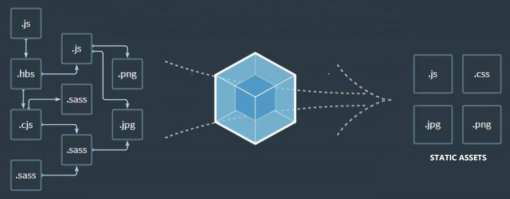

# Webpack 入口与出口

**Webpack Entry and Output**  

---

## Webpack 入口出口简介



在 Webpack 的构建过程中，图片中箭头开始位置的 `.js` 文件就是 Webpack 的资源入口文件。Webpack 会从该入口文件开始，根据其依赖关系，将所有相关联的文件模块打包成一个 `.js` 文件。本质上，这个打包后生成的 `.js` 文件就是 Webpack 构建的资源出口。

然而，这个单一的 `.js` 文件通常并不是我们最终期望的打包结果。我们希望将资源拆分为更细粒度的文件，例如独立的 JavaScript 文件、CSS 文件和图片资源等。幸运的是，Webpack 提供了强大的功能来实现这一目标。在构建过程中，我们可以通过 Webpack 的**预处理器（Loader）**和**插件（Plugin）**进行干预，将一个 `.js` 文件拆解为 JavaScript、CSS、图片等多种资源。

## 模块化 import 与 require 及区别

### JavaScript 模块化历史

在 JavaScript 的早期阶段，这门语言并没有模块化的概念，因为它的设计初衷仅仅是作为网页中的小脚本使用。然而，随着 JavaScript 在 Web 应用中的广泛使用，缺乏模块化机制逐渐成为其发展的瓶颈。

为了解决这一问题，社区提出了一些模块化规范，其中较为著名的包括 **CommonJS**、**AMD** 和 **CMD** 等。这些规范在一定程度上缓解了 JavaScript 模块化的问题，但由于规范众多且不统一，开发者需要学习和适应不同的模块化方案，增加了开发和维护的成本。

为了解决这一问题，JavaScript 在 **ES6** 语言标准中引入了自己的模块化方案，即 **ES6 Module**。经过五年的发展，ES6 Module 已经成为 JavaScript 开发中的主流模块化方案。目前，JavaScript 开发中主要使用的模块化方案是 **ES6 Module** 和 **CommonJS**。

### ES6 Module

ES6 Module 是 JavaScript 语言标准中提出的模块化方案，主要通过 `import` 进行模块导入，`export` 进行模块导出。

#### 1. export 模块导出

`export` 用于将模块中的变量、函数或对象暴露给外部使用。以下是几种常见的导出方式：

- **命名导出**：直接导出变量或函数。

  ```javascript
  // a.js
  export var name = 'Jack';
  export var age = 18;
  export function add(a, b) {
    return a + b;
  }
  ```

- **集中导出**：将需要导出的内容集中在一个 `export` 语句中。

  ```javascript
  // b.js
  var name = 'Jack';
  var age = 18;
  function add(a, b) {
    return a + b;
  }
  export { name, age, add };
  ```

- **默认导出**：使用 `export default` 导出匿名模块，通常用于导出单个值或对象。

  ```javascript
  // c.js
  export default {
    price: 285,
    id: 12,
  }
  ```

#### 2. import 模块导入

`import` 用于从其他模块中导入内容。以下是几种常见的导入方式：

- **导入默认导出的模块**：使用自定义变量接收默认导出的值。

  ```javascript
  // d.js
  import moduleC from './c.js';
  console.log(moduleC); // 输出 { price: 285, id: 12 }
  ```

- **导入命名导出的模块**：使用大括号 `{}` 导入指定的变量或函数。

  ```javascript
  // e.js
  import { name, age, add } from './b.js';
  console.log(name, age); // 输出 'Jack' 和 18
  console.log(add(1, 8)); // 输出 9
  ```

- **仅执行模块**：使用 `import '...'` 导入模块并执行其内容，但不使用其导出的接口。

  ```javascript
  import './f.js'; // 执行 f.js 中的代码
  ```

#### 3. import() 函数

`import()` 是 ES2020 提案中引入的动态导入语法，与静态的 `import` 语法不同，`import()` 可以在运行时动态加载模块。Webpack 早已支持该语法。

- **动态导入模块**：

  ```javascript
  import('./f.js').then(module => {
    console.log(module); // 处理导入的模块
  });
  ```

- **原理**：Webpack 在打包时，遇到 `import()` 并不会立即将模块内容打包到当前文件中，而是在运行时动态生成 `<script>` 标签来加载模块。`import()` 返回一个 Promise 对象，可以通过 `.then()` 处理异步加载的模块。

### CommonJS

CommonJS 是另一种流行的 JavaScript 模块化规范，主要在 Node.js 中使用。需要注意的是，Node.js 对 CommonJS 的实现与规范本身存在一些细微差别。

#### 1. module.exports 模块导出

`module.exports` 用于将模块中的内容暴露给外部使用。

```javascript
// g.js
module.exports = {
  name: 'Gola',
  age: 25
};
```

#### 2. require() 模块导入

`require()` 用于从其他模块中导入内容。

```javascript
// h.js
var person = require('./g.js');
console.log(person); // 输出 { name: 'Gola', age: 25 }
```

#### 3. 动态导入模块

在旧版本的 Webpack 中，`require.ensure` 被用于动态导入模块。不过，现在推荐使用 `import()` 函数来实现动态导入。

```javascript
require.ensure(['./moduleA'], function(require) {
  var moduleA = require('./moduleA');
  console.log(moduleA);
});
```


## entry 入口

### Webpack基础目录context

之前，文章在 `webpack.config.js` 的配置中其实省略了一个配置参数context，Webpack官方称之为基础目录（Base Directory）。

`context` 决定了 Webpack 在解析 `entry` 路径时的基准目录。如果没有显式配置 `context`，Webpack 默认会将项目根目录作为基础目录。通过设置 `context`，我们可以更灵活地指定资源入口的起点，尤其适用于项目结构较为复杂的情况。

> 以下配置展示了如何使用 `context` 指定基础目录：
>
> ```javascript
> var path = require('path');  
> module.exports = {
>     context: path.resolve(__dirname, './src'), // 指定基础目录为 ./src
>     entry: './js/a.js', // 入口文件为 ./src/js/a.js
>     output: {
>         path: path.resolve(__dirname, ''), // 输出目录为项目根目录
>         filename: 'bundle.js' // 输出文件名为 bundle.js
>     },
>     mode: 'none'
> };
> ```
>
> - 上述配置表示从工程根目录下的 `src/js/a.js` 文件开始打包。`a.js` 文件中可能还引入了 `b.js`，Webpack 会递归地解析这些依赖文件，最终将所有相关模块打包到 `bundle.js` 中。

### entry 资源入口

Webpack 的资源入口 `entry` 表示从哪个文件开始打包。`entry` 的路径是相对于 `context` 的相对路径。除了字符串形式，`entry` 还可以是数组、对象或函数形式。

#### 1. 字符串形式

字符串形式是最简单的 `entry` 配置，表示打包的入口文件。

```javascript
module.exports = {
  entry: './a.js', // 入口文件为 a.js
};
```

#### 2. 数组形式

数组形式的 `entry` 表示多个文件作为入口，其中最后一个文件是实际的入口文件，其余文件会预先构建到入口文件中。

```javascript
module.exports = {
  entry: ['core-js/stable', 'regenerator-runtime/runtime', './a.js'],
};
```

上述配置与以下代码等效：

```javascript
// a.js
import 'core-js/stable';
import 'regenerator-runtime/runtime';

// webpack.config.js
module.exports = {
  entry: './a.js',
};
```

数组形式的 `entry` 本质上仍然是单入口配置。

#### 3. 对象形式

对象形式的 `entry` 又称为**多入口配置**，适用于需要生成多个打包文件的场景。

```javascript
var path = require('path');  
module.exports = {
  entry: {
    app: ['core-js/stable', 'regenerator-runtime/runtime', './a.js'],
    vendor: './vendor.js'
  },
  output: {
    path: path.resolve(__dirname, ''),
    filename: '[name].js' // 使用 [name] 占位符生成不同的文件名
  },
  mode: 'none'
};
```

上述配置会分别从 `a.js` 和 `vendor.js` 两个入口文件开始打包，最终生成 `app.js` 和 `vendor.js` 两个文件。

#### 4. 函数形式

函数形式的 `entry` 允许通过函数返回值动态生成入口配置，返回值可以是字符串、数组或对象。

```javascript
module.exports = {
  entry: () => {
    // 动态生成入口配置
    return './a.js';
  }
};
```

函数形式的 `entry` 通常用于需要根据特定条件动态调整入口配置的场景，但在实际开发中较少使用。

## output 出口

**module.exports** 中 `output` 是资源出口的配置项，它是一个包含多个重要属性的对象，包括 `filename`、`path`、`publicPath` 和 `chunkFilename`。

### output.filename

`filename` 用于指定打包后生成的资源名称，可根据需要更改名称的值。此外，`filename` 还可以是一个相对路径，例如 `'./js/bundle.js'`。最终打包输出的文件路径是 `path` 绝对路径与 `filename` 的拼接结果。

`filename` 还支持使用类似变量的方式生成动态文件名：

- `[hash]`: 方括号内的 `hash` 表示特定的动态值。

  > 例如，以下配置将生成一个以当前打包 hash 值为文件名的 JavaScript 文件：
  >
  > ```javascript
  > var path = require('path');
  > module.exports = {
  >   entry: './a.js',
  >   output: {
  >     path: path.resolve(__dirname, ''),
  >     filename: '[hash].js'
  >   },
  >   mode: 'none'
  > };
  > ```
  >
  > 执行 `npx webpack` 打包后，控制台将显示生成的 hash 值，例如 `eaf163aa8342f012d6ee`，因此生成的文件名就是 `eaf163aa8342f012d6ee.js`。

- `[name]` : 表示 chunk 的名称。chunk 是 Webpack 打包过程中的一个概念，简单理解就是一个资源入口或一个异步模块资源。

  - 对于字符串或数组形式的 `entry`，`[name]` 的值为 `main`。
  - 而对于对象形式的多入口配置，`[name]` 则是对象的属性名，对应每一个入口文件。

  > ```js
  > const path = require('path');
  > module.exports = {
  >     entry: './a.js',
  >     output: {
  >         path: path.resolve(__dirname, ''),
  >         filename: '[name].js'
  >     },
  >     mode: 'none'
  > };
  > ```
  >
  > 以上配置输出为 `main.js`
  >
  > ```js
  > const path = require('path');
  > module.exports = {
  >     entry: {
  >         app1: './a.js',
  >         app2: './f.js',
  >     },
  >     output: {
  >         path: path.resolve(__dirname, ''),
  >         filename: '[name].js'
  >     },
  >     mode: 'none'
  > };
  > ```
  >
  > 以上配置输出为 `a.js`、`f.js`

- 特定动态值还有`[chunkhash]`和`[contenthash]`等。

### output.path

`path` 用于指定资源打包后输出的位置，该位置必须是一个绝对路径。如果不设置，Webpack 默认将其设置为 `dist` 目录。

需要注意的是，`path` 表示的是在磁盘上构建生成的真实文件存放地址。在开发时，我们通常会使用 `webpack-dev-server` 开启一个本地服务器，该服务器生成的文件位于内存中，而不是磁盘上。内存中的文件路径可以通过 `devServer` 配置项的 `publicPath` 来表示，它虚拟映射了磁盘路径。

### output.publicPath

`publicPath` 用于指定资源的访问路径（此处`publicPath`指的是`output`中的配置，和`devServer`的`publicPath`配置不一样。

它与 `path` 的区别在于，`path` 表示资源存放的磁盘位置，而 `publicPath` 表示浏览器访问该资源的路径。`publicPath` 可以是相对路径或绝对路径。

- **相对路径**分为两种情况：

  - 一种是以 `"./"` 或 `"../"` 开头，表示资源以当前页面 URL 作为基础路径；
  - 另一种是以 `"/"` 开头，表示资源以当前页面的服务器地址作为基础路径。

- **绝对路径**则以 HTTP 协议名称开始，通常在使用 CDN 时采用这种方式，因为CDN的域名与我们自己服务器的域名不一样，我们会采用这种方式。

- **相对协议**的形式以 // 开头，也就是省略了前面的https:或http:。在使用相对协议的时候，浏览器会对前页面使用的协议名称与相对协议拼接。

  - > 相对协议示例
    >
    > ```js
    > // 设当前协议为 https
    > publicPath: "//cdn.apple.net/dist/"
    > // 资源的访问地址是https://cdn.apple.net/dist/bundle-3fa2.js
    > ```

### output.chunkFilename

`chunkFilename` 用于指定打包过程中非入口文件的 chunk 名称，通常在使用异步模块时会生成非入口文件的 chunk。

它与 `filename` 的区别在于，`filename` 用于指定入口文件的名称，而 `chunkFilename` 用于指定非入口文件的名称。

## hash、chunkhash和contenthash区别

### 浏览器缓存机制

当用户访问网页时，JS/CSS/图片等资源会触发下载行为。为提高二次访问效率，浏览器采用缓存机制：服务器通过`Cache-Control`等响应头指定资源有效期，在此期间浏览器将直接使用本地副本。

**缓存更新痛点**：当资源内容变更时，若文件名不变，浏览器仍会使用过期缓存。解决方案是通过唯一文件名标识内容版本，如`jquery-3b551ac6.js`。

只要资源变动了，我们就需要用一个新的名字。那么我们如何保证每次变动后新的名字都是唯一的呢？这就要用到 hash 相关的知识。

### Webpack 与 hash 算法

在使用 Webpack 对构建的时候，Webpack 会根据所有的文件内容计算出一个特殊的字符串。只要有文件的内容变化了，Webpack 就会计算出一个新的特殊字符串。

Webpack 在根据文件内容计算出一个特殊字符串的时候，使用的就是 hash 算法，这个特殊字符串一般叫做 hash 值。

一般取计算出的特殊字符串的前八位作为文件名的一部分，因为hash算法计算出的前八位基本可以保证唯一性了。

### 三种哈希的区别

Webpack通过哈希算法生成内容标识符，主要提供三种模式。

hash、chunkhash 和 contenthash 这三者都是根据文件内容计算出的 hash 值，只是它们所计算的文件不一样。

|  哈希类型   |       计算范围        |   典型应用场景   |
| :---------: | :-------------------: | :--------------: |
|    hash     |     项目所有文件      | 全局文件变更感知 |
|  chunkhash  |   当前代码块(chunk)   |    多入口项目    |
| contenthash | 特定资源内容（如CSS） |   提取CSS文件    |

hash 是根据打包中所有的文件计算出的 hash 值。在一次打包中，所有出口文件的 filename 获得的[hash] 都是一样的。

chunkhash 是根据打包过程中当前 chunk 计算出的 hash 值。如果 Webpack 配置是多入口配置，那么通常会生成多个 chunk，每个 chunk 对应的出口 filename 获得的 [chunkhash] 是不一样的。这样可以保证打包后每一个 JS 文件名都不一样。

contenthash 有点类似 chunkhash，是根据打包时内容计算出 hash 值。一般在使用提取 CSS 的插件的时候，我们使用 contenthash。
