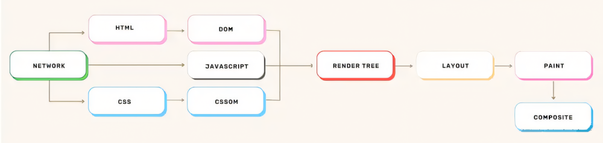
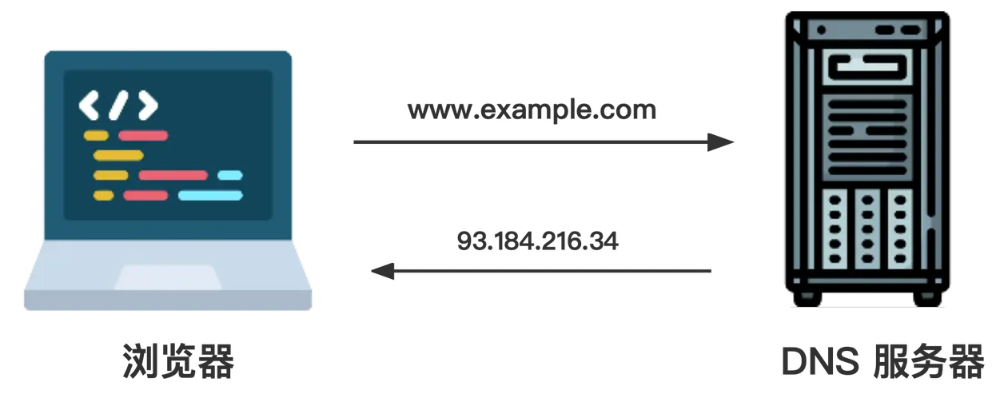
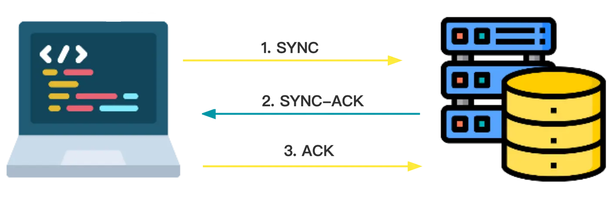
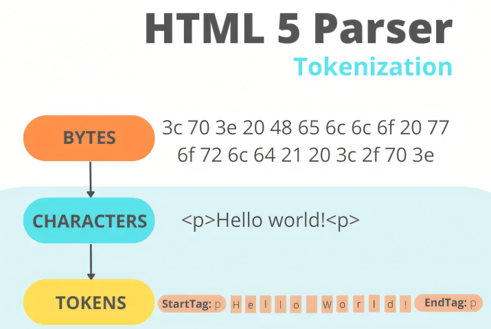
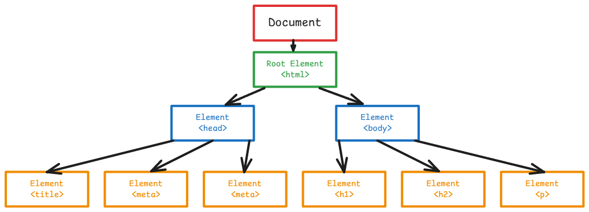
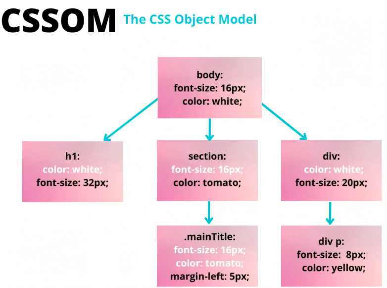
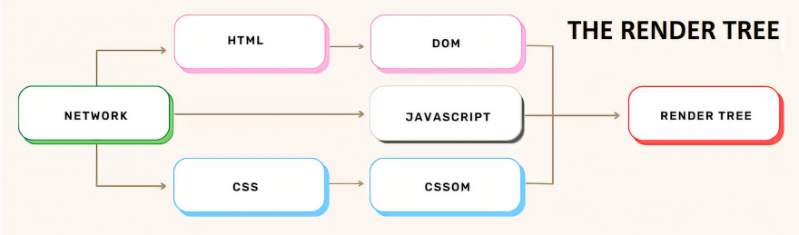
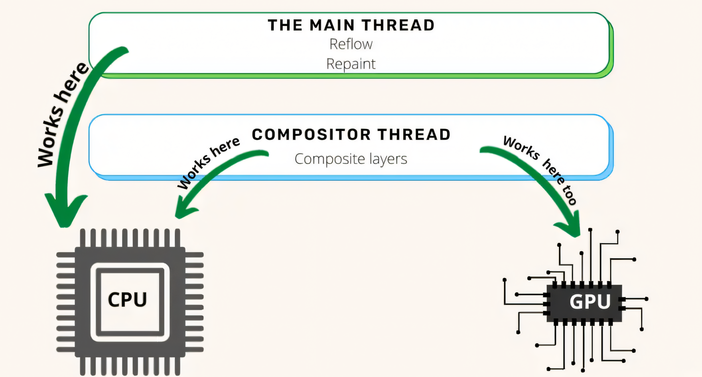

# 浏览器原理及工作流程

---

## 前言

当我们在地址栏输入网址并按下回车键，到最终页面完整呈现在屏幕上，这看似简单的操作背后隐藏着一系列精密的网络通信和浏览器处理流程。

浏览器工作流程大致分为以下步骤：DNS 解析 —— HTTP 请求资源 —— 解析 HTML 创建 DOM 树 —— 解析 CSS 创建 CSSOM —— 执行 Javascript —— 创建 Render 树 —— 布局Layout（重排）—— 绘制 Painting（重绘）



本文将详细探讨学习浏览器的原理及工作流程，助力前端开发。


## 一、导航

导航是加载网页的第一步。它指的是当用户通过`点击一个链接`、`在浏览器地址栏中写下一个网址`、`提交一个表格`等方式请求一个网页时发生的过程。

### DNS 解析

浏览器访问网站的第一步是定位网页静态资源所在的服务器位置。

当我们输入`example.com`这样的域名时，实际上需要找到对应的IP地址才能建立连接。这个转换过程就是通过**DNS（Domain Name System）**查询完成的。如果我们以前从未访问过这个网站，就必须进行域名系统（DNS）查询。

> DNS服务器相当于互联网的"电话簿"，存储着**域名与IP地址的映射关系**。全球分布着600多台`DNS根服务器`，共同构成了这个分布式数据库系统。

DNS 查询实际是浏览器与这些DNS服务器的其中一个进行对话，要求找出与[example.com](https://link.juejin.cn/?target=https%3A%2F%2Fexample.com) 名称相对应的IP地址并返回。若查找失败，就会向浏览器发送错误信息。

DNS 查询只发生在我们第一次访问一个网站时（浏览器未储存该域名的解析记录）。查询后 IP 地址可能会被缓存一段时间，所以下次访问同一个网站会更快，因为不需要进行 DNS 查询。



### TCP 连接

浏览器获取网站的 IP 地址后，将尝试通过 **TCP (Transmission Control Protocol，传输控制协议)** 三次握手（也称为 SYN-SYN-ACK，或者更准确的说是 SYN、SYN-ACK、ACK，因为 TCP 有三个消息传输，用于协商和启动两台计算机之间的TCP 会话），与持有资源的服务器建立连接。

**TCP三次握手过程**：

1. **SYN**：客户端发送SYN=1, Seq=X的同步报文（客户端测试服务端接收能力）
2. **SYN-ACK**：服务器回应SYN=1, ACK=X+1, Seq=Y （服务端确认客户端发送能力，服务端测试客户端接收能力）
3. **ACK**：客户端发送ACK=Y+1, Seq=Z（客户端确认服务端发送能力，客户端确认服务端接收能力，服务端确认客户端接收能力）

**三次握手原因**：

1. 确认双方的收发能力：通过往返通信验证客户端和服务器都能正常发送和接收数据
2. 防止历史连接干扰：避免因网络延迟导致的旧连接请求突然到达服务器而产生错误

**TCP协议特点**：

- 面向连接的可靠传输
- 提供流量控制和拥塞控制机制
- 保证数据顺序和完整性



### TLS 协商

对于通过 HTTPS 建立的安全连接，需要进行另一次握手。

**TLS（Transport Layer Security，传输层安全协议）**是SSL（Secure Sockets Layer）的继任者，是一种`加密协议`，设计用于在计算机网络上提供通信安全。

它位于传输层之上、应用层之下，为HTTP（HTTPS）、SMTP、FTP等应用层协议提供安全保障。

这种握手（TLS协商）决定了哪个密码将被用于加密通信，验证服务器，并在开始实际的数据传输之前建立一个安全的连接。

**TLS 握手步骤**：

1. **客户端 hello**。浏览器向服务器发送一条信息，其中包含：
   - 客户端支持的`最高TLS版本`
   - `密码套件`，即客户端支持的所有加密算法组合
   - `客户端随机数`即一串随机字节（32字节，4字节时间戳+28字节随机数） 。
2. **服务器 hello 和证书**。服务器发回一条信息，其中包含：
   - 确定双方都将使用的`TLS版本`
   - `服务器SSL证书` 与 `完整的证书链`（从叶证书到可信根证书）
   - `服务器选择的密码套件`
   - `服务器随机数`
3. **浏览器进行证书认证**。通过以下步骤，浏览器就可以确定服务器就是访问目标。
   1. 检查证书有效期与吊销状态。
   2. 向颁发证书的机构核实服务器的 SSL 证书。
4. **密钥交换**。
   1. 客户端生成46字节随机数，称为`预主密钥（Pre-Master Secret）`，从服务器的 `SSL 证书`上获取`公钥`进行加密，之后发送给服务器。
   2. 服务器用`私钥`解密`预主密钥`。
   3. 客户端和服务器各自用`PRF`(伪随机函数算法)独立计算得到`主密钥`：$主密钥 = PRF(预主密钥,'mastersecret',客户端随机数+服务端随机数)$
5. **会话密钥生成**。
   - 客户端和服务器各自用`PRF`独立计算`会话密钥`：$会话密钥 = PRF(主密钥,'keyexpansion',客户端随机数+服务端随机数)$
   - 根据服务器在`服务器 hello`中选定密码套件处理密钥，最终确定密钥。
6. **客户端完成**。浏览器向服务器发送一个消息，说它已经完成。
7. **服务器完成**。服务器向浏览器发送一个消息，表示它也完成了。
8. **安全对称加密实现**。握手完成，通信可以继续使用会话密钥。

现在可以开始从服务器请求和接收数据了。


## 二、获取资源

浏览器获取资源的方式主要靠 `HTTP` 通信。

在我们与服务器建立安全连接后，浏览器将发送一个初始的 HTTP GET 请求。首先，浏览器将请求页面的 HTML 文件。

### URI

**URI** 是统一资源识别符的缩写，用于识别互联网上的抽象或物理资源，如网站或电子邮件地址等资源。一个 URI 最多可以有 5 个部分。

示例：`https://example.com/users/user?name=Alice#address`

| 组成部分  |   示例值    |     说明     |
| :-------: | :---------: | :----------: |
|  scheme   |   https:    |  使用的协议  |
| authority | example.com |     域名     |
|   path    | users/user  |   资源路径   |
|   query   | name=Alice  |   请求参数   |
| fragment  |   address   | 资源片段标识 |

### HTTP 请求

**HTTP（Hypertext Transfer Protocol，超文本传输协议）**是一个获取资源的协议，如HTML文件。它是网络上任何数据交换的基础，它是一个客户 - 服务器协议，这意味着请求是由接收者发起的，通常是网络浏览器。

**请求方法 -** POST, GET, PUT, PATCH, DELETE 等

**HTTP 头字段 -** 是浏览器和服务器在每个 HTTP 请求和响应中发送和接收的字符串列表（它们通常对终端用户是不可见的）。在请求的情况下，它们包含关于要获取的资源或请求资源的浏览器的更多信息。

### HTTP 响应

一旦服务器收到请求，它将对其进行处理并回复一个 `HTTP 响应`。在响应的正文中，我们可以找到所有相关的响应头和我们请求的HTML文档的内容

**状态代码 -** 例如：200、400、401、504网关超时等（我们的目标是 200 状态代码，因为它告诉我们一切正常，请求是成功的）

**响应头字段 -** 保存关于响应的额外信息，如它的位置或提供它的服务器。

**相应体 -** 包含返回的内容

### TCP 慢启动和拥塞算法

`TCP 慢启动` 是一种平衡网络连接速度的算法。

1. **慢启动**：
   - 初始传输14kb或更小的数据包
   - 逐步增加传输量直至达到阈值
   - 确保网络连接不被过载
2. **拥塞控制**：
   - 从服务器接收到每个数据包后，通过以 `ACK 消息`响应，监测网络状况。
   - 由于连接容量有限，若服务器发送太多数据包太快，它们将被丢弃。
   - 当数据包丢失时（表现为客户端不相应ACK），服务端自动降低传输速率。
   - 监控发送的数据包和 ACK 消息的流，动态调整传输速率以维持稳定流量。


## 三、HTML 解析

在向服务器发出初始请求后，浏览器收到 HTML 资源（第一块数据）的响应。 现在浏览器的工作就是开始解析数据。

**解析**是指将程序分析并转换为运行时环境实际可以运行的内部格式。换句话说，将代码（HTML、CSS）转换为浏览器可以使用的内容。 

解析将由浏览器引擎完成（不要与浏览器的 Javascript 引擎混淆）。

浏览器引擎是每个主要浏览器的核心组件，它的主要作用是结合结构 (HTML) 和样式 (CSS)，以便它可以在我们的屏幕上绘制网页。 它还负责找出哪些代码片段是交互式的。 我们不应将其视为一个单独的软件，而应将其视为更大软件（在我们的例子中为浏览器）的一部分。

HTML 解析涉及两个步骤：**词法分析** 和 **树构造**

### 词法分析阶段

词法分析器将 HTML 文本分解为基本语法单元（token），类似于将英文句子分解为单词的过程。分析结果包含以下类型的token：

- DOCTYPE声明
- 开始标签（`<tag>`）
- 结束标签（`</tag>`）
- 自闭合标签（`<tag/>`）
- 属性名
- 属性值
- 注释内容
- 文本内容
- 文件结束标记



### DOM 树构建阶段

创建第一个 token 后，`树构建`开始。 这实质上是基于先前解析的标签创建`树状结构`（称为文档对象模型）。**DOM 树(Document Object Model)**描述了 HTML 文档的内容。

基于词法分析产生的 token 序列，解析器构建文档对象模型(DOM)树：

1. `<html>`元素作为文档根节点
2. 元素间的嵌套关系形成父子节点结构
3. 深度越大的DOM树需要更长的构建时间



实际上，DOM 比该模式中看到的更复杂，此处保持简单以便更好地理解。

此构建阶段是`可重入的`，这意味着在处理一个 token 时，分词器可能会恢复，导致在第一个 token 处理完成之前触发并处理更多 token。从字节到创建 DOM，整个过程如下所示：


- **非阻塞资源**：异步加载，不中断解析
  - 如图像
- **阻塞资源**：暂停解析直至加载完成
  - 如CSS 样式表、`<head>` 部分添加的 Javascrpt 文件、从 CDN 添加的字体

解析器从上到下逐行工作。 当解析器遇到非阻塞资源时，浏览器会向服务器请求资源并继续解析。 若它遇到阻塞资源，解析器将停止执行，直到所有这些阻塞资源都被下载。

这解释了为何建议以下操作：将`<script>` 标签置于 HTML 文件的末尾，或`<script>` 标签置于 `<head>` 标签时添加 defer 或 async 属性（ async 允许在下载脚本后立即执行异步操作，而 defer 只允许在整个文档被解析后执行。）。

### 预加载器

现代浏览器采用预加载器优化策略，作为处理阻塞资源的一种方式，尤其是脚本：

1. 当遇到阻塞脚本时，第二个轻量级预加载器扫描后续 HTML 查找需要检索的资源（样式表、脚本等）。
2. 预加载器在后台将找到的需检索的资源提前发送请求。

**预加载器的作用**：在主 HTML 解析器遇到阻塞资源时，它们可能已经被下载（如果这些资源已经被缓存，则跳过此步骤）。

**优势**：显著减少资源等待时间、充分利用网络空闲带宽、对缓存资源实现快速加载。


## 四、解析 CSS

解析完 HTML 之后，轮到解析 **CSS(Cascading Style Sheets）**代码，并构建 CSSOM 树（CSS 对象模型）。

就像从 HTML 构建 DOM 一样，从 CSS 构建 CSSOM 被认为是一个 `渲染阻塞` 过程。

### 词法分析和构建 CSSOM

与 HTML 解析类似，CSS 解析从词法分析开始：

1. **字节流解码**：将网络字节转换为UTF-8字符
2. **Token生成**：识别`@规则`、选择器、声明块等语法单元
3. **规则集构建**：将相关规则分组存储
4. **样式计算**：处理继承与层叠逻辑

CSS 规则是从右到左阅读的，若有代码： `section p { color: blue; }`, 浏览器将先找页面上的所有 p 标签，然后它会查看这些 p 标签中是否有一个 section 标签作为父标签。 

#### 样式计算

浏览器按特定`顺序`处理样式规则，越往后的样式会覆盖之前的样式（**级联规则处理**）：

1. **继承机制**：浏览器从适用于节点的最通用规则开始，子元素继承可继承属性
   - 例如：如果某节点是 body 元素的子节点，该节点继承所有 body 可继承样式
2. **默认样式**：应用浏览器默认样式表
3. **作者样式**：处理开发者定义的样式
4. **重要声明**：应用`!important`规则
5. **内联样式**：处理元素style属性

#### 选择器匹配

优先级按以下规则计算（从高到低）：

1. `内联样式`（1000分）
2. `ID选择器`（100分/个）
3. `类/属性/伪类`（10分/个）
4. `元素/伪元素`（1分/个）

> 假设我们有下面的 HTML 和 CSS：
>
> ```css
> body {
>   font-size: 16px;
>   color: white;
> } 
> h1 {
>   font-size: 32px;
> }
> section {
>   color: tomato;
> }
> section .mainTitle {
>   margin-left: 5px
> }
> div {
>   font-size: 20px;
> }
> div p {
>   font-size:  8px;
>   color: yellow;
> }
> ```
>
> 这段代码的 CSSOM 看起来像这样：
>
> 

## 五、执行 Javascript

在 Javascript 代码资源获取后，浏览器会调用 Javascript 引擎对代码进行编译。

### Javascript 引擎

JavaScript引擎是现代Web技术的核心组件，它将高级JavaScript代码转换为机器可执行的指令。（不要与浏览器引擎混淆）。 根据浏览器的不同，JS 引擎可以有不同的名称和不同的工作方式。

|    引擎名称    |    所属浏览器/环境    | 开发语言 |    显著特性    |
| :------------: | :-------------------: | :------: | :------------: |
|       V8       | Chrome, Node.js, Edge |   C++    |  分层编译架构  |
| JavaScriptCore |        Safari         |   C++    | 低级字节码优化 |
|  SpiderMonkey  |        Firefox        | C++/Rust | 多阶段编译管道 |
|     Chakra     |        Legacy         |   C++    |  后台JIT编译   |

Javascript 引擎有 3 种工作方式：`编译`、`解释`、`即时编译( JIT Compilation )`

- **编译**：将用高级语言编写的代码一次性转换为机器代码。
- **解释**：逐行检查 Javascript 代码并立即执行。
- **即时编译( JIT Compilation )**：即时编译是给定语言的解释器的一个特性，它试图同时利用编译和解释。 在 JIT 编译中，代码在执行时（在运行时）被编译。 可以说源代码是动态转换为机器代码的。 较新版本的 Javascript 使用这种类型的代码执行。

事实上，尽管 Javascript 是一种解释型语言（它不需要编译），但如今大多数浏览器都会使用 JIT 编译来运行代码，而不是纯粹的解释型语言。

JIT 编译的一个很重要的方面就是将源代码编译成当前正在运行的机器的机器码指令。 这意味着生成的机器代码是针对正在运行的机器的 CPU 架构进行了优化。

### Javascript 处理

当 Javascript 代码进入 Javascript 引擎时，它首先被解析。 这意味着代码被读取，并且在这种情况下，代码被转换为称为`抽象语法树` (AST) 的数据结构。 代码将被拆分成与语言相关的部分（如 `function` 或 `const` 关键字），然后所有这些部分将构建抽象语法树。

构建 AST 后，它会被翻译成机器代码并立即执行，因为现代 Javascript 使用即时编译。 这段代码的执行将由 Javascript 引擎完成，利用称为“调用堆栈”的东西。


## 六、创建可访问（无障碍）树

除了我们一直在讨论的所有这些树（DOM、CSSOM 和 AST）之外，浏览器还构建了**可访问（无障碍）树（Accessibility Tree，ACT）**。

可访问性树是浏览器基于DOM构建的**语义化表示结构**，它充当了网页内容与辅助技术之间的桥梁。与渲染树不同，ACT专注于内容的语义表达而非视觉呈现。在未构建 ACT 之前，屏幕阅读器无法访问内容。

一般而言，残疾用户可以并且确实在使用具有各种辅助技术的网页。 他们使用屏幕阅读器、放大镜、眼动追踪、语音命令等。 为了让这些技术发挥作用，它们需要能够访问页面的内容。 由于他们无法直接读取 DOM，因此 ACT 开始发挥作用。

构建可访问的Web应用不仅是道德责任，在许多地区更是法律要求。通过深入理解可访问性树的工作原理，开发者可以创建出真正包容的数字产品，服务全球13亿残障人士。记住：优秀的无障碍实现应该像氧气一样 —— 最好的设计是那些不被注意到却始终存在的设计。


## 七、渲染树

**渲染树（Render Tree）**是浏览器将 DOM 和 CSSOM 合并后生成的中间表示，它决定了哪些内容最终会显示在屏幕上。渲染树的目的是确保页面内容以正确的顺序绘制元素。 它将作为在屏幕上显示像素的绘画过程的输入。

构建过程遵循以下步骤：

1. **节点筛选**：从 `DOM 树的根部`开始遍历DOM树，找到需渲染节点，忽略以下节点：
   - 不可见元素（`<meta>`、`<script>`等）
   - 被CSS隐藏的节点（`display: none`）
2. **样式匹配**：为每个可见节点查找CSSOM中的对应规则
3. **树结构生成**：组合形成包含内容与样式的渲染树



### 布局（重排）阶段

渲染树包含有关显示哪些节点及其计算样式的信息，但不包含每个节点的尺寸或位置。

接下来需要做的是计算这些节点在设备视口（浏览器窗口内）内的确切位置及其大小。 这个阶段称为布局或重排。浏览器在渲染树的根部开始这个过程并遍历它。

浏览器通过以下步骤计算渲染树节点的几何信息：

1. **​视口尺寸计算​**​：基于viewport元标签
2. **从根节点开始遍历**：计算每个节点的精确位置和尺寸
3. **盒模型生成**：确定margin/border/padding/content区域
4. **坐标系建立**：转换为屏幕绝对坐标

布局步骤不只发生一次，每次更改 DOM 中影响页面布局的某些内容时，都会触发重排。

触发重排的常见操作：

|   操作类型   |            示例            | 性能影响 |
| :----------: | :------------------------: | :------: |
| 几何属性变更 |      修改width/height      |    高    |
| 位置属性变更 |     改变position/float     |    高    |
|   内容变化   |   文本增减/图片尺寸变化    |  中-高   |
|   样式查询   | offsetTop/getComputedStyle | 潜在触发 |

### 绘画（重绘）阶段

在浏览器决定哪些节点需要可见并计算出它们在视口中的位置后，就可以开始在屏幕上绘制它们（渲染像素）。 这个阶段也被称为`光栅化阶段`，浏览器将在布局阶段计算的每个盒子信息转换为屏幕上的实际像素。

就像布局阶段一样，绘画阶段也不只发生一次，每次改变屏幕上元素的任何外观时都会触发重绘。

**绘制顺序**：

1. 背景颜色
2. 背景图片
3. 边框
4. 子节点
5. 轮廓

### 分层和合成

绘画意味着浏览器需要将元素的每个视觉部分绘制到屏幕上，包括文本、颜色、边框、阴影和替换元素(如按钮和图像），并且需要超快地完成。

为了确保重绘可以比初始绘制更快地完成，屏幕上的绘图通常被分解成几层，绘画完成后进行合成。

通过合理利用分层和合成，可以显著提升复杂页面的渲染性能，尤其在动画和滚动场景下效果明显。但使用分层时，需占用更多的内存来获得支持。

**分层（Layers）**：浏览器将页面的各个部分分解为多个独立的图层，每个图层包含页面的特定部分（如文本、图片、动画元素等）。

**合成（Composition）**：合成是浏览器将多个图层按正确顺序在称为`合成器线程`的单独线程中合并为最终屏幕图像的过程。

当文档的各个部分绘制在不同的层中并相互重叠时，合成是必要的，以确保它们以正确的顺序绘制到屏幕上并且内容被正确呈现。



为了找出哪些元素需要在哪一层，主线程遍历布局树并创建层树。 默认情况下只有一层（这些层的实现方式因浏览器而异），但我们可以找到会触发重绘的元素，并为每个元素创建一个单独的层。 这样重绘不应应用于整个页面，而且此过程将可以使用到 GPU。

如果我们想向浏览器提示某些元素应该在一个单独的层上，我们可以使用 `will-change` CSS 属性。

触发分层的常见属性：

|       **属性**       |             **示例**              |        **说明**        |
| :------------------: | :-------------------------------: | :--------------------: |
|   `transform: 3D`    | `translateZ(0)`、`rotateY(45deg)` |  3D变换会触发独立图层  |
|    `will-change`     |     `will-change: transform`      | 提示浏览器元素即将变化 |
| `opacity`（动画中）  |        `opacity: 0.5 → 1`         | 透明度变化可能触发分层 |
| `<video>`/`<canvas>` |         视频、Canvas元素          |      默认独立图层      |
|  `position: fixed`   |           固定定位元素            |     避免滚动时重绘     |

### 关键区别

| **阶段** |        **触发条件**        | **性能成本** |         **优化目标**          |
| :------: | :------------------------: | :----------: | :---------------------------: |
| **重排** |  修改布局（如宽度、位置）  |      高      |     减少DOM操作，批量更新     |
| **重绘** | 修改外观（如颜色、透明度） |      中      |      使用CSS硬件加速属性      |
| **合成** |  图层变换（如移动、缩放）  |      低      | 优先使用`transform`/`opacity` |


​    

参考文章：

- [浏览器工作原理 - 掘金](https://juejin.cn/post/7204806134935306301?searchId=202504051353392A4AF327A59D01223650#heading-20)

