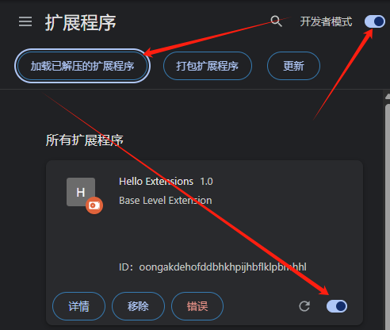
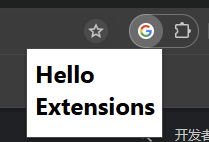
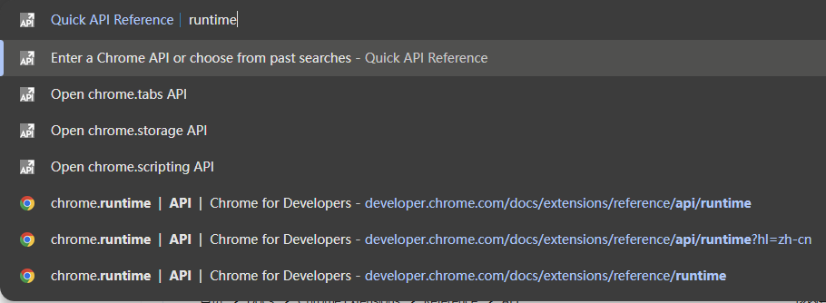
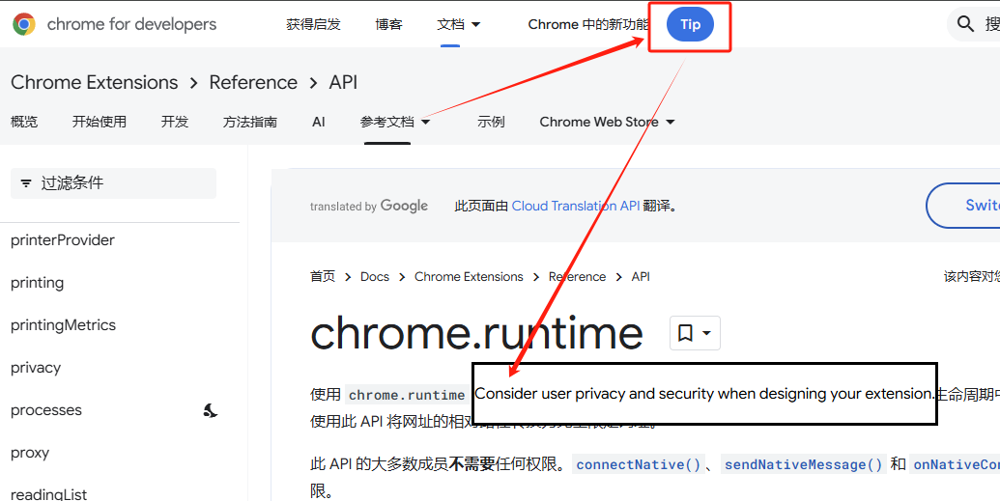

# Chrome 快速入门

**Chrome Extensions development**

---

## 简介

**Chrome扩展（Extension）**是基于Web技术（HTML、CSS、JavaScript）的小程序，用于增强浏览器的功能。它可以实现以下功能：

- 网页内容修改：如屏蔽广告、替换图片或视频封面。
- 工具栏与侧边栏扩展：添加自定义工具栏按钮、集成侧边栏以及上下文菜单，提供丰富的用户交互。
- 后台运行任务：通过Service Worker处理浏览器事件，如书签管理、标签页监控等。
- 代理管理：开发出可以替代SwitchyOmega的代理插件，实现智能代理切换。

### 核心术语与组件

每个 Chrome 扩展都由一系列关键组件和术语构成，这些元素共同协作，赋予扩展强大的功能与灵活性。

- **清单文件（Manifest）**：扩展的核心配置文件，文件名固定为`manifest.json`，位于扩展根目录中。它是扩展的“蓝图”，用于记录元数据、声明所需权限、定义要加载的脚本和页面，以及配置后台与前台运行的文件。清单文件是扩展启动和运行的基础，确保各个组件能够按照预设规则协同工作。
- **内容脚本（Content Scripts）**：在网页上下文中注入并运行的JavaScript代码。内容脚本可以直接操作DOM，实现网页元素的动态替换或注入自定义功能。它们是扩展与网页交互的桥梁，能够根据用户需求对网页内容进行实时修改和增强。
- **Service Worker**：作为后台脚本运行，是扩展的“大脑”。它负责处理浏览器事件和任务，例如监听网络请求、管理消息传递、事件响应等。Service Worker无法直接访问DOM，但可以通过事件监听与页面进行通信。在Manifest V3架构下，它成为扩展后台运行的标准，为扩展提供了高效、安全的后台处理能力。
- **工具栏操作（Browser Action）**：用户点击扩展图标后触发的事件。它常用于显示弹出式窗口或执行即时操作，是用户与扩展交互的最直接入口。通过工具栏操作，用户可以快速访问扩展的核心功能，提升使用体验。
- **侧边栏（Sidebar）**：在浏览器侧边区域展示自定义内容的组件。它为用户提供额外的信息或操作入口，能够在不干扰主网页内容的前提下，提供便捷的扩展功能。侧边栏是扩展与用户交互的重要补充，尤其适合需要持续展示信息或提供快捷操作的场景。
- **DeclarativeNetRequest**：用于拦截、屏蔽或修改网络请求的机制。它是提升扩展安全性和性能的关键工具，能够有效过滤恶意或不必要的网络流量，优化用户的浏览体验。通过DeclarativeNetRequest，扩展可以实现精准的网络请求管理，确保用户数据的安全与隐私。


## 基础开发

接下来将开发一个简单的 Chrome 扩展——**Hello Extensions**。当用户点击扩展程序工具栏图标时，它将显示一条欢迎消息：“Hello Extensions”。

### 构建扩展程序

1. 创建项目目录

   首先，创建一个用于存储扩展程序文件的新目录。这将是扩展程序的根目录，所有相关文件都将放置在此目录中。

2. 创建`manifest.json`

   - `manifest.json` 是扩展程序的核心配置文件，用于描述扩展程序的功能和配置。它必须放置在扩展程序的根目录中。以下是 `manifest.json` 的基本结构：

     ```json
     {
         "name": "Hello Extensions",
         "description": "Base Level Extension",
         "version": "1.0",
         "manifest_version": 3,
         "action": {
             "default_popup": "hello.html",
             "default_icon": "hello_extensions.png"  // 确保在根目录中放置一张图标图片
         }
     }
     ```

     - `"action"` 键用于声明 Chrome 应将哪张图片用作扩展程序的操作图标，以及在用户点击扩展程序图标时弹出的 HTML 页面。
3. 编写加载所需的 `hello.html`

   - 接下来，创建一个简单的 HTML 文件 `hello.html`，用于显示欢迎消息。

   ```html
   <html>
       <body>
           <h1>Hello Extensions</h1>
       </body>
   </html>
   ```

4. 加载未打包的扩展程序

   1. 在 chrome 的新标签页中输入 `chrome://extensions`

      - 或者，点击“扩展程序”菜单拼图按钮，然后选择菜单底部的**管理扩展程序**。
      - 或者，点击 Chrome 菜单，将鼠标悬停在**更多工具**上，然后选择**扩展程序**。

   2. 点击**开发者模式**旁边的切换开关，即可启用开发者模式。

   3. 点击`加载已解压缩的文件`按钮，然后选择扩展程序目录。

      

5. 点击拓展，打开 `Hello Extensions`，即可访问 html 文件。

   

6. 修改拓展文件后，需重新加载扩展程序。点击**开启**/**关闭**切换开关旁边的刷新图标即可刷新拓展。

### 使用 TypeScript

可以使用 npm 软件包 [chrome-types](https://www.npmjs.com/package/chrome-types) 来利用 `Chrome API` 的自动补全功能。当 Chromium 源代码发生变化时，此 npm 软件包会自动更新。


## 脚本注入当前活动标签页

接下来将构建一个扩展程序，用于简化 Chrome 扩展程序和 Chrome 应用商店文档页面的样式。

1. 使用扩展程序的服务工作器（Service Worker）作为事件协调者。
2. 通过 `"activeTab"` 权限保护用户隐私。
3. 在用户点击扩展程序工具栏图标时运行代码。
4. 使用 Scripting API 插入和移除样式表。
5. 分配键盘快捷键以快速启用或禁用功能。

### 构建扩展程序

完整项目文件地址：[Chrome-extensions-samples Github.com](https://github.com/GoogleChrome/chrome-extensions-samples/tree/main/functional-samples/tutorial.focus-mode)

1. 创建一个名为 `focus-mode` 的新目录，用于存放扩展程序的文件。

2. 添加扩展程序数据和图标

   1. 创建一个名为 `manifest.json` 的文件，并添加以下代码。

      ```json
      {
          "manifest_version": 3,
          "name": "Focus Mode",
          "description": "Enable focus mode on Chrome's official Extensions and Chrome Web Store documentation.",
          "version": "1.0",
          "icons": {
              "16": "images/icon-16.png",
              "32": "images/icon-32.png",
              "48": "images/icon-48.png",
              "128": "images/icon-128.png"
          }
      }

   2. 创建一个 `images` 文件夹，然后将[图标](https://github.com/GoogleChrome/chrome-extensions-samples/tree/main/functional-samples/tutorial.focus-mode/images)下载到该文件夹中。

3. 初始化扩展程序，使用服务工作器（Service Worker）在后台监控浏览器事件。服务工作器是一种特殊的 JavaScript 环境，用于处理事件，并在不需要时自动终止。

   1. 注册服务工作器，在 `manifest.json` 文件中添加服务工作器的注册信息：

      ```json
      {
        ...
        "background": {
          "service_worker": "background.js"
        },
        ...
      }
      ```

   2. 创建一个名为 `background.js` 的服务工作器文件，并添加以下代码：

      ```javascript
      chrome.runtime.onInstalled.addListener(() => {
        chrome.action.setBadgeText({
          text: "OFF",
        });
      });
      ```

      - 服务工作器将监听 `runtime.onInstalled` 事件，当插件首次安装或更新时，注册的回调函数会被执行。
      - `chrome.action.setBadgeText`是Chrome扩展API的一部分，用于设置插件图标的右上角的简短徽章文本。这里将徽章文本设置为`"OFF"`，表示插件的初始状态为关闭或未激活。

4. 设置启用扩展程序时的操作：当用户点击扩展程序图标时，扩展程序会运行代码。

   1. 声明扩展程序操作
      在 `manifest.json` 文件中添加以下代码：

      ```json
      {
        ...
        "action": {
          "default_icon": {
            "16": "images/icon-16.png",
            "32": "images/icon-32.png",
            "48": "images/icon-48.png",
            "128": "images/icon-128.png"
          }
        },
        ...
      }
      ```

   2. 保护用户隐私
      使用 `"activeTab"` 权限，扩展程序可以在当前活动标签页上临时执行代码，同时保护用户的隐私。将以下代码添加到 `manifest.json` 的 `permissions` 数组中：

      ```json
      {
        ...
        "permissions": ["activeTab"],
        ...
      }
      ```

      `"activeTab"` 权限允许扩展程序访问当前标签页的敏感属性，但不会触发权限警告。

   3. 跟踪当前标签页的状态。当用户点击扩展程序图标时，扩展程序会检查当前标签页的 URL 是否与目标页面匹配，并根据当前状态切换到下一个状态。

      添加逻辑到 `background.js` :

      ```javascript
      const extensions = "https://developer.chrome.com/docs/extensions";
      const webstore = "https://developer.chrome.com/docs/webstore";
      
      chrome.action.onClicked.addListener(async (tab) => {
        if (tab.url.startsWith(extensions) || tab.url.startsWith(webstore)) {
          // 获取当前状态
          const prevState = await chrome.action.getBadgeText({ tabId: tab.id });
          // 切换状态
          const nextState = prevState === "ON" ? "OFF" : "ON";
      
          // 更新徽章文本
          await chrome.action.setBadgeText({
            tabId: tab.id,
            text: nextState,
          });
        }
      });
      ```

      - `chrome.action.onClicked.addListener` 是一个事件监听器，当用户点击扩展图标时，注册的回调函数会被执行。
      - 用`chrome.action.getBadgeText` 获取当前页面id下(传入一个对象tab.id返回相应的信息)的扩展图标上的徽章文本。

5. 添加或移除样式表

   1. 创建一个名为 `focus-mode.css` 的文件，并添加以下代码：

      ```css
      * {
          ?
          display: none !important;
      }
      
      html,
      body,
      *:has(article),
      article,
      article * {
          display: revert !important;
      }
      
      [role='navigation'] {
          display: none !important;
      }
      
      article {
          margin: auto;
          max-width: 700px;
      }
      ```

      - 使用通用选择器（`*`）将所有元素的 `display` 属性设置为 `none`，并使用了 `!important` 来确保该规则优先级最高。
      - 再针对特定元素，覆盖了前面通用选择器的规则，重新设置 `display` 属性。
      - 选择所有 `role` 属性值为 `navigation` 的元素（通常是导航栏或菜单），将这些元素隐藏它们。

   2. 使用 `Scripting API` 插入或移除样式表。首先，在清单中声明 `"scripting"` 权限：

      ```json
      {
        ...
        "permissions": ["activeTab", "scripting"],
        ...
      }
      ```

   3. 最后，在 `background.js` 中添加以下代码以更改页面的布局：

      ```js
        ...
          if (nextState === "ON") {
            // Insert the CSS file when the user turns the extension on
            await chrome.scripting.insertCSS({
              files: ["focus-mode.css"],
              target: { tabId: tab.id },
            });
          } else if (nextState === "OFF") {
            // Remove the CSS file when the user turns the extension off
            await chrome.scripting.removeCSS({
              files: ["focus-mode.css"],
              target: { tabId: tab.id },
            });
          }
        }
      });
      ```

      > 同理，可以使用 `scripting.executeScript()` 来注入 JavaScript。

6. 分配键盘快捷键。为方便起见，我们添加了一个快捷方式，以便更轻松地启用或停用专注模式。

   ```json
   {
     ...
     "commands": {
       "_execute_action": {
         "suggested_key": {
           "default": "Ctrl+B",
           "mac": "Command+B"
         }
       }
     }
   }
   ```

   - `"_execute_action"` 按键会运行与 `action.onClicked()` 事件相同的代码，因此无需额外的代码。

7. 项目总结构如下：

   ```bash
   focus-mode
   ├── background.js
   ├── focus-mode.css
   ├── images
   │   ├── icon-128.png
   │   ├── icon-16.png
   │   ├── icon-32.png
   │   └── icon-48.png
   └── manifest.json
   ```

8. 加载拓展程序到 Chrome，打开以下任意页面，点击拓展图标，或按快捷键 `Ctrl + B`。

   - [欢迎参阅 Chrome 扩展程序文档](https://developer.chrome.com/docs/extensions?hl=zh-cn)
   - [在 Chrome 应用商店中发布](https://developer.chrome.com/docs/webstore/publish?hl=zh-cn)
   - [Scripting API](https://developer.chrome.com/docs/extensions/reference/api/scripting?hl=zh-cn)

9. 页面发生变化，测试成功。


## Service Worker 处理事件

接下来将介绍 Chrome 扩展程序中的服务工作器（Service Worker）的概念，并指导您构建一个扩展程序，让用户可以通过万能搜索框快速访问 Chrome API 参考页面。

**以下操作将涉及到**：

1. 注册服务工作器并导入模块。
2. 调试扩展程序的服务工作器。
3. 管理状态和处理事件。
4. 触发定期事件。
5. 与内容脚本通信。

**将要制作的拓展含有功能**：

1. 在多功能输入框中输入所查 API 后快捷打开 Chrome 拓展文档，包含打开建议和最近打开记录。
2. 定时获取谷歌

### 构建扩展程序

完整项目文件地址：[Chrome-extensions-samples Github.com](https://github.com/GoogleChrome/chrome-extensions-samples/tree/main/functional-samples/tutorial.quick-api-reference)

1. 创建一个名为 `quick-api-reference` 的新目录来存放扩展程序文件。

2. **注册服务工件，导入多个服务工件模块**

   1. 为了更好地维护代码，我们将服务工作器的功能拆分为多个模块。首先，需要在清单文件中将服务工作器声明为 ES 模块：

      ```json
      // manifest.json
      
      {
          "manifest_version": 3,
          "name": "Open extension API reference",
          "version": "1.0.0",
          "icons": {
              "16": "images/icon-16.png",
              "128": "images/icon-128.png"
          },
          "background": {
              "service_worker": "service-worker.js",
              "type": "module"
          }
      }
      ```

   2. 创建一个 `images` 文件夹，然后将[下载的图标](https://github.com/GoogleChrome/chrome-extensions-samples/tree/main/functional-samples/tutorial.quick-api-reference/images)下载到该文件夹中。
   3. 接下来，创建 `service-worker.js` 文件，并导入两个模块：

      ```javascript
      // service-worker.js
      import './sw-omnibox.js';
      import './sw-tips.js';
      ```

   4. 然后，创建 `sw-omnibox.js` 和 `sw-tips.js` 文件，并在每个文件中添加一个控制台日志：

      ```javascript
      // sw-omnibox.js
      console.log("sw-omnibox.js");
      
      // sw-tips.js
      console.log("sw-tips.js");
      ```

3. **通过地址栏便捷输入，跳转Chrome拓展文档 ：sw-omnibox**

   1. 初始化状态

      1. 由于服务工作器在不需要时会被关闭，因此我们需要使用 `chrome.storage` API 在多个会话中保留状态。为此，我们需要在清单文件中请求 `storage` 权限：

         ```json
         // manifest.json
         {
           // ...
           "permissions": ["storage"]
         }
         ```

      2. 接下来，在 `sw-omnibox.js` 文件中，通过监听 `runtime.onInstalled` 事件，在扩展程序首次安装时初始化状态：

         ```js
         // sw-omnibox.js
         chrome.runtime.onInstalled.addListener(({ reason }) => {
           if (reason === 'install') {
             chrome.storage.local.set({
               apiSuggestions: ['tabs', 'storage', 'scripting']
             });
           }
         });
         ```

         - 此处监听获取的`reason` 属性，表示触发事件的原因。意为检查触发事件的原因是否为首次安装。
         - 服务工作器无法直接访问 `window` 对象，因此无法使用 `window.localStorage`。此外，服务工作器是短时执行环境，会在用户的浏览器会话期间反复终止，因此不适合使用全局变量。建议使用 `chrome.storage.local` 在本地机器上存储数据。
         - `apiSuggestions: ["tabs", "storage", "scripting"]` 设置一个名为 `apiSuggestions` 的键，其值为一个包含三个字符串的数组（`"tabs"`, `"storage"`, `"scripting"`），记录设置。

   2. 注册事件

      1. 所有事件监听器都需要在服务工作器的全局范围内进行静态注册。换句话说，事件监听器不应嵌套在异步函数中，以便 Chrome 可以在服务工作器重新启动时恢复所有事件处理脚本。

         ```json
         // manifest.json
         {
           // ...
           "minimum_chrome_version": "102",
           "omnibox": {
             "keyword": "api"
           },
         }
         ```

         - `chrome.omnibox` 是 Chrome 扩展程序中的一个 API，允许开发者自定义用户在浏览器地址栏（也称为 Omnibox）中输入关键字后的行为。通过这个 API，扩展程序可以监听用户的输入，提供自定义的建议，并在用户选择建议后执行相应的操作。
         - 在脚本的顶级注册 Omnibox 事件监听器。当用户在地址栏中输入多功能框关键字 (`api`) 后跟 Tab 键或空格时，Chrome 会根据存储空间中的关键字显示建议列表。

      2. `onInputChanged()` 事件负责填充 Omnibox 触发的建议，它会接受当前用户输入和 `suggestResult` 对象。

         ```js
         //sw-omnibox.js
         
         // ...
         
         // 监听用户在地址栏输入时的变化事件
         chrome.omnibox.onInputChanged.addListener(async (input, suggest) => {
           // 设置默认的搜索建议，显示在建议列表的第一行
           await chrome.omnibox.setDefaultSuggestion({
             description: "Enter a Chrome API or choose from past searches",
           });
         
           // 从本地存储中获取之前保存的 API 建议列表
           const { apiSuggestions } = await chrome.storage.local.get("apiSuggestions");
         
           // 将 API 建议列表转换为适合显示在地址栏中的格式
           const suggestions = apiSuggestions.map((api) => {
             return { content: api, description: `Open chrome.${api} API` };
           });
         
           // 将生成的建议列表显示在地址栏中
           suggest(suggestions);
         });
         ```

      3. 用户选择某条建议后，`onInputEntered()` 将打开相应的 Chrome API 参考文档页面。

         ```js
         //sw-omnibox.js
         
         // ...
         
         // 确认输入后，打开对应的页面
         chrome.omnibox.onInputEntered.addListener((input) => {
           chrome.tabs.create({ url: URL_CHROME_EXTENSIONS_DOC + input });
           // 记录最新的输入，方便下一次提取最近的搜索字词用作多功能框建议
           updateHistory(input);
         });
         
         // 获取 Omnibox 输入并将其保存到 storage.local
         async function updateHistory(input) {
           const { apiSuggestions } = await chrome.storage.local.get("apiSuggestions");
           apiSuggestions.unshift(input);
           apiSuggestions.splice(NUMBER_OF_PREVIOUS_SEARCHES);
           return chrome.storage.local.set({ apiSuggestions });
         }
         ```

4. **设置定时器，到时自动更新每日提示。同时在 Chrome 文档导航栏中加入 `Tips` 按钮，点击后弹出每日提示。**

   1. 设置周期性活动

      1. `setTimeout()` 或 `setInterval()` 方法用于执行延迟或周期性任务。然而，这些 API 可能会失败，因为服务工作器终止时会取消计时器。因此，建议使用 `chrome.alarms` API。

      2. 首先，在清单文件中请求 `alarms` 权限，并添加网站权限：

         ```json
         // manifest.json
         
         {
           // ...
           "permissions": ["storage", "alarms"],
           "host_permissions": ["https://chrome.dev/f/*"]
         }
         ```

         - `host_permissions` 的作用是允许扩展程序在这些指定的网站上执行某些操作，例如发送网络请求、注入脚本或访问页面内容。

      3. 创建定时小提示程序

         ```js
         // sw-tips.js
         
         // 发送网络请求，从 Chrome 文档官网获取全部小提示，并随机选取一条存入本地。
         const updateTip = async () => {
           const response = await fetch('https://chrome.dev/f/extension_tips');
           const tips = await response.json();
           const randomIndex = Math.floor(Math.random() * tips.length);
           return chrome.storage.local.set({ tip: tips[randomIndex] });
         };
         
         const ALARM_NAME = 'tip';
         
         // 检查闹钟是否存在，如果不存在，则创建一个
         async function createAlarm() {
           const alarm = await chrome.alarms.get(ALARM_NAME);
           if (typeof alarm === 'undefined') {
             chrome.alarms.create(ALARM_NAME, {
               delayInMinutes: 1, 	//alarm 在 1 分钟后首次触发。
               periodInMinutes: 1440	// alarm 每隔 24 小时重复触发一次。
             });
             updateTip();
           }
         }
         
         createAlarm();
         
         // 每次 alarm 触发时，都会调用 updateTip 函数来更新小提示。
         chrome.alarms.onAlarm.addListener(updateTip);
         ```

         - 该扩展程序会提取所有提示，随机选择一个，然后将其保存到存储空间。
         - 然后创建一个每天触发一次的闹钟，以更新提示。
         - 关闭 Chrome 后，系统不会保存闹钟。因此，我们需要检查闹钟是否存在，如果不存在，则创建一个。

   2. 在 Chrome 拓展文档中注入代码。

      1. 首先，在清单中声明内容脚本，并添加与 Chrome API 参考文档对应的匹配模式。

         ```json
         // manifest.json
         {
           // ...
           "content_scripts": [
             {
               "matches": ["https://developer.chrome.com/docs/extensions/reference/*"],
               "js": ["content.js"]
             }
           ]
         }

      1. 扩展程序使用内容脚本来读取和修改网页内容。当用户访问 Chrome API 参考页面时，扩展程序的内容脚本会将当天的提示更新到该页面。它发送消息，请求从服务工件获取当天的提示。

      2. 创建一个新的 `content.js` 文件。

         ```js
         // content.js
         (async () => {
           // 向 service worker 发送信息，获取一个 tip 响应
           const { tip } = await chrome.runtime.sendMessage({ greeting: 'tip' });
         
           const nav = document.querySelector('.upper-tabs > nav');
           
           const tipWidget = createDomElement(`
             <button type="button" popovertarget="tip-popover" popovertargetaction="show" style="padding: 0 12px; height: 36px;">
               <span style="display: block; font: var(--devsite-link-font,500 14px/20px var(--devsite-primary-font-family));">Tip</span>
             </button>
           `);
         
           const popover = createDomElement(
             `<div id='tip-popover' popover style="margin: auto;">${tip}</div>`
           );
         
           document.body.append(popover);
           nav.append(tipWidget);
         })();
         
         function createDomElement(html) {
           const dom = new DOMParser().parseFromString(html, 'text/html');
           return dom.body.firstElementChild;
         }
         ```

         - 使用 `chrome.runtime.sendMessage` 向扩展的后台脚本（Service Worker）发送一条消息，消息内容为 `{ greeting: 'tip' }`。后台脚本会处理这条消息，并返回一个包含 `tip` 字段的响应。
         - 使用 `createDomElement` 函数创建一个按钮元素和一个弹出框元素。之后，在导航栏中加入按钮，并将弹出框插入到页面的 `body` 中。
         - `createDomElement` 函数使用 `DOMParser`将 HTML 字符串解析为 DOM 元素，并返回其第一个子元素。

      4. 最后一步是向我们的服务工作器添加消息处理程序，该处理程序会向内容脚本发送包含每日提示的回复。

         ```js
         // sw-tips.js
         
         // ...
         
         // 从本地存储获取 tip 并返回
         chrome.runtime.onMessage.addListener((message, sender, sendResponse) => {
           if (message.greeting === 'tip') {
             chrome.storage.local.get('tip').then(sendResponse);
             return true;
           }
         });
         ```

         - `onMessage` 监听发往 service worker 的信息。

5. **验证是否使用成功**

   1. 在地址栏中输入 `api 想要查询的Chrome API`，例如： 

      ```bash
      api runtime
      ```

      

   2. 回车，进入对应的 Chrome API 文档。发现导航栏多出一个 tip 按钮，按一下之后弹出提示框。

      

      


