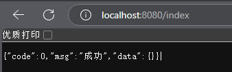

# Gin 快速入门

**Gin Beginning**

---

## Gin 简介

Gin 是一个用 Go 语言编写的高性能 Web 框架，以其简洁、高效和易用性而广受欢迎。它提供了丰富的功能，帮助开发者快速构建 Web 应用程序和 API。

- **高性能**：Gin 基于 `httprouter`、基于 `Radix` 树的路由，小内存占用，具有非常高的路由性能，适合构建高并发的应用。
- **轻量级**：代码简洁，依赖少，易于学习和使用。
- **中间件支持**：支持灵活的中间件机制，可以方便地扩展功能。例如：Logger，Authorization，GZIP，最终操作 DB。
- **路由分组**：支持路由分组，便于管理复杂的路由结构。
- **错误处理**：提供了便捷的错误处理机制。Gin 可以 catch 一个发生在 HTTP 请求中的 panic 并 recover 它。这样，你的服务器将始终可用。
- **JSON 支持**：内置 JSON 解析和渲染，适合构建 RESTful API。
- **可扩展性**：可以通过中间件和插件轻松扩展功能。


## 初始 Gin 框架

### 安装并使用

1. 下载 Gin

   ```bash
   go get -u github.com/gin-gonic/gin
   ```

2. 将 gin 引入代码

   ```bash 
   import "github.com/gin-gonic/gin"
   ```

3. (可选）如果使用诸如 `http.StatusOK` 之类的常量，则需要引入 `net/http` 包。

4. 使用模板

   ```go
   package main
   
   import (
   	"net/http"
   	"github.com/gin-gonic/gin"
   )
   
   type Response struct{
   	Code int `json:"code"`
   	Msg string `json:"msg"`
   	Data any `json:"data"`
   }
   
   func Index(c *gin.Context){
   	c.JSON(http.StatusOK, Response{
   		Code:0,
   		Msg:"成功",
   		Data: map[string]any{},
   	})
   	
   }
   
   func main(){
   	// 1.初始化
   	r := gin.Default()
   	// 2.挂载路由
   	r.GET("/index", Index)
   	// 3.绑定端口，运行
   	r.Run(":8080")
   }
   ```

   - `gin.Context` 包含了`请求(.Request)`与`响应(.ResponseWriter)`对象。
   - `c.JSON` 直接在响应对象写入信息。

5. 运行 `main.go`，访问 `localhost:8080/index`

   

> **拓展**
>
> 1. **内网运行**
>
>    让程序能让内网中的其他人访问，设置 "0.0.0.0" 访问即可。
>
>    ```Go
>    r.Run(":8080") // 等价于 r.Run("0.0.0.0:8080")
>    ```
>
>    若只想本机访问，则设置 "localhost" 或 "127.0.0.1"
>
> 2. **关闭 debug 输出**
>
>    不想看到 gin 默认的那些 debug 输出，设置运行模式为"release"即可，默认是"debug"
>
>    ```Go
>    gin.SetMode("release")
>    ```


## Gin 响应

### JSON响应

在现代前后端分离的开发模式中，JSON是最常用的数据交互格式。Gin提供了简单易用的JSON响应方法。

#### 基本用法

使用`c.JSON`方法可以轻松返回JSON格式的响应：

```go
c.JSON(200, gin.H{
  "code": 0,
  "msg": "ok",
})
```

#### 标准化响应封装

为了统一前后端的交互规范，通常会封装一个标准化的响应格式，包含`code`、`data`和`msg`三个字段。以下是一个封装示例：

```go
package res

import "github.com/gin-gonic/gin"

type Response struct {
  Code int    `json:"code"`
  Data any    `json:"data"`
  Msg  string `json:"msg"`
}

type Code int

const (
  RoleErrCode    Code = 1001
  NetworkErrCode Code = 1002
)

var codeMap = map[Code]string{
  RoleErrCode:    "权限错误",
  NetworkErrCode: "网络错误",
}

func response(c *gin.Context, r Response) {
  c.JSON(200, r)
}

func Ok(c *gin.Context, data any, msg string) {
  response(c, Response{
    Code: 0,
    Data: data,
    Msg:  msg,
  })
}

func OkWithData(c *gin.Context, data any) {
  Ok(c, data, "成功")
}

func OkWithMsg(c *gin.Context, msg string) {
  Ok(c, map[string]any{}, msg)
}

func Fail(c *gin.Context, code int, data any, msg string) {
  response(c, Response{
    Code: code,
    Data: data,
    Msg:  msg,
  })
}

func FailWithMsg(c *gin.Context, msg string) {
  response(c, Response{
    Code: 7,
    Data: nil,
    Msg:  msg,
  })
}

func FailWithCode(c *gin.Context, code Code) {
  msg, ok := codeMap[code]
  if !ok {
    msg = "未知错误"
  }
  response(c, Response{
    Code: int(code),
    Data: nil,
    Msg:  msg,
  })
}
```

封装后，调用响应方法更加简洁：

```go
import "gin_study/res"
res.OkWithMsg(c, "登陆成功")
res.OkWithData(c, map[string]any{"count": "123",})
res.FailWithMsg(c, "参数错误")
```

### HTML响应

Gin支持返回HTML页面，适用于传统的服务端渲染模式。

#### 加载HTML模板

使用`LoadHTMLGlob`或`LoadHTMLFiles`方法加载HTML模板文件：

```go
package main

import "github.com/gin-gonic/gin"

func main() {
  r := gin.Default()
  r.LoadHTMLGlob("templates/*") // 加载目录下所有HTML文件
  r.GET("", func(c *gin.Context) {
    c.HTML(200, "index.html", nil)
  })
  r.Run(":8080")
}
```

#### 传递数据到HTML

可以通过第三个参数向HTML页面传递数据：

```go
c.HTML(200, "index.html", map[string]any{
  "title": "这是网页标题",
})
```

在HTML文件中使用传递的数据：

```html
<title>{{.title}}</title>
```

### 文件响应

Gin支持直接返回文件，并唤起浏览器下载。

#### 基本用法

通过设置响应头`Content-Type`和`Content-Disposition`，可以指定文件类型和下载文件名：

```go
r := gin.Default()
r.GET("", func(c *gin.Context){
    // 表示是文件流，唤起浏览器下载，一般设置了这个，就要设置文件名
    c.Header("Content-Type", "application/octet-stream")
    // 用来指定下载下来的文件名
    c.Header("Content-Disposition", "attachment; filename=文件名")
    // 发送文件
    c.File("文件路径")
})
```

1. 要设置Content-Type，唤起浏览器下载
2. 只能是get请求

建议后端生成一个临时下载地址，前端通过`<a>`标签发起下载请求：

```html
<a href="文件地址" download="文件名">文件下载</a>
```

### 静态文件

Gin提供了静态文件服务功能，方便托管静态资源。

#### 基本用法

1. 使用`Static`方法指定静态文件夹目录：

   ```go
   func main(){
       r := gin.Default()
       r.Static("st", "static") // 第一个参数是别名，第二个是实际路径
       r.Run(":8080")
   }
   ```

   假设项目根目录下的 `static` 文件夹内存在一个 `abc.txt`，访问 `localhost:8080/st/abc.txt` 即可访问该 txt 内容。

2. 使用`StaticFile`方法指定静态文件目录：

   ```go
   r.StaticFile("abc", "static/abc.txt")
   ```

   访问 `localhost:8080/abc` 即可访问该 txt 内容。

注意，被使用的路径不要与其他设置的路由冲突。


## Gin 请求

### 查询参数

查询参数是指附加在URL中的键值对，通常以`?key=value`的形式出现。查询参数并非仅限于GET请求，其他请求方法（如POST、PUT等）也可以使用查询参数。

#### 获取查询参数

Gin提供了以下方法来获取查询参数：

- `c.Query("key")`：获取单个查询参数的值。
- `c.DefaultQuery("key", "default")`：获取查询参数的值，如果不存在则返回默认值。
- `c.QueryArray("key")`：获取多个同名查询参数的值，返回一个字符串切片。

对于请求 `?name=abc&age=123&key=123&key=124`

```go
r := gin.Default()
r.GET("", func(c *gin.Context){
    name := c.Query("name")          // 获取name参数的值
    age := c.DefaultQuery("age", "25") // 获取age参数的值，默认为"25"
    keyList := c.QueryArray("key")   // 获取所有key参数的值
    
    fmt.Println(name, age, keyList)
})
```

输出为，

```go
abc 123 [123 124]
```

### 动态参数

动态参数是指嵌入在URL路径中的参数，通常用于表示资源的唯一标识。

> 例如，用户信息页面的URL
>
> - 查询参数的模式为：`/users?id=123`
> - 动态参数的模式为：`/users/123`，其中`123`是用户ID。

使用`c.Param("key")`方法可以获取动态参数的值。

假设请求URL为：`/users/123`，

```go
r.GET("users/:id", func(c *gin.Context) {
  userID := c.Param("id") // 获取动态参数id的值
  fmt.Println(userID)
})
```

输出结果为：

```
123
```

### 表单参数

表单参数通常用于处理HTML表单提交的数据，适用于`POST`请求。

Gin提供了以下方法来获取表单参数：

- `c.PostForm("key")`：获取单个表单参数的值。
- `c.GetPostForm("key")`：获取表单参数的值，并返回一个布尔值表示参数是否存在。

```go
name := c.PostForm("name") // 获取name参数的值
age, ok := c.GetPostForm("age") // 获取age参数的值，并检查是否存在
fmt.Println(name)
fmt.Println(age, ok)
```

### 文件上传

Gin支持单文件和多文件上传，并提供了便捷的方法来处理上传的文件。

#### 单文件上传

使用`c.FormFile("key")`方法获取上传的文件。

```go
r.POST("users", func(c *gin.Context) {
    fileHeader, err := c.FormFile("file") // 获取上传的文件
    if err != nil {
        fmt.Println(err)
        return
    }
    fmt.Println(fileHeader.Filename) // 文件名
    fmt.Println(fileHeader.Size)     // 文件大小（字节）

    file, _ := fileHeader.Open()
    byteData, _ := io.ReadAll(file) // 读取文件内容
    err = os.WriteFile("xxx.jpg", byteData, 0666) // 保存文件
    fmt.Println(err)
})
```

gin 提供了更简单的保存方法 `SaveUploadedFile`：

```go
err = c.SaveUploadedFile(fileHeader, "uploads/xxx/yyy/"+fileHeader.Filename)
fmt.Println(err)
```

#### 多文件上传

使用`c.MultipartForm()`方法获取多个上传的文件。

```go
r.POST("users", func(c *gin.Context) {
    form, err := c.MultipartForm() // 获取多文件表单
    if err != nil {
        fmt.Println(err)
        return
    }
    for _, headers := range form.File {
        for _, header := range headers {
            c.SaveUploadedFile(header, "uploads/"+header.Filename) // 保存每个文件
        }
    }
})
```

### 请求体处理

Gin支持处理不同类型的请求体，包括`form-data`、`x-www-form-urlencoded`和`JSON`。

#### 获取请求体

使用`io.ReadAll(c.Request.Body)`方法读取请求体内容。需要注意的是，请求体是“阅后即焚”的，读取后需要重新赋值。

```go
byteData, _ := io.ReadAll(c.Request.Body) // 读取请求体
fmt.Println(string(byteData)) // 读后之后，body被清除
name := c.PostForm("name") // 不能再读取，报错

// 用 byteData 重新赋值 (Body 格式是 ReadCloser，NopCloser 可以生成该数据结构)
c.Request.Body = io.NopCloser(bytes.NewReader(byteData)) 
name := c.PostForm("name") // 又可以读取了
```


## Gin 参数绑定

Gin框架提供了强大的参数绑定功能，能够将请求中的参数自动绑定到结构体中，极大地简化了参数处理的流程。

### 查询参数绑定

查询参数是附加在URL中的键值对，通常以`?key=value`的形式出现。Gin提供了`ShouldBindQuery`方法，可以将查询参数绑定到结构体中。

```go
r := gin.Default()
r.GET("", func(c *gin.Context){
    type User struct {
        Name string `form:"name"` // 绑定查询参数中的name字段
        Age  int    `form:"age"`  // 绑定查询参数中的age字段
    }

    var user User
    err := c.ShouldBindQuery(&user) // 绑定查询参数
    fmt.Println(user, err)
})
```

假设请求URL为：`?name=abc&age=25`，输出结果为：

```
{abc 25} <nil>
```

### 路径参数绑定

路径参数是嵌入在URL路径中的参数，通常用于表示资源的唯一标识。Gin提供了`ShouldBindUri`方法，可以将路径参数绑定到结构体中。

```go
r := gin.Default()
r.GET("users/:id/:name", func(c *gin.Context){
    type User struct {
        Name string `uri:"name"` // 绑定路径参数中的name字段
        ID   int    `uri:"id"`   // 绑定路径参数中的id字段
    }

    var user User
    err := c.ShouldBindUri(&user) // 绑定路径参数
    fmt.Println(user, err)
})
```

假设请求URL为：`/users/abc/123`，输出结果为：

```
{abc 123} <nil>
```

### 表单参数绑定

表单参数通常用于处理HTML表单提交的数据。Gin提供了`ShouldBind`方法，可以将表单参数绑定到结构体中。

```go
func main(){
    r := gin.Default()
    r.POST("/index", func(c *gin.Context){
        type User struct{
            Name string `form:"name"`
            Age int `form:"age"`
        }
        var user User
        err := c.ShouldBind(&user)
        fmt.Println(user, err)
    })
    r.Run(":8080")
}
```

### JSON参数绑定

JSON参数是请求体中的JSON格式数据。Gin提供了`ShouldBindJSON`方法，可以将JSON参数绑定到结构体中。

```go
type User struct {
  Name string `json:"name"` // 绑定JSON参数中的name字段
  Age  int    `json:"age"`  // 绑定JSON参数中的age字段
}

var user User
err := c.ShouldBindJSON(&user) // 绑定JSON参数
fmt.Println(user, err)
```

假设请求体为：`{"name": "abc", "age": 25}`，输出结果为：

```
{abc 25} <nil>
```

### Header参数绑定

Header参数是HTTP请求头中的键值对。Gin提供了`ShouldBindHeader`方法，可以将Header参数绑定到结构体中。

```go
type User struct {
  Name        string `header:"Name"`        // 绑定Header中的Name字段
  Age         int    `header:"Age"`         // 绑定Header中的Age字段
  UserAgent   string `header:"User-Agent"`  // 绑定Header中的User-Agent字段
  ContentType string `header:"Content-Type"`// 绑定Header中的Content-Type字段
}

var user User
err := c.ShouldBindHeader(&user) // 绑定Header参数
fmt.Println(user, err)
```

### 内置校验规则

Gin内置了多种校验规则，可以通过`binding`标签为字段添加校验规则。例如：

- `required`：必填字段。
- `min`：最小长度。
- `max`：最大长度。
- `email`：验证邮箱格式。

```go
type User struct {
  Name  string `json:"name" binding:"required"` // 必填字段
  Email string `json:"email" binding:"required,email"` // 必填且为邮箱格式
}
```

如果有多个规则，使用逗号分隔

```go
// 不能为空，并且不能没有这个字段
required： 必填字段，如：binding:"required"  

// 针对字符串的长度
min 最小长度，如：binding:"min=5"
max 最大长度，如：binding:"max=10"
len 长度，如：binding:"len=6"

// 针对数字的大小
eq 等于，如：binding:"eq=3"
ne 不等于，如：binding:"ne=12"
gt 大于，如：binding:"gt=10"
gte 大于等于，如：binding:"gte=10"
lt 小于，如：binding:"lt=10"
lte 小于等于，如：binding:"lte=10"

// 针对同级字段的
eqfield 等于其他字段的值，如：PassWord string `binding:"eqfield=Password"`
nefield 不等于其他字段的值

- 忽略字段，如：binding:"-" 或者不写

// 枚举  只能是red 或green
oneof=red green 

// 字符串  
contains=abc  // 包含 abc 的字符串
excludes // 不包含
startswith  // 字符串前缀
endswith  // 字符串后缀

// 数组
dive  // dive后面的验证就是针对数组中的每一个元素

// 网络验证
ip
ipv4
ipv6
uri
url
// uri 在于I(Identifier)是统一资源标示符，可以唯一标识一个资源。
// url 在于Locater，是统一资源定位符，提供找到该资源的确切路径

// 日期验证  1月2号下午3点4分5秒在2006年
datetime=2006-01-02
```

### 自定义校验规则

在Gin框架中，自定义绑定规则是通过Go语言的`validator`库实现的。`validator` 是一个用于结构体字段校验的Go库，Gin框架默认集成了该库。`validator`库提供了强大的校验功能，并允许开发者自定义校验规则。

如果内置的校验规则无法满足需求，可以通过`RegisterValidation`方法注册自定义校验规则。

1. **定义校验函数**：校验函数需要满足`validator.Func`类型，即`func(fl validator.FieldLevel) bool`。

   ```go
   var bookableDate validator.Func = func(fl validator.FieldLevel) bool {
       date, ok := fl.Field().Interface().(time.Time)
       if ok {
           today := time.Now()
           return date.After(today) // 仅允许未来的日期
       }
       return false
   }
   ```

   - 定义了一个函数 `bookableDate`，用于验证日期是否为未来时间。
   - 通过 `fl.Field().Interface()` 获取字段值，并断言为 `time.Time`。
   - 如果日期在当前时间之后，返回 `true`（验证通过），否则返回 `false`。

2. **注册校验函数**：通过`RegisterValidation`方法将校验函数注册到`validator`中。

   ```go
   if v, ok := binding.Validator.Engine().(*validator.Validate); ok {
       v.RegisterValidation("bookabledate", bookableDate)
   }
   ```

   - 从 Gin 的绑定器中获取 `validator.Validate` 实例。
   - 调用 `RegisterValidation` 方法注册自定义验证器。

3. **使用自定义规则**：在结构体的`binding`标签中使用自定义规则。

   ```go
   type Booking struct {
       CheckIn  time.Time `form:"check_in" binding:"required,bookabledate" time_format:"2006-01-02"`
       CheckOut time.Time `form:"check_out" binding:"required,gtfield=CheckIn,bookabledate" time_format:"2006-01-02"`
   }
   ```

4. 完整代码：

   ```go
   package main
   
   import (
       "net/http"
       "reflect"
       "time"
   
       "github.com/gin-gonic/gin"
       "github.com/gin-gonic/gin/binding"
       "github.com/go-playground/validator/v10"
   )
   
   // Booking 包含绑定和验证的数据。
   type Booking struct {
       CheckIn  time.Time `form:"check_in" binding:"required,bookabledate" time_format:"2006-01-02"`
       CheckOut time.Time `form:"check_out" binding:"required,gtfield=CheckIn,bookabledate" time_format:"2006-01-02"`
   }
   
   var bookableDate validator.Func = func(fl validator.FieldLevel) bool {
       date, ok := fl.Field().Interface().(time.Time)
       if ok {
           today := time.Now()
           if today.After(date) {
               return false
           }
       }
       return true
   }
   
   func main() {
       route := gin.Default()
   
       if v, ok := binding.Validator.Engine().(*validator.Validate); ok {
           v.RegisterValidation("bookabledate", bookableDate)
       }
   
       route.GET("/bookable", getBookable)
       route.Run(":8080")
   }
   
   func getBookable(c *gin.Context) {
       var b Booking
       if err := c.ShouldBindWith(&b, binding.Query); err == nil {
           c.JSON(http.StatusOK, gin.H{"message": "Booking dates are valid!"})
       } else {
           c.JSON(http.StatusBadRequest, gin.H{"error": err.Error()})
       }
   }


### 自定义错误信息

默认情况下，`validator`返回的错误信息是英文的。为了提升用户体验，可以将错误信息翻译为中文。

1. **创建翻译器**：使用`go-playground/universal-translator`库创建翻译器。
2. **注册翻译器**：将翻译器注册到`validator`中。
3. **翻译错误信息**：在参数校验失败时，将错误信息翻译为中文。

以下是一个实现中文错误信息的示例：

1. 创建翻译器

   ```go
   import (
     "github.com/go-playground/locales/zh"
     ut "github.com/go-playground/universal-translator"
     "github.com/go-playground/validator/v10"
     zh_translations "github.com/go-playground/validator/v10/translations/zh"
   )
   
   var trans ut.Translator
   
   func init() {
     uni := ut.New(zh.New())
     trans, _ = uni.GetTranslator("zh") // 创建中文翻译器
     v, ok := binding.Validator.Engine().(*validator.Validate)
     if ok {
       zh_translations.RegisterDefaultTranslations(v, trans) // 注册翻译器
     }
   }

2. 翻译错误信息

   ```go
   func ValidateErr(err error) string {
     errs, ok := err.(validator.ValidationErrors)
     if !ok {
       return err.Error()
     }
     var list []string
     for _, e := range errs {
       list = append(list, e.Translate(trans)) // 翻译错误信息
     }
     return strings.Join(list, ";")
   }

3. 使用翻译后的错误信息

   ```go
   if err := c.ShouldBindJSON(&request); err != nil {
     c.JSON(400, gin.H{
       "error": ValidateErr(err), // 返回中文错误信息
     })
     return
   }
   ```


### 自定义字段名

默认情况下，`validator`使用结构体字段名作为错误信息中的字段名。可以通过`RegisterTagNameFunc`方法自定义字段名。

```go
func init() {
    v.RegisterTagNameFunc(func(field reflect.StructField) string {
        label := field.Tag.Get("label") // 获取label标签的值
        if label == "" {
            return field.Name // 如果未定义label标签，则使用字段名
        }
        return label
    })
}
```

在结构体中使用`label`标签：

```go
type User struct {
  Name  string `json:"name" binding:"required" label:"用户名"`
  Email string `json:"email" binding:"required,email" label:"邮箱"`
}
```


## Gin 路由重定向

使用 `Redirect` 方法可以实现路由重定向。

```go
r.GET("/old", func(c *gin.Context) {
    c.Redirect(301, "/new")
})

r.GET("/new", func(c *gin.Context) {
    c.JSON(200, gin.H{"message": "New route"})
})
```


## Gin 路由分组

路由分组（Group）是 Gin 提供的一种将多个路由组织在一起的方式，这些路由共享相同的前缀或中间件。通过分组，可以避免重复代码，同时使路由结构更加清晰。

**路由分组的优势**

1. 代码简洁：通过分组，可以避免重复的路由前缀，使代码更加简洁。
2. 便于扩展：通过分组，可以轻松扩展新的 API 版本或模块。 
3. 统一中间件：可以为路由组统一添加中间件，例如鉴权、日志等。

使用 `Group()` 方法创建路由组，语法如下：

```go
r := gin.Default()
group := r.Group("/prefix")
```

- `/prefix` 是路由组的前缀，组内所有路由都会自动添加该前缀。
- `group` 是一个 `*gin.RouterGroup` 对象，可以继续注册路由或嵌套分组。

### 将路由绑定到组

- 直接嵌套

  ```go
  func main() {
      r := gin.Default()
  
      // 创建路由组
      v1 := r.Group("/v1")
      {
          v1.GET("/users", func(c *gin.Context) {
              c.JSON(200, gin.H{"message": "Get all users in v1"})
          })
          v1.POST("/users", func(c *gin.Context) {
              c.JSON(200, gin.H{"message": "Create a user in v1"})
          })
      }
      r.Run(":8080")
  }

- 调用函数，使用其引用对象创建

  ```go
  func main() {
      r := gin.Default()
  
      // 创建路由组
      v1 := r.Group("/v1")
  
      r.Run(":8080")
  }
  
  func useGroup(r *gin.RouterGroup){
      r.GET( relativePath:"users", UserView)
      r.P0ST( relativePath:"users",UserView)
      r.DELETE( relativePath:"users",UserView)
      r.PUT( relativePath:"users",Userview)
  }
  
  func userView(c *gin.Context){
      path := c.Request.URL
      fmt.println(path)
  }

### 路由分组的嵌套

Gin 支持路由组的嵌套，可以创建更细粒度的路由结构。

```go
func main() {
    r := gin.Default()

    api := r.Group("/api")
    {
        user := api.Group("/user")
        {
            user.GET("/info", getUserInfo)
            user.POST("/update", updateUserInfo)
        }

        order := api.Group("/order")
        {
            order.GET("/list", getOrderList)
            order.POST("/create", createOrder)
        }
    }

    r.Run(":8080")
}
```


## Gin 中间件

中间件是 Gin 框架中拦截请求/响应的核心机制，本质是 `gin.HandlerFunc` 类型函数，可实现对请求的预处理（如鉴权、日志）和响应后处理（如耗时统计）。其执行顺序遵循 **洋葱模型**：请求阶段按注册顺序执行中间件，响应阶段按反向顺序执行剩余逻辑。

**中间件的作用**

- 预处理：在请求到达路由处理函数之前执行，例如日志记录、身份验证。
- 后处理：在路由处理函数执行之后执行，例如记录响应时间、修改响应头。
- 控制流程：通过 `c.Next()` 或 `c.Abort()` 控制请求是否继续传递。

### Gin 的内置中间件

Gin 默认提供了两个内置中间件：

1. Logger 中间件：记录每个请求的基本信息，包括请求路径、方法、状态码和响应时间。

   ```go
   r := gin.Default() // 默认包含 Logger 中间件
   r.GET("/ping", func(c *gin.Context) {
       c.String(200, "pong")
   })
   ```

2. Recovery 中间件：捕获应用中的 panic 并恢复正常运行状态，避免服务器崩溃。

   ```go
   r := gin.Default() // 默认包含 Recovery 中间件
   r.GET("/panic", func(c *gin.Context) {
       panic("模拟服务器崩溃")
   })
   ```

### 自定义中间件

#### 创建自定义中间件

以下是简单的自定义中间件示例，在请求前后打印日志：

```go
// 闭包形式，调用时记得使用函数调用形式，加上 ()
func MyMiddleware() gin.HandlerFunc {
    return func(c *gin.Context) {
        fmt.Println("请求开始")
        c.Next() // 继续到下一个中间件或处理函数
        fmt.Println("请求结束")
    }
}

// 直接形式，调用时不用函数调用形式，不加 ()
func M1(c *gin.Context) {
    fmt.Println("M1 请求部分")
    c.Next()
    fmt.Println("M1 响应部分")
}
func M2(c *gin.Context) {
    fmt.Println("M2 请求部分")
    c.Next()
    fmt.Println("M2 响应部分")
}
func Home(c *gin.Context) {
    fmt.Println("Home")
    c.String(200, "Home")
}
```

#### 应用自定义中间件

可以将中间件应用到全局、路由组或单个路由

- 局部中间件：直接绑定到特定路由，仅对该路由生效

  ```go
  r.GET("/home", M1, M2, Home) // 仅/home路由触发M1、M2
  ```

- 全局中间件：通过 `Use()`注册到路由组或引擎，影响所有匹配路由

  ```go
  g := r.Group("/api")
  g.Use(M1, M2)  // 组内所有路由触发GM1、GM2
  ```

  ```go
  r := gin.Default()
  r.Use(MyMiddleware()) // 全局触发 MyMiddleware
  ```

#### 中间件控制流

- `c.Next()`：继续执行后续中间件或处理函数

- `c.Abort()`：终止执行链，直接返回响应（常用于权限拦截）

  ```go
  func AuthMiddleware(c *gin.Context) {
    if token无效 {
      c.AbortWithStatusJSON(401, gin.H{"error": "未授权"})
    }
    c.Next()
  }
  ```

#### 中间件数据传递

通过 `c.Set(key, value)` 和 `c.Get(key)` 实现中间件间数据共享：

```go
func M1(c *gin.Context) {
  c.Set("traceID", uuid.New().String())
  c.Next()
}

func M2(c *gin.Context) {
  traceID, _ := c.Get("traceID")
  fmt.Println("追踪ID:", traceID)
}
```

### 中间件的执行顺序

中间件的执行顺序遵循 **洋葱模型**：

1. 请求阶段：按中间件注册顺序执行。
2. 响应阶段：按中间件注册的反向顺序执行。

例如：

```go
func M1(c *gin.Context) {
    fmt.Println("M1 请求部分")
    c.Next()
    fmt.Println("M1 响应部分")
}

func M2(c *gin.Context) {
    fmt.Println("M2 请求部分")
    c.Next()
    fmt.Println("M2 响应部分")
}

r.GET("/test", M1, M2, func(c *gin.Context) {
    fmt.Println("处理函数")
})
```

输出顺序：

```
M1 请求部分 → M2 请求部分 → 处理函数 → M2 响应部分 → M1 响应部分
```