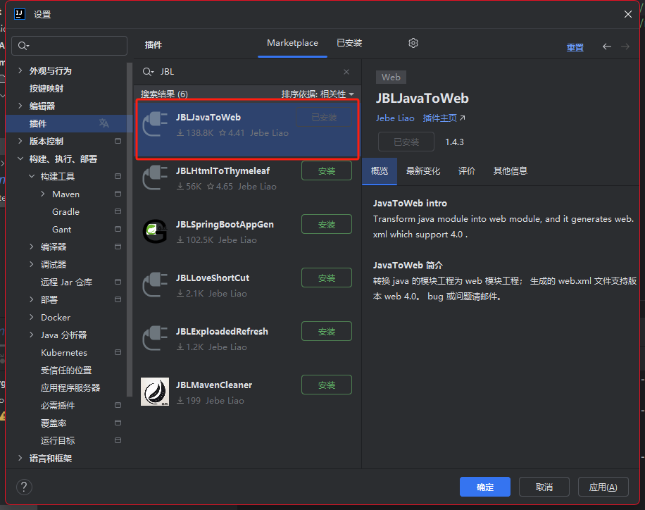
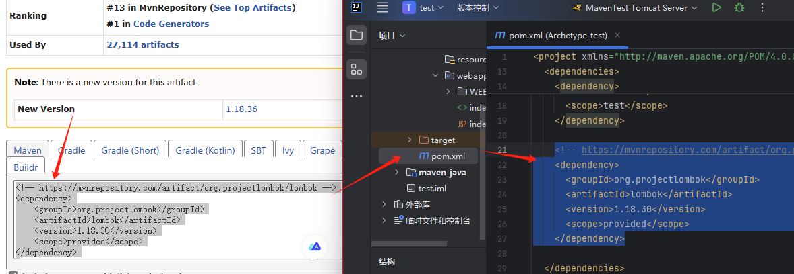
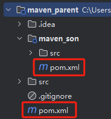

# Maven笔记

**Apache Maven Project**

---
---

## Maven 快速入门

### Maven 简介

[Introduction – Maven (apache.org)](https://maven.apache.org/what-is-maven.html)

**Apache Maven** 是一个项目管理和构建工具，它基于**项目对象模型**(Project Object Model. POM)的概念，通过一小段描述信息来管理项目的构建。

- 依赖管理
  - Maven 可以管理项目的依赖，包括自动下载所需依赖库、自动下载依赖需要的依赖并且保证版本没有冲突、依赖版本管理等。通过 Maven，我们可以方便地维护项目所依赖的外部库，而我们仅仅需要编写配置即可。
- 统一项目结构
  - 提供标准、统一的项目结构。方便再各种开发工具中打开项目。
- 项目构建
  - 标准跨平台(Linux、Windows、MacOs)的自动化项目构建方式。
  - 项目开发完成后，想要将项目打成.war文件，并部署到服务器中运行，使用Maven软件，我们可以通过一行构建命令（mvn package）快速项目构建和打包。

### Maven 工作原理


### Maven 安装

安装地址：[Maven Releases History – Maven (apache.org)](https://maven.apache.org/docs/history.html)

点开网址后查看所有版本对应的Java版本，选好版本后点击右上角Download按钮跳转到下载页，选择Binary格式的zip包下载。

（安装前注意要安装对应的Java版本，并配置有`java_home`环境变量）

下载完成后解压到想要的安装位置，新建系统变量`MAVA_HOME`指到对应安装文件夹。

再配置系统变量Path，新建`%MAVEN_HOME%\bin`

点击应用后完成环境变量配置。

```bash
命令行输入：mvn -v 
# 输出版本信息即可，如果错误，请仔细检查环境变量即可！
# 注：如果未输出maven的版本，绝大部分原因都是java_home变量的配置不正确，请仔细检查！
```

### Maven 配置

需要改**maven/conf/settings.xml**配置文件，来修改maven的一些默认配置。我们主要休要修改的有三个配置：

1. 依赖本地缓存位置（本地仓库位置）

   ```xml
   <localRepository>D:\maven_repository</localRepository>
   ```

2. maven下载镜像：国内阿里镜像 (加快下载速度)

   修改 `<mirrors>`标签，为其添加如下子标签：

   ```xml
   <mirror>
       <id>alimaven</id>
       <name>aliyun maven</name>
       <url>http://maven.aliyun.com/nexus/content/groups/public/</url>
       <mirrorOf>central</mirrorOf>
   </mirror>
   ```

3. 配置jdk版本项目构建（以jdk17为例）

   修改 `<profiles>`标签，为其添加如下子标签：

   ```xml
   <profile>
       <id>jdk-17</id>
       <activation>
         <activeByDefault>true</activeByDefault>
         <jdk>17</jdk>
       </activation>
       <properties>
         <maven.compiler.source>17</maven.compiler.source>
         <maven.compiler.target>17</maven.compiler.target>
         <maven.compiler.compilerVersion>17</maven.compiler.compilerVersion>
       </properties>
   </profile>
   ```

### Maven 软件结构


**bin**：含有Maven的运行脚本

boot：含有plexus-classworlds类加载器框架

**conf**：含有Maven的核心配置文件

lib：含有Maven运行时所需要的Java类库

LICENSE、NOTICE、README.txt：针对Maven版本，第三方软件等简要介绍

### 梳理Maven工程GAVP属性

Maven工程相对之前的工程，多出一组**GAVP属性**，`G`、`A`、`V`需要我们在创建项目的时指定，`P`有默认值，后期通过配置文件修改。

Maven 中的 **GAVP** 是指 `GroupId`（组名）、`ArtifactId`（工件名）、`Version`（版本）、`Packaging`（打包） 四个属性的缩写。其中前三个是必要的，而 Packaging 属性为可选项。这四个属性主要为每个项目在maven仓库总做一个标识。有了具体标识，方便maven软件对项目进行管理和互相引用。

#### GAVP遵循规则

1. **GroupID 格式**：com.{公司/BU }.业务线.[子业务线]，最多 4 级。

   1) 说明：{公司/BU} 例如：alibaba/taobao/tmall/aliexpress 等 BU 一级；子业务线可选。
   2) 正例：com.taobao.tddl 或 com.alibaba.sourcing.multilang com.atguigu.java

2. **ArtifactID 格式**：产品线名-模块名。语义不重复不遗漏，先到仓库中心去查证一下。

   1) 正例：tc-client / uic-api / tair-tool / bookstore

3. **Version版本号格式推荐**：主版本号.次版本号.修订号 1.0.0

   1) 主版本号：当做了不兼容的 API 修改，或者增加了能改变产品方向的新功能。
   2) 次版本号：当做了向下兼容的功能性新增（新增类、接口等）。
   3) 修订号：修复 bug，没有修改方法签名的功能加强，保持 API 兼容性。
   4) 例如： 初始→1.0.0 修改bug → 1.0.1 功能调整 → 1.1.1等

4. **Packaging定义规则**：

   指示将项目打包为什么类型的文件，idea根据packaging值，识别maven项目类型！

   packaging 属性为 jar（默认值），代表普通的Java工程，打包以后是.jar结尾的文件。

   packaging 属性为 war，代表Java的web工程，打包以后.war结尾的文件。

   packaging 属性为 pom，代表不会打包，用来做继承的父工程。


## 基于IDEA的Maven工程创建

### IDEA配置本地Maven（当前工程）

需要将配置好的maven软件，配置到idea开发工具中即可！ 注意：idea工具默认自带maven配置软件，但是因为没有修改配置，建议替换成本地配置好的maven.

打开idea的settings，选中“Build、Execution、Deployment”栏。

再依次点击 build tool / maven

选中本地maven软件根目录。

User settings file 选中 maven/conf/settings.xml 即可。


### 项目创建

#### 普通项目创建

直接创建Maven项目即可


#### Web项目创建

Maven 的 Web模块 路径一般是 `src/main/webapp/WEB-INF/web.xml`

这个路径不要轻易改变，不然 web 模块可能会出现问题。

##### 手动创建-方式1

先按照普通项目创建，然后打开 `pom.xml` ，将打包方式修改为 war 模式，则 IDEA 会自动生成 Web 模块配置。

```xml
<packaging>war</packaging>
```


刷新maven设置后，进入项目结构，打开Web模块，创建xml文件，注意位置要对应。


注意检查 Web资源目录 的设置是否正确。


##### 手动创建-方式2

也可以直接先手动添加Web模块，然后按照上方的配置信息进行设置。

注意，这个方式会直接在 根目录 生成 Web 模块，要将其移动到正确位置。


##### 使用骨架创建

新建项目界面，选择 Maven Archetype，选择 webapp 骨架，这样创建项目之后则会有 Web 模块。


若只是普通项目，不选用webapp，选择quickstart则可。

##### 插件创建

在 IDEA 中创建插件，JBLJavaToWeb。



然后创建一个普通项目，对普通项目右键，然后选择JBLJavaToWeb，即可将普通项目转化为Web项目。


## Maven Web 程序的文件结构及每个文件的作用

Maven 是一个强大的构建工具，它提供一种标准化的项目结构（不可随意修改结构），可以帮助开发者更容易地管理项目的依赖、构建、测试和发布等任务。

以下是 Maven Web 程序的文件结构及每个文件的作用:

```bash
|-- pom.xml                               # Maven 项目管理文件 
|-- src
    |-- main                              # 项目主要代码
    |   |-- java                          # Java 源代码目录
    |   |   `-- com/example/myapp         # 开发者代码主目录
    |   |       |-- controller            # 存放 Controller 层代码的目录
    |   |       |-- service               # 存放 Service 层代码的目录
    |   |       |-- dao                   # 存放 DAO 层代码的目录
    |   |       `-- model                 # 存放数据模型的目录
    |   |-- resources                     # 资源目录，存放配置文件、静态资源等
    |   |   |-- log4j.properties          # 日志配置文件
    |   |   |-- spring-mybatis.xml        # Spring Mybatis 配置文件
    |   |   `-- static                    # 存放静态资源的目录
    |   |       |-- css                   # 存放 CSS 文件的目录
    |   |       |-- js                    # 存放 JavaScript 文件的目录
    |   |       `-- images                # 存放图片资源的目录
    |   `-- webapp                        # 存放 WEB 相关配置和资源
    |       |-- WEB-INF                   # 存放 WEB 应用配置文件
    |       |   |-- web.xml               # Web 应用的部署描述文件
    |       |   `-- classes               # 存放编译后的 class 文件
    |       `-- index.html                # Web 应用入口页面
    `-- test                              # 项目测试代码
        |-- java                          # 单元测试目录
        `-- resources                     # 测试资源目录
```

- pom.xml：Maven 项目管理文件，用于描述项目的依赖和构建配置等信息。
- src/main/java：存放项目的 Java 源代码。
- src/main/resources：存放项目的资源文件，如配置文件、静态资源等。
- src/main/webapp/WEB-INF：存放 Web 应用的配置文件。
- src/main/webapp/index.html：Web 应用的入口页面。
- src/test/java：存放项目的测试代码。
- src/test/resources：存放测试相关的资源文件，如测试配置文件等。

### pom.xml 基础内容简介

```xml
<!-- pom.xml -->

<!-- 模型版本 -->
<modelVersion>4.0.0</modelVersion>
<!-- 公司或者组织的唯一标志，并且配置时生成的路径也是由此生成， 如com.companyname.project-group，maven会将该项目打成的jar包放本地路径：/com/companyname/project-group -->
<groupId>com.companyname.project-group</groupId>
<!-- 项目的唯一ID，一个groupId下面可能多个项目，就是靠artifactId来区分的 -->
<artifactId>project</artifactId>
<!-- 版本号 -->
<version>1.0.0</version>

<!--打包方式
    默认：jar
    jar指的是普通的java项目打包方式！ 项目打成jar包！
    war指的是web项目打包方式！项目打成war包！
    pom不会讲项目打包！这个项目作为父工程，被其他工程聚合或者继承！
-->
<packaging>jar</packaging>
```


## Maven 依赖管理

Maven 的依赖管理能够帮助开发人员自动解决软件包依赖问题，使得开发人员能够轻松地将其他开发人员开发的模块或第三方框架集成到自己的应用程序或模块中，避免出现版本冲突和依赖缺失等问题。

通过定义 POM 文件，Maven 能够自动解析项目的依赖关系，并通过 Maven 仓库自动下载和管理依赖，从而避免了手动下载和管理依赖的繁琐工作和可能引发的版本冲突问题。

### 添加依赖

1. 打开 Maven 仓库网站
   [Maven Repository: Search/Browse/Explore (mvnrepository.com)](https://mvnrepository.com/)

2. 搜索想要的 jar 包

   > 如 lombok
   >
   > 

3. 点进搜索到的网址，选择适合的版本

   > 可以选择使用率多且较新的版本，或根据项目实际选择。
   >
   > 

4. 点进所选版本，复制依赖到 pom.xml 的`<dependencies>`中

   > 复制完后，刷新 Maven 即可下载。
   >
   > 

### 依赖信息属性配置

```xml
<!-- 
   通过编写依赖jar包的gav必要属性，引入第三方依赖！
   scope属性是可选的，可以指定依赖生效范围！
 -->
<dependencies>
    <!-- 引入具体的依赖包 -->
    <dependency>
        <groupId>log4j</groupId>
        <artifactId>log4j</artifactId>
        <version>1.2.17</version>
        <scope>runtime</scope>
    </dependency>

</dependencies>
```

依赖的jar包，默认情况下，可以在任何地方使用。可以通过`<dependency>`中的`<scope>`设置作用范围。

- 主程序范围有效。(main文件夹范围内)
- 测试程序范围有效。(test文件夹范围内)
- 是否参与打包运行。(package指令范围内)

| 依赖范围          | 描述                                                         | 主程序 | 测试程序 | 打包(运行) | 备注           |
| :---------------- | :----------------------------------------------------------- | :----- | :------- | :--------- | :------------- |
| **compile**(默认) | 编译依赖范围, scope元素的缺省值。使用此依赖范围的 Maven 依赖, 对于三种 classpath 均有效。 | Y      | Y        | Y          | 如 log4j       |
| **test**          | 测试依赖范围。使用此依赖范围的 Maven 依赖, 只对测试 classpath 有效。 | -      | Y        | -          | 如 junit       |
| **provided**      | 已提供依赖范围。使用此依赖范围的 Maven 依赖, 只对编译 classpath 和测试 classpath 有效。 | Y      | Y        | -          | 如 servlet-api |
| runtime           | 运行时依赖范围。使用此依赖范围的 Maven 依赖, 只对测试 classpath、运行 classpath 有效。 | -      | Y        | Y          | 如 jdbc 驱动   |
| system            | 系统依赖范围, 其效果与 provided 的依赖范围一致。用于添加非 Maven 仓库的本地依赖。 | -      | -        | -          | 不推荐使用     |
| import            | 导入依赖范围, 只能与 dependencyManagement 元素配合使用。     | -      | -        | -          | 合并配置使用   |

#### 依赖版本提取和维护

1. 先在 properties 中设置一个版本号，标签可随意命名。
2. 然后在 dependencies 中使用 `${标签命名}`来使用这个值。

> 统一制定版本号的好处就是方便快速修改一些需要向同版本的依赖，方便维护。如 Spring。

```XML
<!--声明版本-->
<properties>
  <!--命名随便,内部制定版本号即可！-->
  <junit.version>4.11</junit.version>
  <!-- 也可以通过 maven规定的固定的key，配置maven的参数！如下配置编码格式！-->
  <project.build.sourceEncoding>UTF-8</project.build.sourceEncoding>
  <project.reporting.outputEncoding>UTF-8</project.reporting.outputEncoding>
</properties>

<dependencies>
  <dependency>
    <groupId>junit</groupId>
    <artifactId>junit</artifactId>
    <!--引用properties声明版本 -->
    <version>${junit.version}</version>
  </dependency>
</dependencies>
```

### 依赖下载失败处理

在使用 Maven 构建项目时，可能会发生依赖项下载错误的情况。

**原因**：

1.  下载依赖时出现网络故障或仓库服务器宕机等原因，导致无法连接至 Maven 仓库，从而无法下载依赖。
2.  依赖项的版本号或配置文件中的版本号错误，或者依赖项没有正确定义，导致 Maven 下载的依赖项与实际需要的不一致，从而引发错误。
3.  本地 Maven 仓库或缓存被污染或损坏，导致 Maven 无法正确地使用现有的依赖项。

**只要下载过程出现失败，就必须手动清除下载缓存，否则无法正常进行下载**。

清除本地 Maven 仓库缓存（lastUpdated 文件），因为只要存在lastupdated缓存文件，刷新也不会重新下载。本地仓库中，根据依赖的gav属性依次向下查找文件夹，最终删除内部的文件，刷新重新下载即可！

可以将清除**lastUpdated文件**的操作写在一个脚本文件中，手动创建文件"clearLastUpdated.bat"。

```bat
cls 
@ECHO OFF 
SET CLEAR_PATH=D: 
SET CLEAR_DIR=D:\maven-repository(本地仓库路径)
color 0a 
TITLE ClearLastUpdated For Windows 
GOTO MENU 
:MENU 
CLS
ECHO. 
ECHO. * * * *  ClearLastUpdated For Windows  * * * * 
ECHO. * * 
ECHO. * 1 清理*.lastUpdated * 
ECHO. * * 
ECHO. * 2 查看*.lastUpdated * 
ECHO. * * 
ECHO. * 3 退 出 * 
ECHO. * * 
ECHO. * * * * * * * * * * * * * * * * * * * * * * * * 
ECHO. 
ECHO.请输入选择项目的序号： 
set /p ID= 
IF "%id%"=="1" GOTO cmd1 
IF "%id%"=="2" GOTO cmd2 
IF "%id%"=="3" EXIT 
PAUSE 
:cmd1 
ECHO. 开始清理
%CLEAR_PATH%
cd %CLEAR_DIR%
for /r %%i in (*.lastUpdated) do del %%i
ECHO.OK 
PAUSE 
GOTO MENU 
:cmd2 
ECHO. 查看*.lastUpdated文件
%CLEAR_PATH%
cd %CLEAR_DIR%
for /r %%i in (*.lastUpdated) do echo %%i
ECHO.OK 
PAUSE 
GOTO MENU 
```

### 依赖传递

Maven的依赖传递特性是指当一个项目依赖于另一个项目或库时，如果被依赖的项目或库又依赖于其他的项目或库，那么这些间接的依赖也会被传递到原始项目中。

这种依赖传递结构可以形成一个依赖树。当我们引入一个库或框架时，构建工具（如 Maven、Gradle）会自动解析和加载其所有的直接和间接依赖，确保这些依赖都可用。

>   例如，当一个模块或库 `A` 依赖于另一个模块或库 `B`，而 `B` 又依赖于模块或库 `C`，那么 `A` 会间接依赖于 `C`。（A—>B—>C）这样，`A` 也可以使用 `C` 的功能。

#### 依赖传递的作用

1. 减少重复依赖：当多个项目依赖同一个库时，Maven 可以自动下载并且只下载一次该库。这样可以减少项目的构建时间和磁盘空间。
2. 自动管理依赖: Maven 可以自动管理依赖项，使用依赖传递，简化了依赖项的管理，使项目构建更加可靠和一致。
3. 确保依赖版本正确性：通过依赖传递的依赖，之间都不会存在版本兼容性问题，确实依赖的版本正确性！

#### 依赖传递的规则

在 A 依赖 B，B 依赖 C 的前提下，C 是否能够传递到 A，取决于 B 依赖 C 时使用的依赖范围以及配置。

- **可以传递**

  - `<scope>` 为 compile

    ```xml
    <dependency>
        <groupId>com.alibaba</groupId>
        <artifactId>druid</artifactId>
        <version>1.2.15</version>
        <scope>compile</scope>
    </dependency>
    ```

- **不可传递**

  - `<scope>` 为 test 或 provided

  - `<optional>` 为 true

    ```xml
    <dependency>
        <groupId>com.alibaba</groupId>
        <artifactId>druid</artifactId>
        <version>1.2.15</version>
        <optional>true</optional>
    </dependency>
    ```

  - 用`<exclusions>`排除不需要传递的依赖。

    ```xml
    <dependency>
        <groupId>com.atguigu.maven</groupId>
        <artifactId>pro01-maven-java</artifactId>
        <version>1.0-SNAPSHOT</version>
        <scope>compile</scope>
        <!-- 使用excludes标签配置依赖的排除  -->
        <exclusions>
            <!-- 在exclude标签中配置一个具体的排除 -->
            <exclusion>
                <!-- 指定要排除的依赖的坐标（不需要写version） -->
                <groupId>commons-logging</groupId>
                <artifactId>commons-logging</artifactId>
            </exclusion>
        </exclusions>
    </dependency>
    ```

> 注意：`<exclusions>` 与 `<optional>`的使用位置不一。使用`<exclusions>` 而不使用`<optional>`的原因是：我们需要停止传递的依赖可能存在于别人的 jar 包，而不是我们自己创建的 jar 包。

### 依赖冲突

当直接引用或者间接引用出现了相同的jar包，一个项目就会出现相同的重复jar包，这就产生了冲突。

maven自动解决依赖冲突问题能力，会按照自己的原则，进行重复依赖选择。同时也提供了手动解决的冲突的方式。

**自动选择原则**

- **短路优先原则**（*第一原则*）
  - A—>B—>C—>D—>E—>X(version 0.0.1)
  - A—>F—>X(version 0.0.2)
  - 则A依赖于X(version 0.0.2)。
- 依赖路径长度相同情况下，则“**先声明优先**”（*第二原则*）
  - A—>E—>X(version 0.0.1)
  - A—>F—>X(version 0.0.2)
- 在`<depencies></depencies>`中，先声明的，路径相同，会优先选择！

**手动排除**

用`<exclusions>`排除不需要或者冲突的依赖。


## Maven 进行测试

1. 进入项目文件夹 `src / test / java` ，创建一个测试类

   > 注意：测试类命名必须以`Test`开头或结尾，否则无法被 test 生命周期识别

2. 需要引入 Junit 依赖，以便进行测试。

3. 在类中编写测试方法

   > 注意：测试方法的命名应以`test`加上被测试的方法名开头

4. 使用 Junit 的 `Assertions.assertEquals(expected, actual)` 方法进行测试。

5. 然后使用 `mvn test`。

6. 测试完毕后，target 目录会生成测试报告。

> 示例
>
> ```java
> import org.junit.Test;
> import static org.junit.Assert.*;
> 
> public class HelloTest {
>        @Test
>        public void testSayHello() {
>            Hello hello = new Hello();
>            assertEquals("Hello, world!", hello.sayHello());
>        }
> }
> ```


## Maven 工程构建

### 构建操作

项目构建是指将源代码、依赖库和资源文件等转换成可执行或可部署的应用程序的过程，在这个过程中包括编译源代码、链接依赖库、打包和部署等多个步骤。

项目构建是软件开发过程中至关重要的一部分，它能够大大提高软件开发效率，使得开发人员能够更加专注于应用程序的开发和维护，而不必关心应用程序的构建细节。

同时，项目构建还能够将多个开发人员的代码汇合到一起，并能够自动化项目的构建和部署，大大降低了项目的出错风险和提高开发效率。常见的构建工具包括 Maven、Gradle、Ant 等。


| 命令方式项目构建 | 描述                                                |
| ---------------- | --------------------------------------------------- |
| mvn compile      | 编译项目，生成target文件                            |
| mvn package      | 打包项目，生成jar或war文件                          |
| mvn clean        | 清理编译或打包后的项目结构                          |
| mvn install      | 打包后上传到maven本地仓库（依赖自有工程的必须步骤） |
| mvn deploy       | 只打包，上传到maven私服仓库                         |
| mvn site         | 生成站点                                            |
| mvn test         | 执行测试源码                                        |

**可视化创建**：


**构建生命周期**可以理解成是一组固定构建命令的有序集合。

> 触发周期后的命令，会自动触发周期前的命令。
>
> 所以，构建周期会简化构建过程。

- **清理周期**：主要是对项目编译生成文件进行清理 （把 target 目录的内容进行删除）
  - 包含命令：clean
- **默认周期**：定义了真正构件时所需要执行的所有步骤，它是生命周期中最核心的部分
  - 包含命令：compile - test - package - install / deploy
- **报告周期**
  - 包含命令：site

```bash
打包: mvn clean package
重新编译: mvn clean compile
本地部署: mvn clean install 
```

**插件、命令、周期三者关系（了解）**

周期→包含若干命令→包含若干插件

使用周期命令构建，简化构建过程！

最终进行构建的是插件！

### Build 构建配置

项目构建是指将源代码、依赖库和资源文件等转换成可执行或可部署的应用程序的过程，在这个过程中包括编译源代码、链接依赖库、打包和部署等多个步骤。

默认情况下，构建不需要额外配置，都有对应的缺省配置。也可以在pom.xml定制一些配置，来修改默认构建的行为和产物。

构建配置是在`pom.xml` 中的 `<build>`标签中指定。

#### 指定打包命名

注意后缀要跟 `<packing>` 设置的打包方式对应。

```xml
<!-- 默认的打包名称：artifactid+verson.打包方式 -->
<build>
    <!-- finalName>定义打包名称</finalName -->
    <finalName>maven_web-1.0.war</finalName>
</build>  
```

#### 指定打包文件

打包时，存在一定规则，默认只会对存在于指定位置的指定文件进行打包。

>   例如，在 `src / main/  java` 文件夹中添加 java 类，会自动打包编译到classes文件夹下。但如果添加非 java 类的其他文件，则不会打包。又例如，在 resources 中的 .xml 文件会被打包，在其他位置的 .xml 文件则不会被打包。

可以使用resources标签，指定要打包资源的文件夹要把哪些静态资源打包到 classes根目录下。

```xml
<build>
    <!--设置要打包的资源位置-->
    <resources>
        <resource>
            <!--设置资源所在目录-->
            <directory>src/main/java</directory>
            <includes>
                <!--设置包含的资源类型-->
                <include>**/*.xml</include>
            </includes>
        </resource>
    </resources>
</build>
```

>   应用场景：mybatis 中有时会将用于编写SQL语句的映射文件和mapper接口都写在src/main/java 下的某个包中，此时映射文件就不会被打包

#### 配置依赖插件

可以在 `build/plugins/plugin` 标签引入插件

```xml
<build>
    <plugins>
        <!-- java编译插件，配jdk的编译版本 -->
        <plugin>
            <groupId>org.apache.maven.plugins</groupId>
            <artifactId>maven-compiler-plugin</artifactId>
            <!-- 以下是配置选项 -->
            <configuration>
                <source>1.8</source>
                <target>1.8</target>
                <encoding>UTF-8</encoding>
            </configuration>
        </plugin>
    </plugins>
</build>
```


## Maven 项目部署到 Tomcat

### IDEA 手动配置

webapp目录下创建一个index.html


配置Tomcat服务器，先创建配置项


然后进入部署设置，创建工件，将应用程序上下文改为 `/` 方便访问，然后回到服务器设置


注意 Tomcat 应用是否已经配置好了（选Tomcat源文件夹），然后将更新操作设置为重新部署。


运行，发现成功。


### Maven 插件配置

> 不推荐，仅作了解！
>
> 插件方式 在 Apache Tomcat 官网最高只支持到版本 7，后续不再更新。
>
> Tomcat 7 与 JDK 8 之间存在兼容性问题。

在 `build/plugins/plugin` 标签引入插件。

```xml
<build>
    <plugins>
        <!-- tomcat插件 -->
        <plugin>
            <groupId>org.apache.tomcat.maven</groupId>
            <artifactId>tomcat7-maven-plugin</artifactId>
            <version>2.2</version>
            <configuration>
                <port>8080</port>
                <path>/</path>
                <uriEncoding>UTF-8</uriEncoding>
                <server>tomcat7</server>
            </configuration>
        </plugin>
    </plugins>
</build>
```

刷新后等待下载完成，然后打开Maven可视化界面调用Tomcat插件即可运行。


## Maven 工程继承

Maven 继承是 Maven 项目对象模型（POM）中的一个核心概念，它允许一个 POM 从另一个 POM 继承属性和配置。这种机制主要用于创建一个父 POM，然后让多个子模块 POM 继承它，从而实现项目间的配置共享和标准化管理。继承可以让我们在多个项目中共享同一配置信息，简化项目的管理和维护工作。

**继承的作用**

1. *配置共享*：通过继承，子模块可以共享父模块中定义的配置，如插件配置、依赖管理等，从而避免在每个子模块中重复相同的配置。
2. *版本控制*：父 POM 中可以统一管理所有子模块的依赖版本，确保整个项目的依赖版本一致，减少版本冲突。
3. *项目标准化*：继承允许定义一套标准的项目结构和构建流程，使得所有子模块都遵循相同的标准，提高项目的一致性。
4. *简化子模块 POM*：子模块 POM 可以不必包含所有配置，只需继承父 POM 并根据需要进行少量定制，这大大简化了子模块 POM 的复杂性。
5. *项目组织*：在大型项目中，继承有助于组织项目结构，使得项目层次更加清晰，便于管理和维护。

### 继承使用

**父母工程修改打包方式为 pom。**

```xml
<groupId>org.example.maven</groupId>
<artifactId>maven_parent</artifactId>
<version>1.0-SNAPSHOT</version>

<packaging>pom</packaging>
```

**子工程添加 parent 标签标明父母工程。**

```xml
<parent>
    <groupId>org.example.maven</groupId>
    <artifactId>maven_parent</artifactId>
    <version>1.0-SNAPSHOT</version>
</parent>

<artifactId>maven_son</artifactId>
```



**父母工程依赖统一管理**

若父母工程在 pom.xml 中直接使用 dependencies 来声明所需依赖，那么子工程将会无条件继承所有父母工程中的依赖。

使用dependencyManagement标签配置对依赖的管理，可让子工程选用需要用到的依赖。

1. - 父母工程声明版本

     ```xml
     <properties>
         <spring.version>6.0.10</spring.version>
     </properties>
     <!-- 使用dependencyManagement标签配置对依赖的管理 -->
     <!-- 被管理的依赖并没有真正被引入到工程 -->
     <dependencyManagement>
         <dependencies>
             <dependency>
                 <groupId>org.springframework</groupId>
                 <artifactId>spring-core</artifactId>
                 <version>${spring.version}</version>
             </dependency>
             <dependency>
                 <groupId>org.springframework</groupId>
                 <artifactId>spring-beans</artifactId>
                 <version>${spring.version}</version>
             </dependency>
             <dependency>
                 <groupId>org.springframework</groupId>
                 <artifactId>spring-context</artifactId>
                 <version>${spring.version}</version>
             </dependency>
             <dependency>
                 <groupId>org.springframework</groupId>
                 <artifactId>spring-expression</artifactId>
                 <version>${spring.version}</version>
             </dependency>
             <dependency>
                 <groupId>org.springframework</groupId>
                 <artifactId>spring-aop</artifactId>
                 <version>${spring.version}</version>
             </dependency>
         </dependencies>
     </dependencyManagement>
     ```

   - 子工程引用版本

     ```xml
     <!-- 子工程引用父工程中的依赖信息时，可以把版本号去掉。  -->
     <!-- 把版本号去掉就表示子工程中这个依赖的版本由父工程决定。 -->
     <!-- 具体来说是由父工程的dependencyManagement来决定。 -->
     <dependencies>
         <dependency>
             <groupId>org.springframework</groupId>
             <artifactId>spring-core</artifactId>
         </dependency>
         <dependency>
             <groupId>org.springframework</groupId>
             <artifactId>spring-beans</artifactId>
         </dependency>
         <dependency>
             <groupId>org.springframework</groupId>
             <artifactId>spring-context</artifactId>
         </dependency>
         <dependency>
             <groupId>org.springframework</groupId>
             <artifactId>spring-expression</artifactId>
         </dependency>
         <dependency>
             <groupId>org.springframework</groupId>
             <artifactId>spring-aop</artifactId>
         </dependency>
     </dependencies>
     ```


## Maven工程聚合

在Maven中，工程聚合（Project Aggregation）允许你将多个相关的Maven项目组织在一起，以便统一管理和构建。

工程聚合是指在一个父项目中包含多个子项目，这些子项目可以独立存在，但通常在逻辑上是相关的。通过聚合，你可以一次性构建所有子项目，而不需要分别进入每个子项目的目录进行构建。

**聚合的作用**

1.  管理多个子项目：通过聚合，可以将多个子项目组织在一起，方便管理和维护。
2.  构建和发布一组相关的项目：通过聚合，可以在一个命令中构建和发布多个相关的项目，简化了部署和维护工作。
3.  优化构建顺序：通过聚合，可以对多个项目进行顺序控制，避免出现构建依赖混乱导致构建失败的情况。
4.  统一管理依赖项：通过聚合，可以在父项目中管理公共依赖项和插件，避免重复定义。

### 聚合的使用

**父母工程在 modules 标签中标明含有的子工程。**

```xml
<groupId>org.example.maven</groupId>
<artifactId>maven_parent</artifactId>
<version>1.0-SNAPSHOT</version>

<packaging>pom</packaging>

<modules>
    <module>maven_son</module>
</modules>
```

对父工程进行操作，子工程会进行相同的操作。


## Maven 私服

Maven 私服是一种特殊的Maven远程仓库，它是架设在局域网内的仓库服务，用来代理位于外部的远程仓库（中央仓库、其他远程公共仓库）。

> 建立了 Maven 私服后，当局域网内的用户需要某个构件时，会按照如下顺序进行请求和下载:
>
> 1. 请求本地仓库，若本地仓库不存在所需构件，则跳转到第 2 步；
> 2. 请求 Maven 私服，将所需构件下载到本地仓库，若私服中不存在所需构件，则跳转到第 3 步。
> 3. 请求外部的远程仓库，将所需构件下载并缓存到 Maven 私服，若外部远程仓库不存在所需构件，则 Maven 直接报错。
>
> 此外，一些无法从外部仓库下载到的构件，也能从本地上传到私服供其他人使用。

**Maven私服的优势**

1. *节省外网带宽*：消除对外部远程仓库的大量重复请求（会消耗很大量的带宽），降低外网带宽压力。

2. *下载速度更快*：Maven私服位于局域网内，从私服下载构建更快更稳定。

3. *便于部署第三方构件*：有些构件无法从任何一个远程仓库中获得（如：公司或组织内部的私有构件、Oracle的JDBC驱动等），建立私服之后，就可以将这些构件部署到私服中，供内部Maven项目使用。

4. *提高项目的稳定性，增强对项目的控制*：如果不建立私服，那么Maven项目的构件就高度依赖外部的远程仓库，若外部网络不稳定，则项目的构建过程也会变得不稳定。建立私服后，即使外部网络状况不佳甚至中断，只要私服中已经缓存了所需的构件，Maven也能够正常运行。私服软件（如：Nexus）提供了很多控制功能（如：权限管理、RELEASE/SNAPSHOT版本控制等），可以对仓库进行一些更加高级的控制。

5. *降低中央仓库得负荷压力*：由于私服会缓存中央仓库得构件，避免了很多对中央仓库的重复下载，降低了中央仓库的负荷。

**常见的Maven私服产品**

1. Apache的Archiva
2. JFrog的Artifactory
3. Sonatype的Nexus（[ˈneksəs]）（当前最流行、使用最广泛）

### Nexus

#### 简介

Nexus 是由 Sonatype 公司开发的一款强大的仓库管理工具，广泛应用于软件开发和持续集成/持续部署（CI/CD）流程中。它支持多种仓库类型，包括 Maven、npm、Docker、NuGet 等，以满足不同类型的项目需求。

对 Maven 支持 Java 项目的依赖管理和构件存储。

官网： [My Sonatype | Customer Platform](https://my.sonatype.com/) 

#### Nexus下载安装

1. 进入下载页面：[Download (sonatype.com)](https://help.sonatype.com/en/download.html) 
   如果版本不匹配，下载历史版本：[Download Archives - Repository Manager 3 (sonatype.com)](https://help.sonatype.com/en/download-archives---repository-manager-3.html) 

2. 下载完毕，打开压缩包并将其解压到对应目录。
   *nexus-版本号* ：核心程序。
   *sonatype-work* ：存放 nexus 工作过程中生成的文件。

3. 使用 cmd 进入目录 `nexus-版本号 / bin` 
   输入 `nexus.exe /run`，启动 nexus，等待加载。

4. 得到以下输出即启动成功（有可能已经输出了但之后又输出了内容）
   ```bash
   -------------------------------------------------
   
   Started Sonatype Nexus OSS 3.76.0-03
   
   -------------------------------------------------
   ```
5. 访问首页，默认端口为8081：[http://localhost:8081/](http://localhost:8081/) 

#### Nexus 初始设置

1. 点击首页右上角的 `Sign In`，进行初次登录。
2. 打开登录弹窗后，根据提示输入账号密码。
   - 用户名：admin
   - 密码：查看 **... \ sonatype-work \nexus3 \admin.password** 文件
3. 根据指导进行初始化
   - 更新密码
   - 是否启用匿名登录（禁用：`Disable anonymous access`）
   - 初始化完毕

#### Nexus 上的各种仓库

在首页左边的侧栏点击 `Browser` 即可访问仓库页面。

默认存在 7 个仓库。

Maven 用到的仓库会以 maven 开头，有 4 个。

| 仓库名称        | 说明                                                         |
| --------------- | ------------------------------------------------------------ |
| maven-central   | Nexus 对 Maven 中央仓库的代理                                |
| maven-public    | Nexus 默认创建，供开发人员下载使用的组仓库                   |
| maven-releases  | Nexus 默认创建，供开发人员部署自己 jar 包的宿主仓库 要求 releases 版本 |
| maven-snapshots | Nexus 默认创建，供开发人员部署自己 jar 包的宿主仓库 要求 snapshots 版本 |

| 仓库类型 | 说明                                           |
| -------- | ---------------------------------------------- |
| proxy    | 某个远程仓库的代理                             |
| group    | 存放：通过 Nexus 获取的第三方 jar 包           |
| hosted   | 存放：本团队其他开发人员部署到 Nexus 的 jar 包 |

#### 通过 Nexus 下载 jar 包

1. 将原来的 maven 设置文件 settings.xml 复制变为副本存放。

2. 修改本地 settings.xml，设置新的本地仓库地址。

   把原来配置云仓库地址的 mirror 标签改成私服仓库地址。

   ```xml
   <localRepository>D:\MavenRepositoryNew</localRepository>
   
   <mirrors>
       <mirror>
           <id>nexus-mine</id>
           <mirrorOf>central</mirrorOf>
           <name>Nexus mine</name>
           <url>http://localhost:8081/repository/maven-public/</url>
       </mirror>
   </mirrors>
   ```

   以上 url 标签信息可以直接复制得到：

   
3. 配置访问的账号密码（如果启用匿名访问则不用配置）

   > 注意：server 标签内的 id 标签值必须和 mirror 标签中的 id 值一样。

   ```xml
   <servers>
       <server>
           <id>nexus-mine</id>
           <username>admin</username>
           <password>初始化时重新设置的密码</password>
       </server>
   </servers>
   ```
4. 检查 IDEA 中关于 Maven 的设置是否更新（仓库位置是否已经改变）。
5. 然后在一个项目中导入依赖，进行下载。
6. 下载完毕后，可以看到 maven-public 仓库出现内容。
   

#### Nexus 远程仓库换源


#### 将 jar 包部署到 Nexus

1. 工程中 pom.xml 中添加配置：

   > 注意：这里 snapshotRepository 的 id 标签必须和 settings.xml 中指定的 mirror 标签的 id 属性一致。

   ```xml
   <distributionManagement>
       <snapshotRepository>
           <id>nexus-mine</id>
           <name>Nexus Snapshot</name>
           <url>http://localhost:8081/repository/maven-snapshots/</url>
       </snapshotRepository>
   </distributionManagement>
   ```

   以上 url 标签信息可以直接复制得到：
   

2. 执行部署命令：
   ```bash
   mvn deploy
   ```

3. 部署完毕后，可以看到 maven-public 仓库出现内容。
   

#### 通过 Nexus 引用部署的 jar 包

修改本地 settings.xml，添加配置信息。

```xml
<repositories>
    <repository>
        <id>nexus-mine</id>
        <name>nexus-mine</name>
        <url>http://localhost:8081/repository/maven-snapshots/</url>
        <snapshots>
            <enabled>true</enabled>
        </snapshots>
        <releases>
            <enabled>true</enabled>
        </releases>
    </repository>
</repositories>
```

