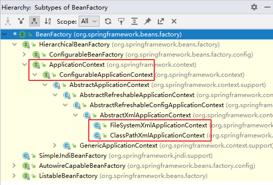
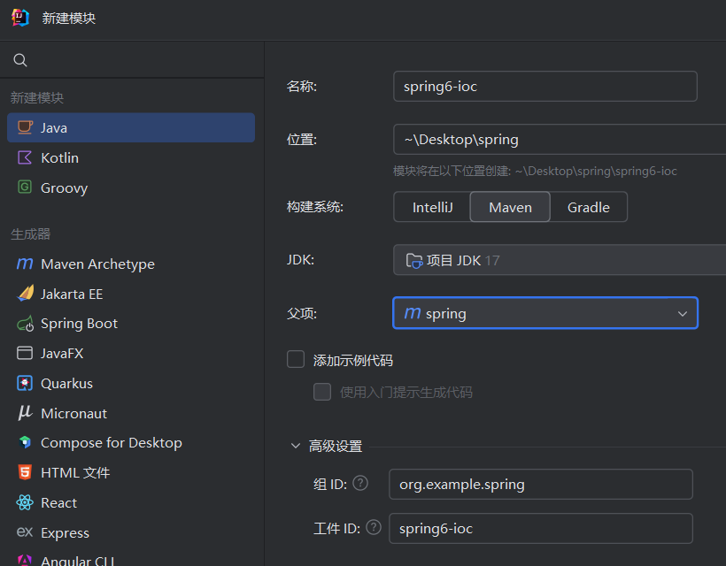

# Spring 框架基础

**Java - Spring Framework Beginning**

---
---

## Spring 概述

Spring 是一款主流的 Java EE `轻量级` `开源` `框架` ，Spring 由 Rod Johnson 提出并创立，其目的是用于简化 Java 企业级应用的开发难度和开发周期。

Spring的用途不仅限于服务器端的开发。从简单性、可测试性和松耦合的角度而言，任何Java应用都可以从Spring中受益。Spring 框架除了自己提供功能外，还提供整合其他技术和框架的能力。

Spring 自诞生以来备受青睐，一直被广大开发人员作为 Java 企业级应用程序开发的首选。时至今日，Spring 俨然成为了 Java EE 代名词，成为了构建 Java EE 应用的事实标准。

官网地址：[Spring | Home](https://spring.io/)

中文网：[spring 中文文档 - spring 中文网 (springdoc.cn)](https://springdoc.cn/docs/)

官方文档：[Spring Framework Documentation :: Spring Framework](https://docs.spring.io/spring-framework/reference/index.html) 

中文文档：[Spring Framework 概览 (springdoc.cn)](https://springdoc.cn/spring/overview.html#overview) 

### Spring 定义

**广义的 Spring：Spring 技术栈**

广义上的 Spring 泛指以 Spring Framework 为核心的 Spring 技术栈。

经过十多年的发展，Spring 已经不再是一个单纯的应用框架，而是逐渐发展成为一个由多个不同子项目（模块）组成的成熟技术，其中 Spring Framework 是其他子项目的基础。

这些子项目涵盖了从企业级应用开发到云计算等各方面的内容，能够帮助开发人员解决软件发展过程中不断产生的各种实际问题，给开发人员带来了更好的开发体验。

> 例如：Spring Framework、Spring MVC、SpringBoot、Spring Cloud、Spring Data、Spring Security 等

**狭义的 Spring：Spring Framework**

狭义的 Spring 特指 Spring Framework，通常我们将它称为 Spring 框架。

Spring 框架是一个分层的、面向切面的 Java 应用程序的一站式轻量级解决方案，它是 Spring 技术栈的核心和基础，是为了解决企业级应用开发的复杂性而创建的。

Spring 框架有两个最核心模块： IoC 和 AOP。

**IoC**（Inverse of Control）译为“**控制反转**”，指把创建对象过程交给 Spring 进行管理。

**AOP**（Aspect Oriented Programming）译为“**面向切面编程**”。AOP 用来封装多个类的公共行为，将那些与业务无关，却为业务模块所共同调用的逻辑封装起来，减少系统的重复代码，降低模块间的耦合度。另外，AOP 还解决一些系统层面上的问题，比如日志、事务、权限等。

| Spring**特点** | 说明                                                         |
| --------------------- | ------------------------------------------------------ |
| `非侵入式`      | 使用 Spring Framework 开发应用程序时，Spring 对应用程序本身的结构影响非常小。对领域模型可以做到零污染；对功能性组件也只需要使用几个简单的注解进行标记，完全不会破坏原有结构，反而能将组件结构进一步简化。这就使得基于 Spring Framework 开发应用程序时结构清晰、简洁优雅。 |
| `控制反转`      | IoC——Inversion of Control，翻转资源获取方向。把自己创建资源、向环境索取资源变成环境将资源准备好，我们享受资源注入。 |
| `面向切面编程`  | AOP——Aspect Oriented Programming，在不修改源代码的基础上增强代码功能。 |
| `容器`          | Spring IoC 是一个容器，因为它包含并且管理组件对象的生命周期。组件享受到了容器化的管理，替程序员屏蔽了组件创建过程中的大量细节，极大的降低了使用门槛，大幅度提高了开发效率。 |
| `组件化`        | Spring 实现了使用简单的组件配置组合成一个复杂的应用。在 Spring 中可以使用 XML 和 Java 注解组合这些对象。这使得我们可以基于一个个功能明确、边界清晰的组件有条不紊的搭建超大型复杂应用系统。 |
| `一站式`        | 在 IoC 和 AOP 的基础上可以整合各种企业应用的开源框架和优秀的第三方类库。而且 Spring 旗下的项目已经覆盖了广泛领域，很多方面的功能性需求可以在 Spring Framework 的基础上全部使用 Spring 来实现。 |

| Spring **优势** | 说明                                                         |
| --------------------- | ------------------------------------------------------ |
| `预定义模板`    | Spring框架提供了JDBC，Hibernate，JPA等技术的模板。它隐藏了这些技术的基本步骤，因此无需编写过多的代码。 |
| `松耦合`        | 由于依赖项注入，Spring应用程序松散耦合。                     |
| `易于测试`      | 依赖注入使测试应用程序更加容易。 EJB或Struts应用程序需要服务器来运行该应用程序，但Spring框架不需要服务器。 |
| `轻巧`          | Spring框架由于其POJO而轻巧实施。 Spring Framework不会强迫程序员继承任何类或实现任何接口。这就是为什么它被称为非侵入性的。 |
| `快速开发`      | Spring Framework的依赖注入功能及其对各种框架的支持使开发变得容易 |
| `强大的抽象`    | 它为JavaEE规范(例如 JMS, JDBC, JPA and JTA提供了强大的抽象。 |
| `声明式支持`    | 它为以下内容提供声明式支持: 缓存，验证，事务和格式。         |


## 环境搭建与程序创建

### 版本要求

Spring：6+

JDK：Java17**（Spring6要求JDK最低版本是Java17）**

### 入门步骤

1. 打开 IDEA ，创建父母项目（父母项目中的src可以删除）

   

2. 在项目内创建子模块

   

3. 打开父母项目的 pom.xml，引入 spring 依赖。

   

4. 创建 类 User ，添加 add 方法。

   

5. 创建配置文件 beam.xml

   

6. 创建测试类进行调用

   

7. 查看输出内容

   

#### 入门分析

1. **通过反射进行对象创建**：

   1. 加载 beam.xml 配置文件
   2. 对 xml 文件进行解析操作
   3. 获取 xml 文件 beam 标签属性值：id 和 class
   4. 使用反射根据类的全路径创建对象

      ```java
         Class clazz = class.forName("org.example.spring.User");
         User user = (User)clazz.getDeclaredConstructor().newInstance();
      ```

2. 创建对象后存储在 Spring 框架内创建的 Map 中

   1. Map <String, BeanDefinition> beanDefinitionMap

   2. key:唯一标识，value:类的定义（描述信息）

      > 储存在 DefaultListableBeanFactory.class
      >
      > IDEA 中双击 shift 搜索以上名称可打开。


## Log4j2 日志框架

### 概述

在项目开发中，日志记录是不可或缺的重要环节。无论是记录系统的运行情况，还是定位线上问题，日志都发挥着至关重要的作用。日志详细记录了系统行为的时间、地点、状态等关键信息，帮助我们实时了解系统运行状况，监控系统健康状态。当系统出现错误或接近潜在危险状态时，日志能够及时发出警报，提醒我们采取措施进行处理。更重要的是，在系统出现问题时，日志可以作为关键线索，帮助我们快速定位、诊断并解决问题。

**Apache Log4j2** 是一款广泛使用的开源日志记录组件。它以其强大的功能和便捷的使用方式，取代了传统的 `System.out` 打印语句，成为 Java 领域中最流行的日志工具之一。

**Log4j2 的核心组件包括以下三个方面：**

1. **日志信息的优先级**
   从低到高依次为：**TRACE < DEBUG < INFO < WARN < ERROR < FATAL**。

   ​	**TRACE**：用于追踪程序的执行过程，是最低的日志级别，通常用于详细记录程序的运行轨迹。
   ​	**DEBUG**：主要用于调试阶段，记录程序的运行细节，帮助开发人员排查问题。
   ​	**INFO**：用于输出重要的运行信息，是日常使用频率较高的日志级别。
   ​	**WARN**：用于输出警告信息，提示潜在问题或需要注意的事项。
   ​	**ERROR**：用于记录错误信息，表明系统运行过程中出现了异常。
   ​	**FATAL**：用于记录严重错误，通常会导致系统无法正常运行。

   这些级别用于标识日志信息的重要程度。日志级别越高，优先级越高。

   级别高的日志会自动屏蔽级别低的日志。

   > 例如，如果日志级别设置为 **WARN**，则 **INFO** 和 **DEBUG** 级别的日志将不会被记录或显示。

2. **日志信息的输出目的地**
   日志信息的输出目的地决定了日志的存储位置。  Log4j2 支持将日志输出到 **控制台** 或 **文件** 中。根据实际需求，可以选择将日志实时显示在控制台上，便于开发阶段的即时查看；也可以将日志写入文件，便于长期存储和后续分析。

3. **日志信息的输出格式**
   日志的输出格式控制了日志信息的显示内容和格式。通过配置日志格式，可以自定义日志的输出样式，例如包含时间戳、日志级别、线程信息、日志消息等。合理的日志格式能够使日志信息更加清晰易读，便于后续的分析和排查。

### 使用

#### 引入依赖

打开 pom.xml 加入

```xml
<!--log4j2的依赖-->
<dependency>
    <groupId>org.apache.logging.log4j</groupId>
    <artifactId>log4j-core</artifactId>
    <version>2.19.0</version>
</dependency>
<dependency>
    <groupId>org.apache.logging.log4j</groupId>
    <artifactId>log4j-slf4j2-impl</artifactId>
    <version>2.19.0</version>
</dependency>
```

#### 加入日志配置文件

在类的根路径下提供配置文件（resources 文件夹内创建 log4j2.xml)

文件名固定为`log4j2.xml`，文件必须放到类根路径下。

整个配置文件以 `<configuration>` 标签作为根节点，包含：**日志级别（Loggers）**、**日志输出目标（Appenders）**、**日志格式（PatternLayout）**。

Appenders 是日志的输出目的地，Log4j2 支持多种类型的 Appenders，例如控制台、文件、滚动文件等。

```xml
<?xml version="1.0" encoding="UTF-8"?>
<configuration>
    <loggers>
        <!--
            level指定日志级别，从低到高的优先级：
                TRACE < DEBUG < INFO < WARN < ERROR < FATAL
                trace：追踪，是最低的日志级别，相当于追踪程序的执行
                debug：调试，一般在开发中，都将其设置为最低的日志级别
                info：信息，输出重要的信息，使用较多
                warn：警告，输出警告的信息
                error：错误，输出错误信息
                fatal：严重错误
        -->
        <root level="DEBUG">
            <appender-ref ref="spring6log"/>
            <appender-ref ref="RollingFile"/>
            <appender-ref ref="log"/>
        </root>
    </loggers>

    <appenders>
        <!--输出日志信息到控制台-->
        <console name="spring6log" target="SYSTEM_OUT">
            <!--控制日志输出的格式-->
            <PatternLayout pattern="%d{yyyy-MM-dd HH:mm:ss SSS} [%t] %-3level %logger{1024} - %msg%n"/>
        </console>

        <!--文件会打印出所有信息，这个log每次运行程序会自动清空，由append属性决定，适合临时测试用-->
        <File name="log" fileName="d:/spring6_log/test.log" append="false">
            <PatternLayout pattern="%d{HH:mm:ss.SSS} %-5level %class{36} %L %M - %msg%xEx%n"/>
        </File>

        <!-- 这个会打印出所有的信息，
            每次大小超过size，
            则这size大小的日志会自动存入按年份-月份建立的文件夹下面并进行压缩，
            作为存档-->
        <RollingFile name="RollingFile" fileName="d:/spring6_log/app.log"
                     filePattern="log/$${date:yyyy-MM}/app-%d{MM-dd-yyyy}-%i.log.gz">
            <PatternLayout pattern="%d{yyyy-MM-dd 'at' HH:mm:ss z} %-5level %class{36} %L %M - %msg%xEx%n"/>
            <SizeBasedTriggeringPolicy size="50MB"/>
            <!-- DefaultRolloverStrategy属性如不设置，
            则默认为最多同一文件夹下7个文件，这里设置了20 -->
            <DefaultRolloverStrategy max="20"/>
        </RollingFile>
    </appenders>
</configuration>
```

#### 测试

运行之前写好的测试程序


#### 调用方法

修改 TestUser 程序，手动写入日志。

可选调用级别，演示使用 info 级别。

```java
import org.example.spring.User;
import org.junit.Test;
import org.slf4j.Logger;
import org.slf4j.LoggerFactory;
import org.springframework.context.ApplicationContext;
import org.springframework.context.support.ClassPathXmlApplicationContext;

public class TestUser {
    // 创建 Logger 对象
    private Logger logger = LoggerFactory.getLogger(TestUser.class);

    @Test
    public void testUserAdd(){
        ApplicationContext context = new ClassPathXmlApplicationContext("beam.xml");
        User user = (User)context.getBean("user");
        System.out.println(user);
        user.add();

        // 手动写入日志
        logger.info("执行了 testUserAdd 方法");
    }
}
```


## 容器：IoC

### IoC 概述

**控制反转（Inversion of Control，IoC）** 是一种重要的设计思想，也是面向对象编程中的一项关键原则。它通过将对象的创建和生命周期管理从应用程序代码中分离出来，交由一个专门的容器或框架来负责。在传统的编程模式中，开发者通常使用 `new` 关键字直接创建对象，而 IoC 则巧妙地将这种控制权“反转”，交由框架来统一管理。

**控制反转（IoC）核心要点**

- *定义*：控制反转是一种设计思想，用于降低程序耦合度，提升扩展性和可维护性。
- *反转的内容*：
  - 将对象的创建权交给第三方容器。
  - 将对象依赖关系的管理权交给第三方容器。
- *实现方式*：通过 <u>依赖注入</u>（DI）实现，容器自动注入依赖，减少代码耦合。

### 依赖注入

**依赖注入（Dependency Injection，DI）**指Spring创建对象的过程中，将对象依赖属性通过配置进行注入。

Spring 支持以下几种依赖注入方式：

- **构造器注入**：通过构造函数注入依赖。
- **Setter 注入**：通过 Setter 方法注入依赖。
- **字段注入**：直接将依赖注入到字段中，但这种方式不推荐，因为它会降低测试的灵活性。

### 容器概述

在Spring中，构成应用程序的骨干并由`Spring IoC容器`管理的对象被称 **Spring Bean**。Bean是一个由Spring IoC容器实例化、组装和管理的对象。Bean以及它们之间的依赖关系都反映在容器使用的配置元数据中。

这些 Bean 与通过 `new` 关键字创建的普通 Java 对象在功能上并无二致，但它们的创建、配置和生命周期管理均由 Spring 容器负责，从而实现了高度的解耦和灵活性。

1. `org.springframework.beans` 和 `org.springframework.context` 包是Spring Framework的IoC容器的基础。

2. **BeanFactory** 接口提供了一种高级配置机制，能够管理任何类型的对象。这是 IoC 容器的基本实现，是 Spring 内部使用的接口。面向 Spring 本身，不提供给开发人员使用。

3. **ApplicationContext** 是 `BeanFactory` 的一个完整的超集，也是它的一个子接口，增加了更多的企业特定功能：

   - 更容易与Spring的AOP功能集成

   - Message resource 处理（用于国际化）

   - 事件发布

   - 应用层的特定上下文，如 `WebApplicationContext`，用于 web 应用

   `org.springframework.context.ApplicationContext` 接口代表 Spring IoC 容器，负责实例化、配置和组装bean。

   容器通过读取配置元数据来获得关于要实例化、配置和组装哪些对象的指示。配置元数据以XML、Java注解或Java代码表示。它可以让你表达构成你的应用程序的对象以及这些对象之间丰富的相互依赖关系。

   **主要实现类**：

   

   | 类型名                          | 简介                                                         |
   | ------------------------------- | ------------------------------------------------------------ |
   | ClassPathXmlApplicationContext  | 通过读取类路径下的 XML 格式的配置文件创建 IOC 容器对象       |
   | FileSystemXmlApplicationContext | 通过文件系统路径读取 XML 格式的配置文件创建 IOC 容器对象     |
   | ConfigurableApplicationContext  | ApplicationContext 的子接口，包含一些扩展方法 refresh() 和 close() ，让 ApplicationContext 具有启动、关闭和刷新上下文的能力。 |
   | WebApplicationContext           | 专门为 Web 应用准备，基于 Web 环境创建 IOC 容器对象，并将对象引入存入 ServletContext 域中。 |

### Bean 概览

一个Spring IoC容器管理着一个或多个Bean。这些Bean是用你提供给容器的配置元数据创建的.

在容器本身中，这些Bean定义被表示为 `BeanDefinition` 对象，它包含（除其他信息外）以下元数据。

- 一个全路径类名：通常，被定义的Bean的实际实现类。
- Bean的行为配置元素，它说明了Bean在容器中的行为方式（scope、生命周期回调，等等）。
- 对其他Bean的引用，这些Bean需要做它的工作。这些引用也被称为合作者或依赖。
- 要在新创建的对象中设置的其他配置设置—例如，pool的大小限制或在管理连接池的Bean中使用的连接数。

这个元数据转化为构成每个Bean定义的一组属性。下表描述了这些属性。

| 属性                     | 解释                                   |
| :----------------------- | :------------------------------------- |
| Class                    | 实例化 Bean                            |
| Name                     | Bean 命名                              |
| Scope                    | Bean Scope                             |
| Constructor arguments    | 依赖注入                               |
| Properties               | 依赖注入                               |
| Autowiring mode          | 注入协作者（Autowiring Collaborators） |
| Lazy initialization mode | 懒加载的Bean                           |
| Initialization method    | 初始化回调                             |
| Destruction method       | 销毁回调                               |

除了包含如何创建特定 Bean 的信息的 Bean 定义外，`ApplicationContext` 实现还允许注册在容器外（由用户）创建的现有对象。这是通过 `getBeanFactory()` 方法访问 `ApplicationContext` 的 `BeanFactory` 来实现的，该方法返回 `DefaultListableBeanFactory` 实现。`DefaultListableBeanFactory` 通过 `registerSingleton(..)` 和 `registerBeanDefinition(..)` 方法支持这种注册。然而，典型的应用程序只与通过常规Bean定义元数据定义的Bean一起工作。

> Bean 元数据和手动提供的单体实例需要尽早注册，以便容器在自动注入和其它内省步骤中正确推导它们。虽然在某种程度上支持覆盖现有的元数据和现有的单体实例，但 **官方不支持在运行时注册新的Bean**（与对工厂的实时访问同时进行），这可能会导致并发访问异常、Bean容器中的不一致状态，或者两者都有。

#### Bean 命名

每个 Bean 在其所属的容器中拥有一个或多个唯一的标识符（identifier）。这些标识符用于唯一标识容器中的 Bean。通常情况下，一个 Bean 只有一个标识符，但在某些场景下，也可以为其指定多个标识符，其中多余的标识符将被视为别名。

在基于 XML 的配置元数据中，可以通过以下方式指定 Bean 的标识符：

1. **`id` 属性**：用于精确指定一个唯一的标识符。`id` 属性的值必须在容器中保持唯一。
2. **`name` 属性**：可以用于指定一个或多个别名。如果需要为 Bean 提供多个标识符，可以在 `name` 属性中使用逗号（`,`）、分号（`;`）或空格进行分隔。

```xml
<bean name="userService, user-service; userServiceBean" class="com.example.UserService">
    <!-- Bean 的其他配置 -->
</bean>
```

需要注意的是，虽然在某些情况下可以不显式提供 `name` 或 `id`，但容器会为未命名的 Bean 自动生成一个唯一的名称。然而，如果需要通过 `ref` 元素或其他服务定位器风格的查找方式引用该 Bean 的名称，则必须显式提供一个名称。

> 在classpath中的组件扫描（component scanning），Spring为未命名的组件生成Bean名称，遵循前面描述的规则：基本上，取简单的类名并将其初始字符变成小写。然而，在（不寻常的）特殊情况下，当有一个以上的字符，并且第一个和第二个字符都是大写时，原来的大小写会被保留下来。这些规则与 `java.beans.Introspector.decapitalize`（Spring在此使用）所定义的规则相同。

##### 外部别名

在实际定义 Bean 的地方指定所有别名并不总是足够的。有时，为一个在其他地方定义的 Bean 引入别名是必要的。这种情况在大型系统中尤为常见，尤其是当配置被分割到各个子系统中，每个子系统都有自己的对象定义集时。在这种场景下，基于 XML 的配置元数据可以通过 `<alias/>` 元素为 Bean 引入别名。

> ```xml
> <alias name="fromName" alias="toName"/>
> ```
>
> 在此示例中，名为 `fromName` 的 Bean（位于同一容器中）在定义别名后，也可以通过 `toName` 进行引用。
>
> 例如，假设子系统 A 的配置元数据引用了一个名为 `subsystemA-dataSource` 的数据源，而子系统 B 的配置元数据引用了一个名为 `subsystemB-dataSource` 的数据源。当主应用程序整合这两个子系统时，它可能以 `myApp-dataSource` 的名称来引用数据源。为了确保这三个名称都指向同一个对象，可以在配置元数据中添加以下别名定义：
>
> ```xml
> <alias name="myApp-dataSource" alias="subsystemA-dataSource"/>
> <alias name="myApp-dataSource" alias="subsystemB-dataSource"/>
> ```
>
> 通过这种方式，每个子系统和主应用程序都可以通过一个独特的名称来引用数据源，同时避免与其他定义发生冲突（有效地创建了一个命名空间），但它们实际上引用的是同一个 Bean。

##### 嵌套类名

如果你想为一个嵌套类配置一个Bean定义（definition），你可以使用嵌套类的二进制名称或源（source）名称。

根据 Java 的规范，嵌套类的类名可以用点（`.`）或美元符号（`$`）分隔。

> ```java
> package com.example;
> 
> public class SomeThing {
>     public static class OtherThing {
>         public void doSomething() {
>             System.out.println("OtherThing is doing something.");
>         }
>     }
> }
> ```
>
> 在 Spring 的配置中，可这样定义 `OtherThing` 的 Bean，容器会根据配置创建 `OtherThing` 类的实例：
>
> ```xml
> <bean id="otherThing" class="com.example.SomeThing$OtherThing" />
> <!-- 或 -->
> <bean id="otherThing" class="com.example.SomeThing.OtherThing" />
> ```

### 配置元数据

Spring IoC 容器通过配置元数据来了解如何在你的应用中实例化、配置和组装对象。这种元数据是你作为开发者向 Spring 容器传达指令的方式。

这些 Bean 的定义对应于应用程序中实际运行的对象。通常，你会在 Spring 容器中定义服务层对象、持久层对象（如存储库或数据访问对象 DAO）、表现层对象（如 Web 控制器）、基础设施对象（如 JPA 的 `EntityManagerFactory`）、JMS 队列等。而细粒度的领域对象（domain object）通常不会在容器中配置，因为它们的创建和加载通常是存储库（repository）和业务逻辑的责任。

#### 基于 XML 管理 Bean

**基础配置**

基于XML的配置元数据将这些Bean配置为顶层 `<beans/>` 元素内的 `<bean/>` 元素。

```xml
<?xml version="1.0" encoding="UTF-8"?>
<beans xmlns="http://www.springframework.org/schema/beans"
    xmlns:xsi="http://www.w3.org/2001/XMLSchema-instance"
    xsi:schemaLocation="http://www.springframework.org/schema/beans
        https://www.springframework.org/schema/beans/spring-beans.xsd">

    <bean id="..." class="...">  
        <!-- 1.这个bean的合作者和配置在这里 -->
    </bean>

    <bean id="..." class="...">
        <!-- 2.这个bean的合作者和配置在这里 -->
    </bean>

    <!-- 更多bean 定义在这里 -->
</beans>
```

1. `id` 属性是一个字符串，用于识别单个Bean定义。`id` 属性的值可以用来指代协作对象。
2. `class` 属性定义了 Bean 的类型，并使用类的全路径名。

**跨越多个XML文件**

让Bean的定义跨越多个XML文件可能很有用。通常情况下，每个单独的XML配置文件代表了你架构中的一个逻辑层或模块。

1. 你可以使用 application context 构造函数从所有这些XML片段中加载Bean定义。这个构造函数需要多个 `Resource` 位置。

   > 提供给 `ApplicationContext` 构造函数的一条或多条路径是资源字符串，它让容器从各种外部资源（如本地文件系统、Java `CLASSPATH` 等）加载配置元数据。
   >
   > ```java
   > ApplicationContext context = new ClassPathXmlApplicationContext("services.xml", "daos.xml");
   > ```

2. 或者，使用一个或多个 `<import/>` 元素的出现来从另一个或多个文件中加载Bean定义。

   ```xml
   <beans>
       <import resource="services.xml"/>
       <import resource="resources/messageSource.xml"/>
       <import resource="/resources/themeSource.xml"/>
   
       <bean id="bean1" class="..."/>
       <bean id="bean2" class="..."/>
   </beans>
   ```

> 在前面的例子中，外部 Bean 定义是从三个文件加载的：`services.xml`、`messageSource.xml` 和 `themeSource.xml`。这些文件的路径是相对于导入文件的位置而言的。（例如，`services.xml` 必须与导入文件位于同一目录或 classpath 位置，而 `messageSource.xml` 和 `themeSource.xml` 则位于导入文件所在位置的子目录 `resources` 目录中。需要注意的是，前导斜杠会被忽略，因此建议避免使用斜杠路径。）
>
> 虽然可以使用相对路径（如 `../`）来引用父目录中的文件，但这种做法并不推荐，因为它可能导致对应用程序外部文件的依赖。特别是对于 `classpath:` URL（例如 `classpath:../services.xml`），运行时解析会依赖于“最近的”classpath 根目录，然后查找其父目录。这种路径方式在 classpath 配置发生变化时，可能会导致解析到错误的目录。
>
> 为了避免这些问题，可以使用绝对路径来指定资源位置，例如 `file:C:/config/services.xml` 或 `classpath:/config/services.xml`。然而，使用绝对路径会将应用程序配置与特定的文件位置耦合在一起，因此建议通过占位符（如 `${...}`）来动态解析这些路径，例如基于 JVM 系统属性进行配置。

##### 实验

###### 准备实验内容

1. 新建工程模块：父工程选用之前创建的 spring （父工程已经引入依赖 springframework、junit、log4j）

   

2. 模块内 `src / main / java` 目录中创建类 `org.example.spring6.iocxml.User`，写入相应内容。

   

3. 在 resources 目录中创建 `bean.xml` 配置文件

   

4. 在 `src / test / java` 目录中创建测试类 `TestUser`

   

###### 一：获取 Bean

1. **根据id获取**：由于 id 属性指定了 bean 的唯一标识，所以根据 bean 标签的 id 属性可以精确获取到一个组件对象。

2. **根据类型获取**：通过 Bean 的类型进行查找，但需注意IoC容器中指定类型的bean有且只能有一个，否则会出现异常。

3. **根据id和类型**：结合 id 和类型进行精确查找。

4. 示例代码：

   ```java
   import org.junit.Test;
   import org.springframework.context.ApplicationContext;
   import org.springframework.context.support.ClassPathXmlApplicationContext;
   import org.example.spring6.iocxml.User;
   
   public class TestUser {
       ApplicationContext ac = new ClassPathXmlApplicationContext("bean.xml");
   
       @Test
       public void test1(){
           User bean = (User) ac.getBean("user"); // 根据id获取
           bean.run();
       }
   
       @Test
       public void test2(){
           User bean = ac.getBean(User.class); // 根据类型获取
           bean.run();
       }
   
       @Test
       public void test3(){
           User bean = ac.getBean("user", User.class); //根据id和类型
           bean.run();
       }
   }
   ```

> **拓展**
>
> 在 Spring 框架中，当组件类实现了某个接口时，可以通过*接口*类型获取 Bean，但这一操作的前提是该接口的实现类在 Spring 容器中必须是唯一的。
>
> 如果一个接口有*多个实现类*，并且这些实现类都被配置为 Bean，那么通过接口类型获取 Bean 将无法成功，因为容器无法确定具体返回哪一个实现类的 Bean。
>
> 根据类型获取 Bean 的机制 是基于 Java 的 `instanceof` 运算符的。Spring 容器会检查容器中的对象是否满足 `instanceof` 指定类型的条件，即对象是否是该类型或其子类/实现类的实例。如果满足条件，即 `instanceof` 返回 `true`，则认为该对象与目标类型匹配，从而可以成功获取。因此，`instanceof` 的使用要求左右操作数之间必须存在继承或实现关系。
>
> **实验步骤**：
>
> 1. 新建接口 org.example.spring6.iocxml.bean.`UserDao`
>
>    ```java
>    package org.example.spring6.iocxml.bean;
>    public interface UserDao {
>        public void run();
>    }
>    ```
>
> 2. 新建实现类 org.example.spring6.iocxml.bean.`UserDaoImpl`
>
>    ```java
>    package org.example.spring6.iocxml.bean;
>    public class UserDaoImpl implements UserDao{
>        @Override
>        public void run() {
>            System.out.println("UserDaoImpl.run...");
>        }
>    }
>    ```
>
> 3. 在 bean.xml 中添加内容
>
>    ```xml
>    <!--此处写下的是实现类-->
>    <bean id="userDao" class="org.example.spring6.iocxml.bean.UserDaoImpl"></bean>
>    ```
>
> 4. 创建测试类 TestUserDao
>
>    ```java
>    import org.example.spring6.iocxml.bean.UserDao;
>    import org.springframework.context.ApplicationContext;
>    import org.springframework.context.support.ClassPathXmlApplicationContext;
>    
>    public class TestUserDao {
>        public static void main(String[] args) {
>            ApplicationContext context = new ClassPathXmlApplicationContext("bean.xml");
>            UserDao bean = context.getBean(UserDao.class); // 通过接口类型获取
>            bean.run();
>        }
>    }
>    ```
>
>    运行发现成功。
>
> 5. 但如果新增一个 实现类，则再使用接口类型寻找对象: `context.getBean(UserDao.class)`，则会出错，理由是指代不明确。 

###### 二：依赖注入 setter 注入方式

1. 父工程导入 lombok 方便 getter 、 setter 和 构造器的创建。

   ```xml 
   <dependency>
       <groupId>org.projectlombok</groupId>
       <artifactId>lombok</artifactId>
       <version>1.18.30</version>
       <scope>provided</scope>
   </dependency>
   ```

2. 创建一个实验类 Student : `org.example.spring6.iocxml.di.Student`

   ```java
   package org.example.spring6.iocxml.di;
   
   import lombok.Data;
   import lombok.NoArgsConstructor;
   import lombok.ToString;
   
   @Data
   @NoArgsConstructor
   @ToString
   public class Student {
       private Integer id;
       private String name;
       private Integer age;
       private String sex;
   }
   
   ```

3. 配置 bean 时为属性赋值

   `<property>` 元素是用于配置 Bean 的属性注入的核心组件，在 Spring 的 XML 配置文件中为 Bean 的属性赋值。`<property>` 元素通常嵌套在 `<bean>` 元素内。

   

   

4. 


#### 基于注解管理 Bean


#### 基于 Java 管理 Bean

Java配置通常使用 `@Configuration` 类中的 `@Bean` 注解的方法。


