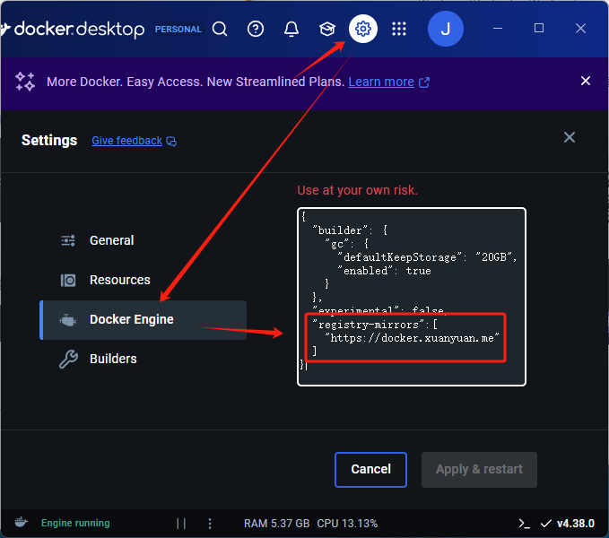
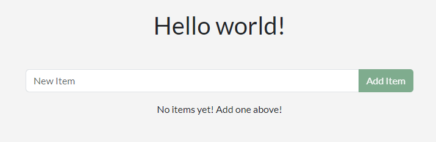
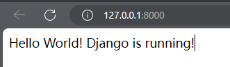

# Docker 快速入门

**Docker Beginning**

---

## Docker 简介

*官方文档*：[Docker Docs](https://docs.docker.com/)

*中文文档*：[Docker中文文档 (cadn.net.cn)](https://docker.cadn.net.cn/get-started/docker-overview)

*推荐博客*：[Docker 教程（图文讲解） - 犬小哈教程](https://www.quanxiaoha.com/docker/docker-tutorial.html)

**Docker** 是一个开源的*容器化平台*，提供了在松散隔离的环境，它允许开发者将应用程序及其所有依赖项（库、配置文件、环境变量等）打包成一个轻量级的、可移植的容器，并在任何环境中快速部署和运行。简单来说，Docker 是一种“*将应用打包成标准化单元*”的技术。

传统虚拟机（VM）与Docker容器的本质区别：

|   特性   |            虚拟机            |          Docker容器          |
| :------: | :--------------------------: | :--------------------------: |
| 启动速度 | 分钟级（需启动完整操作系统） | 秒级（直接运行在宿主机内核） |
| 资源占用 |  高（需分配固定内存和CPU）   |   低（动态共享宿主机资源）   |
| 系统依赖 |    需要Hypervisor虚拟化层    |      直接使用宿主机内核      |
| 隔离级别 |        进程级完全隔离        |        进程级轻量隔离        |
| 镜像大小 |          通常GB级别          |          通常MB级别          |

###  Docker 的作用

- **环境一致性**：开发、测试、生产环境保持完全一致，消除"依赖地狱"问题。容器内包含精确的运行时环境配置，确保代码在任何Docker环境中行为一致。
- **快速部署**：容器可以在几秒钟内启动，大大缩短了部署时间。
- **资源高效利用**：多个容器可以共享宿主机的资源，节省硬件成本。
- **简化依赖管理**：将应用和依赖打包在一起，避免环境配置的复杂性。
- **微服务友好架构**：天然支持微服务拆分，每个服务独立容器化。配合Docker Compose可实现多容器编排

### Docker 架构


Docker 采用**客户端-服务器架构  (C/S) **，由以下几个核心组件组成：

- **Docker 客户端（Docker Client）**：Docker 客户端是用户与 Docker 守护进程交互的命令行界面（CLI）。用户通过 Docker CLI 发出命令，这些命令被发送到 Docker 守护进程执行相应的操作。
  - 交互方式：Docker 客户端与 Docker 守护进程之间通过 REST API 或 Unix 套接字通信。常用的命令行工具是 `docker`，通过它，用户可以发出各种 Docker 操作命令。
- **Docker 守护进程（Docker Daemon）**：Docker 守护进程（通常是 `dockerd`）是 Docker 架构的核心，通常以后台进程的方式运行。
  - Docker 守护进程监听来自 Docker 客户端的 API 请求，并且通过 Docker API 执行这些请求。守护进程将负责容器、镜像等 Docker 对象的管理，并根据请求的参数启动容器、删除容器、修改容器配置等。
- **Docker 镜像仓库（Docker Registries）**：存储和分发 Docker 镜像的仓库。
  - Docker Hub 是默认的公共仓库，任何人都可以使用。
  - 支持搭建私有仓库，用于企业内部镜像管理。
- **Docker Objects（核心对象）**
  - `镜像（Image）`：是一个只读的模板，包含了运行应用所需的所有文件、依赖和配置。类似于虚拟机的“快照”，但更轻量。它通过UnionFS实现分层存储，每一层代表一个修改或添加的内容。这种分层结构使得镜像可以复用，节省存储空间。
  - `容器（Container）`：镜像的可运行实例，包含可写层。当你启动一个容器时，Docker 会基于镜像创建一个可写的层，容器中的所有操作都在这个层中进行。
  - `Dockerfile`：是一个文本文件，包含了一系列指令，用于定义如何构建一个镜像。通过 Dockerfile 可以自动化地创建自定义镜像。
  - `网络（Network）`：Docker 网络允许容器之间相互通信，并与外部世界进行连接。支持`bridge`（默认）/`host`/`none` 等多种网络模式
  - `数据卷（Volume）`：一种数据持久化机制，允许数据在容器之间共享，并且独立于容器的生命周期。与容器文件系统不同，卷的内容不会随着容器的销毁而丢失，适用于数据库等需要持久存储的应用。
- **Docker Desktop**：一款用于构建和共享容器化应用程序和微服务的应用程序。
  - Docker Desktop 包括 Docker 守护程序 （`dockerd`）、Docker 客户端 （`docker`）、Docker Compose、Docker Content Trust、Kubernetes 和 Credential Helper 的 Credential Helper 结合使用。

### Docker 底层技术

Docker 是用 Go 编程语言编写的，它利用 Linux 内核的几个功能来提供其功能。 Docker 使用一种名为`namespaces`提供隔离的工作区称为容器。当您运行容器时，Docker 会创建一组命名空间。

这些命名空间提供了一个隔离层。容器的每个方面都运行 ，并且其访问权限仅限于该命名空间。

- **命名空间（Namespaces）**：实现进程、网络、文件系统等资源的隔离。
- **控制组（cgroups）**：限制容器的资源使用（如 CPU、内存等）。
- **联合文件系统（UnionFS）**：实现镜像的分层存储，使得镜像可以复用和共享。

### Docker 生态常用工具链

|    工具名称    |      用途说明      |           典型命令示例           |
| :------------: | :----------------: | :------------------------------: |
| Docker Compose |   多容器编排工具   |      `docker-compose up -d`      |
|  Docker Swarm  |  原生集群管理工具  |       `docker swarm init`        |
|   Portainer    | 可视化容器管理平台 |          通过Web UI操作          |
|   Watchtower   |  自动更新容器工具  | `docker run --detach watchtower` |

### Docker 架构的工作流程

- **构建镜像**：使用 `Dockerfile` 创建镜像。
- **推送镜像到注册表**：将镜像上传到 Docker Hub 或私有注册表中。
- **拉取镜像**：通过 `docker pull` 从注册表中拉取镜像。
- **运行容器**：使用镜像创建并启动容器。
- **管理容器**：使用 Docker 客户端命令管理正在运行的容器（例如查看日志、停止容器、查看资源使用情况等）。
- **网络与存储**：容器之间通过 Docker 网络连接，数据通过 Docker 卷或绑定挂载进行持久化。


## Docker 安装

官方文档中含有各种系统的安装教程： [Get Docker | Docker Docs](https://docs.docker.com/get-started/get-docker/)

我主要在 Windows 上进行学习，记录 Windows 安装过程。

> 注意，Docker 并非是一个通用的容器工具，它依赖于已存在并运行的 Linux 内核环境。
>
> Docker 实质上是在已经运行的 Linux 下制造了一个隔离的文件环境，因此它执行的效率几乎等同于所部署的 Linux 主机。
>
> 因此，Docker 必须部署在 Linux 内核的系统上。如果其他系统想部署 Docker 就必须安装一个虚拟 Linux 环境。

在 windows 中，可以采用 `WSL 2` 或 `Hyper-V` 来虚拟化 Linux 环境。

这里尝试使用 WSL2 ，按照文档启用 WSL2 ：[安装 WSL | Microsoft Learn](https://learn.microsoft.com/zh-cn/windows/wsl/install)

- 在任意位置打开 PowerShell
- 输入 `wsl --install` ，自动切换 wsl2 且按照 Ubuntu 发行版

接下来按照 `Docker Desktop for windows`： [Get Docker | Docker Docs](https://docs.docker.com/get-started/get-docker/)

下载完成后，运行安装。

安装完毕后，打开 Linux 发行版（默认是 Ubuntu，在开始菜单搜索即可）

在控制台中输入`docker --version`来显示版本和内部版本号，确认是否安装成功

通过使用 `docker run hello-world` 运行简单的内置 Docker 映像，测试安装是否正常工作

若要开始使用 Docker 和 WSL 2 开发应用，建议使用 VS Code 以及 WSL、Dev Containers 和 Docker 扩展。

- [安装 VS Code WSL 扩展](https://marketplace.visualstudio.com/items?itemName=ms-vscode-remote.remote-wsl)。 此扩展使你能够在 VS Code 中打开在 WSL 上运行的 Linux 项目（无需担心路径问题、二进制兼容性或其他跨 OS 的难题）。
- [安装 VS Code Dev Containers 扩展](https://marketplace.visualstudio.com/items?itemName=ms-vscode-remote.remote-containers)。 此扩展使你能够打开容器内的项目文件夹或存储库，并利用 Visual Studio Code 的完整功能集在容器中执行开发工作。
- [安装 VS Code Docker 扩展](https://marketplace.visualstudio.com/items?itemName=ms-azuretools.vscode-docker)。 此扩展添加了从 VS Code 内生成、管理和部署容器化应用程序的功能。 （需要 Dev Containers 扩展才能使用容器作为你的开发环境。）


## Docker 修改容器镜像

成功安装 Docker Desktop 后，即可进行应用程序开发。

> 接下来将拉取一个项目进行测试，
>
> 环境中包含几个容器（或进程）每个容器都满足应用程序的特定需求：
>
> - React 前端 - 一个使用 [Vite](https://vitejs.dev/) 运行 React 开发服务器的 Node 容器。
> - Node 后端 - 后端提供了一个 API，该 API 提供了检索、创建和删除待办事项的能力。
> - MySQL 数据库 - 用于存储项目列表的数据库。
> - phpMyAdmin - 一个基于 Web 的界面，用于与可通过 [http://db.localhost](http://db.localhost/) 访问的数据库进行交互。
> - Traefik 代理 - [Traefik](https://traefik.io/traefik/) 是一种应用程序代理，可将请求路由到正确的服务。它会发送`localhost/api/*`到后端，对`localhost/*`到前端，然后请求`db.localhost`发送到 phpMyAdmin。这提供了使用端口 80 （而不是每个服务的不同端口） 访问所有应用程序的能力。

### 启动项目

1. 要开始使用，请将项目作为 ZIP 文件克隆或下载到本地计算机。

   ```bash
   cd '你的测试地址'
   git clone https://github.com/docker/getting-started-todo-app
   cd getting-started-todo-app
   ```

   - 发现 WSL2 无法访问 github，则观看博客 [WSL2 无法访问 github 解决方案-CSDN博客](https://blog.csdn.net/hadoopdevelop/article/details/129559506)

2. 拥有项目后，使用 Docker Compose 启动开发环境：

   ```bash
   docker compose watch
   ```

   - 将看到一个输出，其中显示正在拉取容器镜像、容器正在启动等。

   - 若发现启动失败，则可能是外网访问问题，增加镜像加速配置(来源：[Docker/DockerHub 国内镜像源](https://cloud.tencent.com/developer/article/2485043)）：

     ```json
     "registry-mirrors":[
         "https://docker.xuanyuan.me"
     ]
     ```

     

3. 等待一段时间，项目启动完毕，则可打开浏览器以 http://localhost/ 以查看应用程序。

4. 等待加载：

   - 若出现错误，则可参考 [docker.exe 未找到 ·问题 #14583 ·docker/for-win (github.com)](https://github.com/docker/for-win/issues/14583)

     - 回退 docker 版本：[旧版本 Docker 下载](https://desktop.docker.com/win/main/amd64/178610/Docker Desktop Installer.exe)
     - 在下载目录打开 PowerShell，输入以下指令无视版本安装 Docker：

     ```bash
     ./"Docker Desktop Installer.exe" install --disable-version-check
     ```

5. 这个项目默认是将访问地址设置为 `localhost:80`。但是因为现代浏览器默认规则，访问该地址会自动跳转为 `https://localhost/`，导致无法成功访问。

   - 需要修改项目配置文件，详细内容请查看之后的部分。

6. 访问加载完成后，显示页面。该应用程序是一个简单的待办事项应用程序，因此您可以随意添加一两个项目，将一些项目标记为已完成，甚至删除一个项目。

   

### 更改应用程序

1. 进入项目文件夹位置，打开 vscode：

   - 未安装 vscode 请看官方文档：[通过 WSL 使用 VS Code | Microsoft Learn](https://learn.microsoft.com/zh-cn/windows/wsl/tutorials/wsl-vscode)

   ```bash
   cd getting-started-todo-app
   code .
   ```

2. 之后，即可在 windows 端的 vscode 访问到 WSL2 下的项目。

3. 进行修改，保存文件并返回浏览器，即可看到更改已热重新加载到浏览器中。


## Docker 创建开发容器镜像

> 对于此示例，我将在 Python 开发环境设置文档中使用[适用于 Django 的 Hello World 教程](https://learn.microsoft.com/zh-cn/windows/python/web-frameworks#hello-world-tutorial-for-django)中的源代码。

1. 打开 WSL 终端（例如 Ubuntu）并输入：

   ```bash
   git clone https://github.com/mattwojo/helloworld-django.git
   cd helloworld-django
   code .
   ```

2. 从 VS Code 命令面板 (Ctrl + Shift + P)，输入：`开发容器: 在容器中重新打开`

   - 因为使用的是已使用 WSL 扩展打开的文件夹，所以也可使用`开发容器: 在容器中打开文件夹...`来选择 WSL 文件夹。

3. 系统将打开新的 VS Code 实例，开始生成新映像，等待容器构建。 

   1. 创建 `.devcontainer` 文件夹（内含的 `Dockerfile` 和 `devcontainer.json`包含容器配置信息。）
   2. 根据配置拉取基础镜像，安装 Python、Django 等依赖
   3. 启动容器并将项目文件挂载到容器内

4. 配置调试器

   - 若要使用 Visual Studio Code 在容器内运行和调试应用，请首先打开“运行”菜单（Ctrl+Shift+D 或选择最左侧菜单栏上的选项卡）。 
   - 然后选择“运行和调试”以选择调试配置，并选择最适合项目的配置（在我的示例中，这将是“Django”）。 
   - 这会在项目的 `launch.json` 文件夹中创建一个 `.vscode` 文件，其中包含有关如何运行应用的说明。

   

5. 启动项目

   - 在 VS Code 中，选择“运行”>“开始调试”（或只按 F5 键）。 
   - 这会在 VS Code 中打开终端，并且你应会看到如下所示的结果：“`正在 http://127.0.0.1:8000/ 启动开发服务器。使用 CONTROL-C 退出服务器。`”

6. 打开网页后，发现项目正常运行：

   


## Docker 构建并推送容器镜像

创建应用程序后，可以为应用程序创建容器镜像并在 Docker Hub 上共享它：

1. **使用 Docker 帐户登录**

   1. 打开 Docker 仪表板。
   2. 选择右上角的 *Sign in （登录）*。
   3. 如果需要，请创建一个帐户，然后完成登录流程。

2. **在 Docker Hub 上创建镜像仓库**

   1. 转到 [Docker Hub](https://hub.docker.com/)。
   2. 选择 *Create repository（创建存储库）*。
   3. 进入页面后，输入以下信息：
      - Repository Name - 存储库名称
      - Short Description - 简短描述
      - Visibility - 可见性：选择 **Public** 以允许其他人提取您的自定义待办事项应用程序
   4. 选择 *Create （创建）*以创建存储库。

3. **构建容器镜像**

   1. 进入项目根目录

      ```bash
      cd "项目根目录"
      ```

   2. 通过运行以下命令来构建项目，换出`<用户名>`替换为您的用户名，换出`<仓库名>`替换为您的仓库名。

      ```bash
      docker build -t <用户名>/<仓库名> .
      ```

      若是之前的 helloworld-django 项目，用户为 jenlybein，则如下：

      ```bash
      docker build -t jenlybein/first-test -f .devcontainer/Dockerfile .
      ```

   3. 要验证镜像在本地是否存在，您可以使用`docker image ls`命令：

      ```bash
      docker image ls
      ```

4. **将镜像推送到 Docker Hub**

   1. 请使用`docker push`命令进行推送镜像。

      ```bash 
      docker push <用户名>/<仓库名>
      ```


## Docker 从 Hub 拉取镜像

1. 使用 `docker images` 查看镜像列表，删除我们刚刚上传的镜像

2. 删除指定镜像，

   ```bash
   # 按名称删除（推荐）
   docker rmi jenlybein/first-test:latest
   # 按 IMAGE ID 删除（强制删除）
   docker rmi -f a1b2c3d4e5f6
   ```

3. 拉取镜像

   ```bash
   docker pull jenlybein/first-test:latest
   ```
