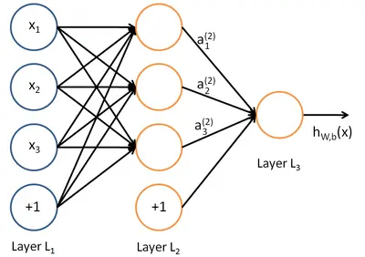

# 深度学习入门

**Deep Learning Beginning**

---

---

## 深度学习简介

### 学习路线

**理论**：李宏毅老师

**实战**：李沐老师

**快速零基础入门文章**：[零基础入门深度学习 - 作业部落 (zybuluo.com)](https://www.zybuluo.com/hanbingtao/note/433855) 

> 上诉文章链接中，图片由于防盗链设置，需要在浏览器控制台输入以下内容来显示图片：
>
> ```js
> // 遍历所有  标签并设置 referrerpolicy 属性
> var images = document.querySelectorAll('img');
> images.forEach(function(img) {
>  img.setAttribute('referrerpolicy', 'no-referrer');
> });
> ```

### 简介

**机器学习**（Machine Learning）是人工智能的一个分支，旨在使计算机系统能够通过数据学习和改进，而无需明确的编程指令。其核心思想是通过算法从数据中发现规律和模式，进而进行预测、分类或决策。

> 在机器学习领域，有一类重要算法称为**神经网络（Neural Network）**。神经网络的结构如下图所示：
>
> 
>
> 上图中，每个圆圈代表一个**神经元（Neuron）**，每条线表示神经元之间的连接。可以看到，神经元被组织成多层结构，层与层之间的神经元相互连接，而同一层内的神经元则没有连接。最左边的层称为**输入层（Input Layer）**，负责接收输入数据；最右边的层称为**输出层（Output Layer）**，我们可以从这一层获取神经网络的输出结果。位于输入层和输出层之间的层称为**隐藏层（Hidden Layer）**。
>
> 当隐藏层的数量较多（通常大于2层）时，这样的神经网络被称为**深度神经网络（Deep Neural Network, DNN）**。
>
> 简单来说，深层网络相比浅层网络具有更强的表达能力。实际上，仅含一个隐藏层的神经网络理论上可以拟合任意函数，但这需要大量的神经元。相比之下，深层网络可以用更少的神经元实现相同的拟合效果。换句话说，要拟合一个函数，可以选择使用一个“浅而宽”的网络，也可以选择使用一个“深而窄”的网络，而后者通常更加高效且节省资源。
>
> 尽管深层网络具备强大的表达能力，但其也存在劣势。首先，深层网络通常需要海量的标注数据来避免过拟合问题；其次，训练过程中可能面临梯度消失或梯度爆炸等问题；此外，深层网络的超参数（如学习率、网络深度）选择也需反复调试。

**深度学习**（Deep Learning）是机器学习的一个子领域，基于<u>深层结构的神经网络</u>实现复杂任务的自动化学习。其核心思想是通过多层非线性变换，从原始数据中自动提取高级特征和抽象模式——例如，在图像识别中，深度神经网络可以逐层解析像素、边缘、纹理直至物体整体，最终模拟接近人类认知的决策过程。

