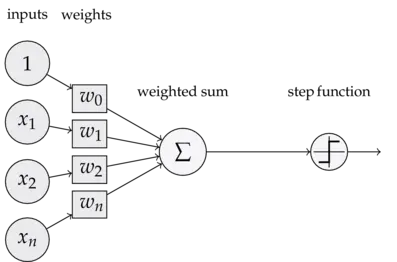
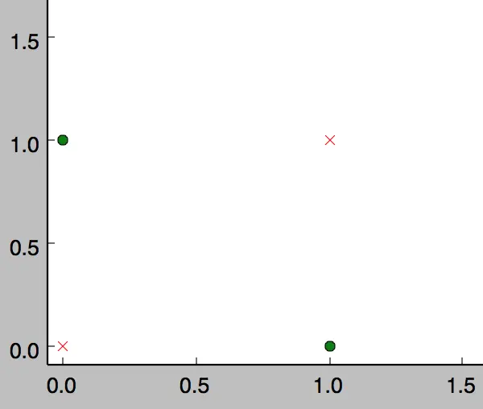

# 深度学习入门

**Deep Learning Beginning**

---

---

## 感知器

**感知器**（Perceptron）是人工神经网络中最基础的模型之一，由心理学家弗兰克·罗森布拉特（Frank Rosenblatt）于1957年提出。它模拟了生物神经元的工作原理，用于解决二元线性分类问题。

感知器结构简单，易于实现。

### 感知机的模型



上图所示为一个感知器，可以看到，一个感知器有如下组成部分：

- **输入权值**：一个感知器可以接收多个输入 $(x_1, x_2, \ldots, x_n | x_i \in \mathcal{R})$，每个输入上有一个权值 $w_i \in \mathcal{R}$，此外还有一个偏置项 $b \in \mathcal{R}$，就是上图中的 $w_0$，用于调整模型的输出。

- **加权和**：将所有输入信号与其对应的权重相乘后求和，，再加上偏置 $b$ 得到加权和 $\sum$。

  相当于 $\sum = x_1 \cdot w_1 + x_2 \cdot w_2 + \ldots + x_n \cdot w_n + b $

- **激活函数**：将加权和传递给激活函数
  感知器的激活函数可以有很多选择，比如我们可以选择下面这个阶跃函数（Step Function） $f$ 来作为激活函数，用于二元分类。
  $$
  f(z) = 
  \begin{cases} 
  1 & z > 0 \\
  0 & \text{otherwise}
  \end{cases} \tag{1.1}
  $$

- **输出**：感知器的输出由下面这个公式来计算。
  $$
  y = f(w \cdot x + b) \tag{1.2}
  $$

### 感知机的功能

感知器不仅能实现简单的**二分类**问题，也可以拟合任何的线性函数，任何**线性分类**或**线性回归**问题都可以用感知器来解决。

但感知机仅适用于**线性可分问题**，无法处理线性不可分的情况，对噪声和非线性数据敏感。

**线性可分与线性不可分：**

- 线性可分： 如果存在一条直线（在二维空间中）或超平面（在高维空间中），能够将不同类别的样本完全分开，则称数据是线性可分的。
- 线性不可分： 如果无法通过一条直线或超平面将不同类别的样本完全分开，则称数据是线性不可分的。

> **示例讲解**
>
> 1. **用感知器实现`and`函数**（0 表示 false，1 表示 true）。
>
>    AND 是一个二元函数（带有两个参数 $x_1$ 和 $x_2$），下面是它的真值表：
>
>    | $x_1$ | $x_2$ | $y$  |
>    | ----- | ----- | ---- |
>    | 0     | 0     | 0    |
>    | 0     | 1     | 0    |
>    | 1     | 0     | 0    |
>    | 1     | 1     | 1    |
>
>    令 $w_1 = 0.5$; $w_2 = 0.5$; $b = -0.8$，这时，感知器就相当于 AND 函数。
>
>    根据公式 (1.1)，验算输出：
>    $$
>    \begin{aligned}
>    y & = f(w \cdot x + b) \\
>    
>     & = f(w_1 x_1 + w_2 x_2 + b) \\
>    
>     & = f(0.5 \times 0 + 0.5 \times 0 - 0.8) \\
>    
>     & = f(-0.8) \\
>    
>     & = 0
>    \end{aligned} \tag{1.3}
>    $$
>    当 $x_1, x_2$ 都为 0 的时候，$y$ 为 0，这就是真值表的第一行。其他同理。
>
> 2. **用感知器实现 `or` 函数**
>
>    同样，我们也可以用感知器来实现 OR 运算。仅需将偏置项的值设置为 -0.3 即可。
>
>    | $x_1$ | $x_2$ | $y$  |
>    | ----- | ----- | ---- |
>    | 0     | 0     | 0    |
>    | 0     | 1     | 1    |
>    | 1     | 0     | 1    |
>    | 1     | 1     | 1    |
>
>    验算第二行，带入公式(1.1):
>    $$
>    \begin{aligned}
>    y & = f(\mathbf{w} \cdot \mathbf{x} + b) \\
>    
>    & = f(w_1 x_1 + w_2 x_2 + b)\\
>    
>    & = f(0.5 \times 1 + 0.5 \times 0 - 0.3)\\
>    
>    & = f(0.2)\\
>    
>    & = 1
>    \end{aligned}\tag{1.4}
>    $$
>    当 $x_1 = 0$; $x_2 = 1$ 时，$y$ 为 1，即 OR 真值表第二行。其他同理。
>
> 3. **感知器不可实现 异或(XOR)函数**
>
>    异或问题是线性不可分的，，其真值表如下：
>
>    | 输入1 | 输入2 | 输出 |
>    | ----- | ----- | ---- |
>    | 0     | 0     | 0    |
>    | 0     | 1     | 1    |
>    | 1     | 0     | 1    |
>    | 1     | 1     | 0    |
>
>    其 true 与 false 的点分布如下图，无法找到一条直线将不同类别的样本完全分开，数据是线性不可分的。
>
>    

### 感知器的训练

1. **初始化权重：** 将权重项和偏置项初始化为零或足够小的值。

2. **权重更新：** 如果模型的预测结果与实际标签不一致，则根据以下规则更新权重

   - 对于正类样本（标签为1）：如果预测为负类（输出为0），则权重增加。
   - 对于负类样本（标签为-1）：如果预测为正类（输出为1），则权重减少。

   公式如下：
   $$
   w_i \leftarrow w_i + \Delta w_i \\
   
   b \leftarrow b + \Delta b \tag{1.5}
   $$
   其中：
   $$
   \Delta w_i = \eta(t - y)x_i \\
   
   \Delta b = \eta(t - y) \tag{1.6}
   $$
   $w_i$ 是与输入 $x_i$ 对应的权重项，$b$ 是偏置项。$\eta$ 是称为学习速率的常数，其作用是控制每一步调整权重的幅度。t 是训练样本的实际值，而 $y$ 是感知器的输出值。

3. 每次从训练数据中取出一个样本的输入向量$x$，使用感知器计算其输出$y$，再根据上面的规则来调整权重。每处理一个样本就调整一次权重。经过多轮迭代后（即全部的训练数据被反复处理多轮），就可以训练出感知器的权重，使之实现目标函数。

### 感知器的实现

#### 原生 python 实现

```py
class Perceptron(object):
    def __init__(self, input_num, activator):
        """
        初始化感知机，设置输入参数的个数和激活函数
        """
        self.activator = activator
        self.weights = [0.0 for _ in range(input_num)] # 权重向量初始化为0
        self.bias = 0.0 # 偏置项初始化为0

    def __str__(self):
        """
        打印学习到的权重、偏置项
        """
        return 'weights\t:%s\nbias\t:%f\n' % (self.weights, self.bias)

    def predict(self, input_vec):
        """
        输入向量，输出感知器的计算结果
        """
        # 使用zip将input_vec和weights打包在一起，计算加权和
        weighted_sum = sum(x * w for x, w in zip(input_vec, self.weights)) + self.bias
        return self.activator(weighted_sum)

    def train(self, input_vecs, labels, iteration, rate):
        """
        输入训练数据：一组向量、与每个向量对应的label；以及训练轮数、学习率
        """
        for i in range(iteration):
            self._one_iteration(input_vecs, labels, rate)

    def _one_iteration(self, input_vecs, labels, rate):
        """
        一次迭代，把所有的训练数据过一遍
        """
        # 对每个样本，按照感知器规则更新权重
        for input_vec, label in zip(input_vecs, labels):
            output = self.predict(input_vec) # 计算感知器在当前权重下的输出
            self._update_weights(input_vec, output, label, rate) # 更新权重

    def _update_weights(self, input_vec, output, label, rate):
        """
        按照感知器规则更新权重
        """
        delta = label - output # 计算误差
        self.weights = [w + rate * delta * x for x, w in zip(input_vec, self.weights)] # 更新权重
        self.bias += rate * delta # 更新偏置项
```

接下来，用该感知机实现 `and` 函数

```py
def f(x):
    """
    定义激活函数f
    """
    return 1 if x > 0 else 0

def get_training_dataset():
    """
    基于and真值表构建训练数据
    """
    # 构建训练数据
    # 输入向量列表
    input_vecs = [[1, 1], [0, 0], [1, 0], [0, 1]]
    # 期望的输出列表，注意要与输入一一对应
    # [1,1] -> 1, [0,0] -> 0, [1,0] -> 0, [0,1] -> 0
    labels = [1, 0, 0, 0]
    return input_vecs, labels    

def train_and_perceptron():
    """
    使用and真值表训练感知器
    """
    # 创建感知器，输入参数个数为2（因为and是二元函数），激活函数为f
    p = Perceptron(2, f)
    # 训练，迭代10轮, 学习速率为0.1
    input_vecs, labels = get_training_dataset()
    p.train(input_vecs, labels, 10, 0.1)
    # 返回训练好的感知器
    return p

if __name__ == '__main__':
    # 训练and感知器
    and_perception = train_and_perceptron()
    # 打印训练获得的权重
    print(and_perception)
    # 测试
    print('1 and 1 =', and_perception.predict([1, 1]))
    print('0 and 0 =', and_perception.predict([0, 0]))
    print('1 and 0 =', and_perception.predict([1, 0]))
    print('0 and 1 =', and_perception.predict([0, 1]))
```

输出如下：

```py
weights	:[0.1, 0.2]
bias	:-0.200000

1 and 1 = 1
0 and 0 = 0
1 and 0 = 0
0 and 1 = 0
```

#### 利用 scikit-learn 包 实现

```py
from sklearn.linear_model import Perceptron
import numpy as np

# 构建训练数据：输入特征和对应的标签
X = np.array([[1, 1], [0, 0], [1, 0], [0, 1]])  # 输入特征
y = np.array([1, 0, 0, 0])  # 标签

# 创建感知机模型，设置最大迭代次数和学习率
model = Perceptron(max_iter=10, eta0=0.1)

# 训练模型
model.fit(X, y)

# 打印训练后的权重和偏置
print(f'权重: {model.coef_}')
print(f'偏置: {model.intercept_}')

# 测试模型
test_samples = np.array([[1, 1], [0, 0], [1, 0], [0, 1]])
predictions = model.predict(test_samples)
print(f'预测结果: {predictions}')
```
