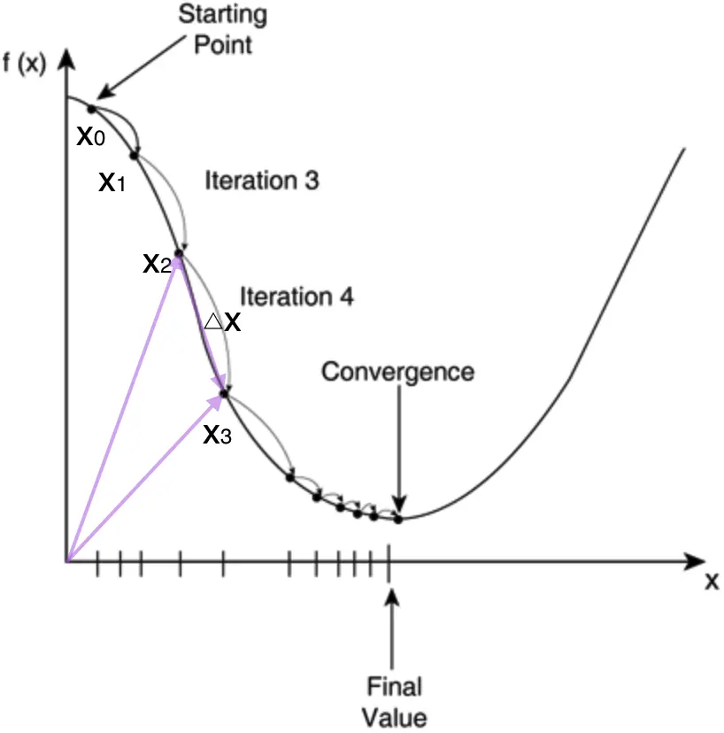
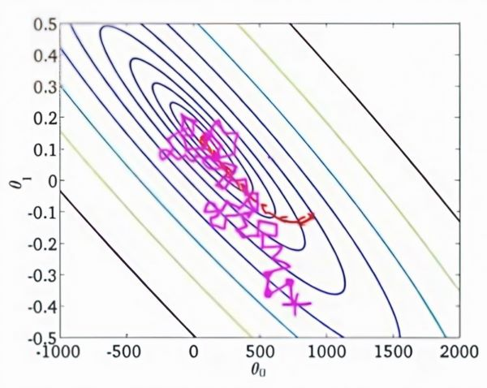
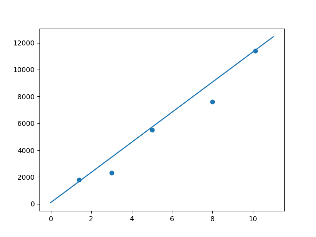

# 深度学习入门

**Deep Learning Beginning**

---

---

## 线性单元和梯度下降

### 线性单元简介

感知器在面对**线性不可分**的数据集时，训练过程可能无法收敛，这意味着感知器无法有效完成训练任务，无法找到一个能够完美分离不同类别的超平面。

为了解决这个问题，我们可以采用一种**可导**的**线性函数**来替代感知器中的**阶跃函数**，这种模型被称为**线性单元**。与感知器不同，线性单元能够在面对线性不可分的数据集时，收敛到一个最佳的近似解，而不必强求完美分割。

为了简化模型，我们可以设置线性单元的激活函数$f$为：
$$
f(x) = x \tag{2.1}
$$
通过这种替换，线性单元的输出将不再是分类结果（如0或1），而是一个**实数值**。因此，线性单元主要用于解决**回归问题**，而非传统的**分类问题**。


> **回归问题**：回归任务的目标是预测一个连续的数值。换句话说，回归问题的输出是一个实数值。常见的例子包括房价预测、气温预测、股市价格预测等。
>
> **分类问题**：分类任务的目标是将数据点分到某个类别或标签。分类问题的输出是一个离散的类别。常见的例子包括垃圾邮件检测、图像分类、疾病预测等。

### 线性单元的模型

可以发现，线性单元除了输出时采用的激活函数不同，其他的部分相同。

为了书写和计算方便，我们可以令 $w_0$ 等于 $b$，同时令 $w_0$ 对应于特征 $x_0$。由于 $x_0$ 其实并不存在，我们可以令它的值永远为1。也就是说 $b = w_0 \cdot x_0 \quad \text{其中} \, x_0 = 1$。

加权和也可以转为如下的向量形式，其中最终得到的 w 和 x 是向量形式。
$$
\begin{aligned}
\sum = h(x) & = x_1 \cdot w_1 + x_2 \cdot w_2 + \ldots + x_n \cdot w_n + b \\
& = x_0 \cdot w_0 + x_1 \cdot w_1 + x_2 \cdot w_2 + \ldots + x_n \cdot w_n\\
& = w^Tx
\end{aligned} \tag{2.2}
$$

长成这种样子模型就叫做**线性模型**，因为输出y就是输入特征$x_1, x_2, \ldots, x_n$的**线性组合**。

### 监督学习和无监督学习

监督学习和无监督学习是机器学习中的两大基本范式，它们的主要区别在于数据是否带有标签。

**监督学习**（Supervised Learning）的训练数据是*带标签的*。也就是说，每个输入数据点都有一个对应的目标输出（标签）。通过学习这些已知标签的数据，模型能够学到输入与输出之间的关系，从而对新的、未见过的数据进行预测。

**无监督学习**（Unsupervised Learning）的训练数据是*没有标签的*。

> 很多时候，既有$x$又有$y$的训练样本是很少的，大部分样本都只有$x$。
>
> 比如在语音到文本(STT)的识别任务中，$x$是语音，$y$是这段语音对应的文本。我们很容易获取大量的语音录音，然而把语音一段一段切分好并**标注**上对应文字则是非常费力气的事情。
>
> 这种情况下，为了弥补带标注样本的不足，我们可以用**无监督学习方法**先做一些**聚类**，让模型总结出哪些音节是相似的，然后再用少量的带标注的训练样本，告诉模型其中一些音节对应的文字。这样模型就可以把相似的音节都对应到相应文字上，完成模型的训练。

### 线性单元的目标函数

在监督学习下，对于一个样本，我们知道它的特征 $x$，以及标记 $y$。同时，我们还可以根据模型计算得到输出 $\bar{y}$。注意这里面我们用 $y$ 表示训练样本的实际标签值；用 $\bar{y}$ 表示模型计算出的预测值。我们希望 $\bar{y}$ 和 $y$ 越接近越好。

数学上可以用 $y$ 和 $\bar{y}$ 的差的平方的 $\frac{1}{2}$ 来表示它们的接近程度，如下式。我们把 $e$ 叫做单个样本的误差。公式中乘 $\frac{1}{2}$ 是为了后续计算方便。
$$
e = \frac{1}{2} (y - \bar{y})^2 \tag{2.3}
$$
训练数据中所有样本的误差之和 $E$ 表示模型的误差 ，如下式。其中 $e^{(1)}$ 表示第一个样本的误差，$e^{(2)}$ 表示第二个样本的误差，以此类推。
$$
E = e^{(1)} + e^{(2)} + e^{(3)} + \ldots + e^{(n)} \tag{2.4}
$$
将其用和式形式表示为：

$$
\begin{aligned}
E &= e^{(1)} + e^{(2)} + e^{(3)} + \ldots + e^{(n)} \\
&= \sum_{i=1}^{n} e^{(i)} \\
&= \frac{1}{2} \sum_{i=1}^{n} (y^{(i)} - \bar{y}^{(i)})^{2}
\end{aligned} \tag{2.5}
$$
其中：

$$
\bar{y}^{(i)} = h(x^{(i)}) = w^T x^{(i)} \tag{2.6}
$$
上诉式子中：

- $x^{(i)}$ 表示第 $i$ 个训练样本的特征
- $y^{(i)}$ 表示第 $i$ 个样本的标记（可用元组 $(x^{(i)}, y^{(i)})$ 表示）
- $\bar{y}^{(i)}$ 是模型对第 $i$ 个样本的预测值

我们希望对于一个训练数据集来说，误差(式2.5）越小越好。对于特定的训练数据集来说，$(x^{(i)}, y^{(i)})$ 的值都是已知的，因此(式2.5)实际上是参数 $w$ 的函数。

$$
\begin{aligned}
E(w) & = \frac{1}{2} \sum_{i=1}^{n} (y^{(i)} - \bar{y}^{(i)})^2 \\
& = \frac{1}{2} \sum_{i=1}^{n} (y^{(i)} - w^T x^{(i)})^2
\end{aligned} \tag{2.7}
$$
由此可见，模型的训练实际上就是求取合适的 $w$，使得目标函数 $E(w)$ 取得最小值。这在数学上称为**优化问题**，而 $E(w)$ 就是我们优化的目标，称为**目标函数**。

### 梯度下降优化算法

函数 $y = f(x)$ 的极值点是满足导数 $f'(x) = 0$ 的点。因此，求解方程 $f'(x) = 0$ 可以得到函数的极值点 $(x_0, y_0)$。

然而，对于计算机来说，它并不直接解方程。而是通过强大的计算能力，逐步地“试”出函数的极值点。



首先，我们随便选择一个点开始，比如上图的 $x_0$ 点。接下来，每次迭代向函数 $y = f(x)$ 梯度的相反方向来修改 $x$ 的值为 $x_1, x_2, x_3, \ldots$，经过数次迭代后最终收敛到函数的最小值点附近。

> **梯度**（gradient）描述了一个多变量函数在给定点处沿各个方向的变化率。梯度是一个**值**或**向量**，包含函数对每个变量的偏导数。
>
> $\nabla$ 是梯度算子，$\nabla f(x)$ 就是指 $f(x)$ 的梯度。
>
> 对于一元函数 $f(x)$，梯度实际上就是它的导数，因为只有一个变量：$\nabla f =  \frac{d f}{d x} $。
>
> 对于多元函数 $f(x_1, x_2, \ldots, x_n)$，由各个变量的偏导数组成梯度 $\nabla f = \left( \frac{\partial f}{\partial x_1}, \frac{\partial f}{\partial x_2}, \ldots, \frac{\partial f}{\partial x_n} \right)$ 。
>
> 梯度指向函数增长最快的方向。换句话说，梯度向量的方向是函数值**增加最快**的方向。梯度向量的长度（或模）表示在该点沿梯度方向的变化率的大小。显然，梯度的反方向当然就是函数值下降最快的方向了。

> **偏导数**（Partial derivative）描述一个多变量函数在某一点处沿特定变量方向的变化率。偏导数是将其他变量视为常数，对其中一个变量求导的过程。
>
> - 假设有一个函数 $f(x,y)$，*关于 x 的偏导数* 为：将 $y$ 视为常数，对 $f$ 关于 $x$ 求导，记作 $\frac{\partial f}{\partial x}$。

**步长**，也称为学习速率，是一个关键的超参数，它决定了在每次迭代过程中参数更新的幅度。因为步长选择存在局限性，在应用梯度下降法进行优化时，我们通常只能逼近函数的最小值点，而非精确达到该点。步长的选择需要在快速收敛和避免越过最小值点之间找到平衡。

按照上面的讨论，我们就可以写出**梯度下降算法**(Gradient Descent, GD)的公式，如下式。其中，$\eta$ 是步长，也称作学习速率。
$$
x_{\text{new}} = x_{\text{old}} - \eta \nabla f(x)
$$

将上式$f(x)$换为目标函数(式2.5），梯度下降算法可以写成下式。

$$
w_{\text{new}} = w_{\text{old}} - \eta \nabla E(w) \tag{2.8}
$$

> 如果要求目标函数的最大值，那么我们就应该用梯度上升算法，修改为下式。
>
> $$
> w_{\text{new}} = w_{\text{old}} + \eta \nabla E(w)
> $$

> **$\nabla E(w)$ 的推导过程**
>
> 函数的梯度的定义就是它相对于各个变量的**偏导数**。
> $$
> \begin{aligned}
> \nabla E(\mathbf{w}) & = \frac{\partial}{\partial \mathbf{w}} E(\mathbf{w}) \\
> & = \frac{\partial}{\partial \mathbf{w}} \frac{1}{2} \sum_{i=1}^{n} (y^{(i)} - \bar{y}^{(i)})^2 \\
> & = \frac{1}{2} \sum_{i=1}^{n} \frac{\partial}{\partial \mathbf{w}} \left(y^{(i)} - \bar{y}^{(i)}\right)^2
> \end{aligned}
> $$
> 和的导数等于导数的和，所以我们可以先把求和符号$\sum$里面的导数求出来，然后再把它们加在一起就行了。
> $$
> \begin{aligned}
> & \frac{\partial}{\partial \mathbf{w}} \left(y^{(i)} - \bar{y}^{(i)}\right)^2 \\
> = & \frac{\partial}{\partial \mathbf{w}} \left(y^{(i)2} - 2\bar{y}^{(i)}y^{(i)} + \bar{y}^{(i)2}\right)
> \end{aligned}
> $$
> $y$ 是与 $\mathbf{w}$ 无关的常数。$\bar{y} = \mathbf{w}^T \mathbf{x}$，是一个复合函数，需要根据链式求导法则来求导：
>
> $$
> \frac{\partial E(\mathbf{w})}{\partial \mathbf{w}} = \frac{\partial E(\bar{y})}{\partial \bar{y}} \frac{\partial \bar{y}}{\partial \mathbf{w}}
> $$
> 之后，分别计算上式等号右边的两个偏导数：
> $$
> \begin{aligned}
> 
> \frac{\partial E(\mathbf{w})}{\partial \bar{y}} & = \frac{\partial}{\partial \bar{y}} \left(y^{(i)2} - 2\bar{y}^{(i)}y^{(i)} + \bar{y}^{(i)2}\right) \\
> & = -2y^{(i)} + 2\bar{y}^{(i)}
> \\ \\
> \frac{\partial \bar{y}}{\partial \mathbf{w}} & = \frac{\partial}{\partial \mathbf{w}} \mathbf{w}^T \mathbf{x} \\
> & = \mathbf{x}
> 
> \end{aligned}
> $$
> 代入，求得求和符号$\sum$里面的导数：
> $$
> \frac{\partial E(\mathbf{w})}{\partial \mathbf{w}} = 2x(-y^{(i)} + \bar{y}^{(i)})
> $$
> 最后代入$\nabla E(\mathbf{w})$，求得
> $$
> \begin{aligned}
> \nabla E(\mathbf{w}) & = \frac{1}{2} \sum_{i=1}^{n} \frac{\partial}{\partial \mathbf{w}} \left(y^{(i)} - \bar{y}^{(i)}\right)^2
> \\
> & = \frac{1}{2} \sum_{i=1}^{n} 2(-y^{(i)} + \bar{y}^{(i)}) \mathbf{x}
> \\
> & = -\sum_{i=1}^{n} (y^{(i)} - \bar{y}^{(i)}) \mathbf{x}
> \\
> \end{aligned}
> $$
>
> 最终得：
> $$
> \nabla E(\mathbf{w}) = -\sum_{i=1}^{n} (y^{(i)} - \bar{y}^{(i)}) \mathbf{x} \tag{2.9}
> $$

根据(式 2.9），线性单元的参数修改规则最终可以表示为下式。利用该公式，我们可以编写出训练线性单元所需的代码。

$$
w_{\text{new}} = w_{\text{old}} + \eta \sum_{i=1}^{n} (y^{(i)} - \bar{y}^{(i)}) x^{(i)} \tag{2.10}
$$

需要特别指出的是，如果每个样本具有 $M$ 个特征，则在上述公式中，向量 $x$ 和 $w$ 都是 $M+1$ 维向量（因为引入了一个恒为 1 的虚拟特征 $x_0$，见 式子2.2），而 $y$ 是一个标量。采用更严谨的数学符号表示，可以写作：

$$
\begin{align*}
x, w &\in \mathfrak{R}^{(M+1)} \\
y &\in \mathfrak{R}^1
\end{align*}
$$

下面的解释更清晰地阐释上述内容。由于 $w$ 和 $x$ 是 $M+1$ 维列向量，因此（式2.10）可以进一步展开为：

$$
\begin{bmatrix}
w_0 \\
w_1 \\
w_2 \\
\vdots \\
w_m
\end{bmatrix}_{\text{new}}
=
\begin{bmatrix}
w_0 \\
w_1 \\
w_2 \\
\vdots \\
w_m
\end{bmatrix}_{\text{old}}
+
\eta
\sum_{i=1}^{n}
(y^{(i)} - \bar{y}^{(i)})
\begin{bmatrix}
1 \\
x_1^{(i)} \\
x_2^{(i)} \\
\vdots \\
x_m^{(i)}
\end{bmatrix}
$$

### 随机梯度下降算法

当依据公式 (2.10) 进行模型训练时，若在每次迭代中更新参数 $w$ 需要遍历训练集中的所有样本进行计算，则这种方法被称为**批梯度下降（Batch Gradient Descent, BGD）**。然而，当样本量非常庞大，例如达到数百万甚至数亿时，这种方法的计算量将变得异常庞大。

**随机梯度下降算法（Stochastic Gradient Descent, SGD）**提供更高效的解决方案。在SGD中，每次迭代更新参数 $w$ 仅基于单个样本进行计算。这样对于一个具有数百万样本的训练数据，完成一次遍历就会对 $w$ 更新数百万次，效率大大提升。

尽管由于单个样本的随机性和噪声，每次更新 $w$ 可能并不严格遵循减少损失函数 $E$ 的方向，但大量更新的整体趋势是朝着减少 $E$ 的方向进行的。因此，尽管存在一定的随机性，SGD算法最终仍能收敛至损失函数的最小值附近。

下图展示了SGD和BGD的区别。如图，椭圆表示的是函数值的等高线，椭圆中心是函数的最小值点。红色是BGD的逼近曲线，而紫色是SGD的逼近曲线。我们可以看到BGD是一直向着最低点前进的，而SGD明显躁动了许多，但总体上仍然是向最低点逼近的。



需要强调的是，SGD算法的优势不仅在于其计算效率，还在于其随机性在特定情况下能够带来益处。

对于凸函数，由于其具有全局唯一最小值的特性，通过沿梯度反方向迭代可以准确找到该最小值。然而，非凸函数包含多个局部最小值。SGD算法的随机性有助于算法从不良的局部最小值中逃逸，从而有可能获得更优的模型参数，增加了算法的探索能力，提高了找到更优解的概率。

### 线性单元的实现

| 算法        | 感知器                                                       | 线性单元                                                     |
| ----------- | ------------------------------------------------------------ | ------------------------------------------------------------ |
| 模型 $h(x)$ | $y = f(\mathbf{w}^T \mathbf{x}) \\ f(z) = \begin{cases} 1 & z > 0 \\ 0 & \text{otherwise} \end{cases}$ | $y = f(\mathbf{w}^T \mathbf{x}) \\ f(z) = z$                 |
| 训练规则    | $\mathbf{w} \leftarrow \mathbf{w} + \eta (y - \bar{y}) \mathbf{x}$ | $\mathbf{w} \leftarrow \mathbf{w} + \eta (y - \bar{y}) \mathbf{x}$ (SDG算法) |

通过比较发现，除了激活函数 $f$ 不同之外，两者的模型和训练规则是一样的。那么，我们只需要参考感知器的实现，继承感知机的实现代码，把感知器的激活函数进行重写即可。

```py
from Perceptron import Perceptron
import matplotlib.pyplot as plt


class LinearUnit(Perceptron):
    def __init__(self, input_num):
        """初始化线性单元，设置输入参数的个数，并修改激活函数为 f(x) = x"""
        Perceptron.__init__(self, input_num, lambda x: x)

def get_training_dataset():
    """捏造5个人的收入数据"""
    # 构建训练数据
    # 输入向量列表，每一项是工作年限
    input_vecs = [[5], [3], [8], [1.4], [10.1]]
    # 期望的输出列表，月薪，注意要与输入一一对应
    labels = [5500, 2300, 7600, 1800, 11400]
    return input_vecs, labels

def train_linear_unit():
    """使用数据训练线性单元"""
    # 创建感知器，输入参数的特征数为1（工作年限）
    lu = LinearUnit(1)
    # 训练，迭代10轮, 学习速率为0.01
    input_vecs, labels = get_training_dataset()
    lu.train(input_vecs, labels, 10, 0.01)
    # 返回训练好的线性单元
    return lu

def plot(linear_unit):
    """最终结果可视化"""
    input_vecs, labels = get_training_dataset()
    fig = plt.figure()
    ax = fig.add_subplot(111)
    ax.scatter(list(map(lambda x: x[0], input_vecs)), labels)
    weights = linear_unit.weights
    bias = linear_unit.bias
    x = range(0, 12, 1)
    y = list(map(lambda x: weights[0] * x + bias, x))
    ax.plot(x, y)
    plt.show()

if __name__ == '__main__':
    '''训练线性单元'''
    linear_unit = train_linear_unit()
    # 打印训练获得的权重
    print(linear_unit)
    # 测试
    print('Work 3.4 years, monthly salary = %.2f' % linear_unit.predict([3.4]))
    print('Work 15 years, monthly salary = %.2f' % linear_unit.predict([15]))
    print('Work 1.5 years, monthly salary = %.2f' % linear_unit.predict([1.5]))
    print('Work 6.3 years, monthly salary = %.2f' % linear_unit.predict([6.3]))
    plot(linear_unit)
```

运行结果如下：

```bash
weights	:[1124.0634970262222]
bias	:85.485289

Work 3.4 years, monthly salary = 3907.30
Work 15 years, monthly salary = 16946.44
Work 1.5 years, monthly salary = 1771.58
Work 6.3 years, monthly salary = 7167.09
```


