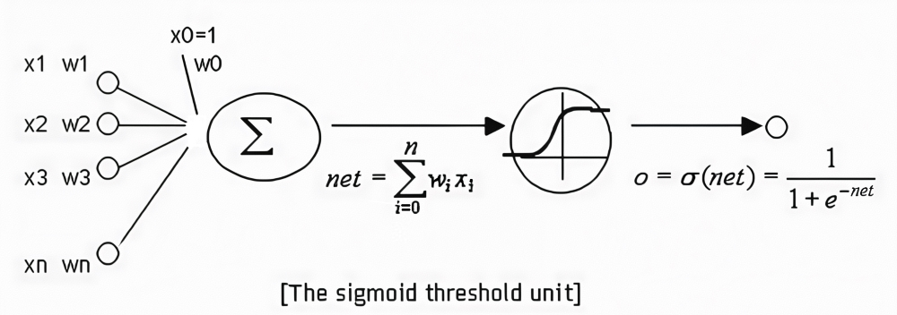
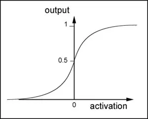
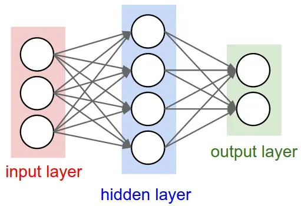
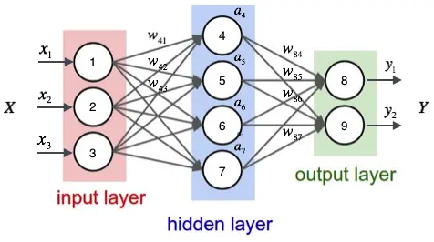
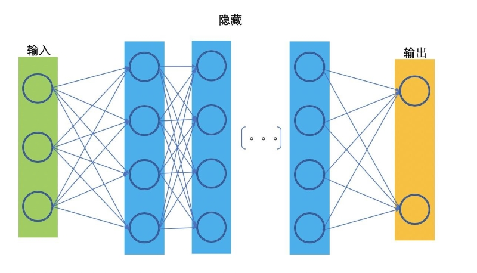

# 深度学习入门

**Deep Learning Beginning**

---

---

## 神经网络和反向传播

### 神经元简介

神经元是神经网络的基本构建单元，模拟了生物神经元的工作原理。每个神经元接收来自其他神经元或输入层的数据，通过加权求和并应用激活函数，生成输出信号。

神经元和感知器本质上是一样的，只不过我们说感知器的时候，它的激活函数是**阶跃函数**，而当我们说神经元时，激活函数往往选择有以下选择：

- **线性函数（Linear Function）**：输出等于输入。
- **Sigmoid函数**：输出值在0和1之间，适用于二分类问题。
- **ReLU函数（Rectified Linear Unit）**：当输入大于0时，输出等于输入；否则，输出为0。
- **Leaky ReLU**：对ReLU的改进，Leaky ReLU函数通过把非常小的线性分量给予负输入，调整负值的零梯度问题。
- **Tanh函数**：输出值在-1和1之间，适用于需要输出为负值的场景。



### 神经元输出计算

神经元的输出计算与感知器的输出计算方法相同。

设神经元的输入向量为 $\vec{x}$，权重向量为 $\vec{w}$（包含偏置项 $w_0$），并采用 sigmoid 函数作为激活函数，则神经元的输出 $y$ 可以表示为：
$$
y = \sigma(\vec{w}^T \cdot \vec{x}) \quad \tag{3.1}
$$

其中，sigmoid 函数定义为：

$$
\sigma(x) = \frac{1}{1 + e^{-x}} \tag{3.2}
$$

sigmoid 函数是一个非线性函数，其输出值域位于 $(0, 1)$ 区间内。该函数的图像展示如下。



sigmoid函数的导数是：

$$
\begin{align*}
\frac{d}{dx}\,\sigma(x) &= \frac{d}{dx}\left(\frac{1}{1+e^{-x}}\right) \\
&= \frac{e^{-x}}{(1+e^{-x})^{2}} \\
&= \frac{(1+e^{-x})-1}{(1+e^{-x})^{2}} \\
&= \frac{1}{1+e^{-x}} - \frac{1}{(1+e^{-x})^{2}} \\
&= \sigma(x) - \sigma(x)^{2} \\
&= \sigma(x)(1-\sigma(x))
\end{align*} \tag{3.3}
$$

可以看到，sigmoid函数的导数非常有趣，它可以用sigmoid函数自身来表示。这样，一旦计算出sigmoid函数的值，计算它的导数的值就非常方便。

### 神经网络简介

神经网络其实就是按照**特定规则**连接起来的多个**神经元**。下图展示了一个**全连接(full connected, FC)**神经网络。



通过观察上面的图，我们可以发现它的规则包括：

- 神经元按照**层**来布局。最左边的层叫做**输入层**，负责接收输入数据；最右边的层叫**输出层**，提供网络的最终输出。输入层和输出层之间的层叫做**隐藏层**，它们对外部不可见。
- 同一层的神经元之间没有连接。
- 第N层的每个神经元和第N-1层的**所有**神经元相连（即全连接的定义），第N-1层神经元的输出就是第N层神经元的输入。
- 每个连接都有一个与之关联的**权重**。

这些规则定义了全连接神经网络的基本结构。实际上，还存在多种其他类型的神经网络结构，如卷积神经网络（CNN）和循环神经网络（RNN），它们各自具有不同的连接规则。

### 神经网络的输出计算（前向传播)

神经网络实际上就是一个输入向量$\vec{x}$到输出向量$\vec{y}$的函数。从输入层开始，一层一层地传递数据，直到最后得到预测结果。获取输出向量的过程也称为**前向传播（Forward Propagation）**。

首先，将输入向量 $\vec{x}$ 的每个元素 $x_i$ 的值赋给神经网络的输入层的对应神经元，然后根据公式 (3.1) 依次向前计算每一层的每个神经元的值，直到输出层的所有神经元的值计算完毕。最后，将输出层每个神经元的值串在一起就得到了输出向量 $\vec{y}$。

> **举例说明**
>
> 如图，这是含有一个输入层，一个输出层，一个隐藏层的神经网络。输入层包含三个节点，编号为1、2、3；隐藏层包含四个节点，编号为4、5、6、7；输出层包含两个节点，编号为8、9。在全连接神经网络中，输每个节点与上一层的所有节点相连。
>
> 
>
> 1. **节点的输出值计算**
>
>    接下来将对节点4的输出值 $a_4$ 进行计算，举例说明如何计算节点的输出值。
>
>    首先，必须获取节点4所有上游节点（即节点1、2、3）的输出值。由于节点1、2、3位于输入层，其输出值即为输入向量 $\vec{x}$ 的元素。之后，利用公式 (3.1) 计算节点4的输出值 $a_4$：
>    $$
>    \begin{aligned}
>    a_4 & = \sigma(\vec{w}^T \cdot \vec{a}) \\
>    & = \sigma(w_{41}x_1 + w_{42}x_2 + w_{43}x_3 + w_{4b})
>    \end{aligned}
>    \tag{3.4}
>    $$
>
>    其中，$w_{4b}$ 为节点4的偏置项，图中未显示。$w_{41}, w_{42}, w_{43}$ 分别表示节点1、2、3到节点4的连接权重。权重 $w_{ji}$ 的编号规则是将目标节点编号 $j$ 置于前，源节点编号 $i$ 置于后。
>
>    同样，可以计算节点5、6、7的输出值 $a_5, a_6, a_7$。
>
> 2. **输出层的输出计算与普通节点一致。**
>
>    完成隐藏层所有节点的输出值计算后，可以继续计算输出层节点8的输出值 $y_1$：
>    $$
>    \begin{aligned}
>    y_1 & = \sigma(\vec{w}^T \cdot \vec{a}) \\
>    & = \sigma(w_{84}a_4 + w_{85}a_5 + w_{86}a_6 + w_{87}a_7 + w_{8b})
>    \end{aligned}
>    \tag{3.5}
>    $$
>
>    同样，可以计算 $y_2$ 的值。
>
> 3. **向量形式**的计算表示如下：
>
>    - （加入偏置）加入偏置 $\vec{x} = \begin{bmatrix} x_1 \\ x_2 \\ x_3 \\ 1 \end{bmatrix}$
>    - （加入偏置）输入层权重矩阵 $W_1 = \begin{bmatrix} \vec{w}_4 \\ \vec{w}_5 \\ \vec{w}_6 \\ \vec{w}_7 \end{bmatrix} = \begin{bmatrix} w_{41}, w_{42}, w_{43}, w_{4b} \\ w_{51}, w_{52}, w_{53}, w_{5b} \\ w_{61}, w_{62}, w_{63}, w_{6b} \\ w_{71}, w_{72}, w_{73}, w_{7b} \end{bmatrix}$
>    - 隐藏层输入向量 $ \vec{a} = \begin{bmatrix} a_4 \\ a_5 \\ a_6 \\ a_7 \end{bmatrix} = f(W_1 \cdot \vec{x})$ （加入偏置）$ \vec{a} = \begin{bmatrix} a_4 \\ a_5 \\ a_6 \\ a_7 \\ 1 \end{bmatrix}$
>    - （加入偏置）隐藏层权重矩阵 $W_2 = \begin{bmatrix} \vec{w}_8 \\ \vec{w}_9 \end{bmatrix} = \begin{bmatrix} w_{84}, w_{85}, w_{86}, w_{87}, w_{8b} \\ w_{94}, w_{95}, w_{96}, w_{97}, w_{9b} \end{bmatrix}$ 
>    - 输出向量为 $\vec{y} = \begin{bmatrix} y_1 \\ y_2 \end{bmatrix} = f(W_2 \cdot \vec{a})$ 

在神经网络中，每一层的计算过程是一致的。若一个神经网络含有一个输入层，一个输出层和$n-1$个隐藏层，其权重矩阵分别为 $W_n$，每个隐藏层的输出分别是 $\vec{a}_n$，神经网络的输入为 $\vec{x}$，神经网络的输入为 $\vec{y}$。



则每一层的输出向量的计算可以表示为：

$$
\begin{align*}
\vec{a}_1 & = f(W_1 \cdot \vec{x}) \\
\vec{a}_2 & = f(W_2 \cdot \vec{a}_1) \\
\vec{a}_3 & = f(W_3 \cdot \vec{a}_2) \\
& \  ... \\
\vec{a}_{n} & = f(W_{n} \cdot \vec{a}_{n-1}) \\
\vec{y} & = f(W_n \cdot \vec{a}_{n})
\end{align*}
$$

这就是神经网络输出值的计算方法。

### 神经网络的训练

我们可以说神经网络是一个**模型**，那么这些权值就是模型的**参数(Parameters)**，也就是模型要学习的东西。

然而，一个神经网络的连接方式、网络的层数、每层的节点数这些参数，则不是学习出来的，而是人为事先设置的。对于这些人为设置的参数，我们称之为**超参数(Hyper-Parameters)**。

#### 计算损失（Loss）

我们假设每个训练样本为 $(\vec{x}, \vec{t})$，其中向量 $\vec{x}$ 是训练样本的特征，而 $\vec{t}$ 是样本的目标值。


首先，我们根据上一节介绍的算法，用样本的特征 $\vec{x}$ 计算出神经网络中每个隐藏层节点的输出 $a_i$，以及输出层每个节点的输出 $y_i$。

然后，我们按照下面的方法计算每个节点的误差项 $\delta_i$：

- 对于输出层节点 $i$：
  $$
  \delta_i = y_i(1 - y_i)(t_i - y_i) \tag{3.6}
  $$

  其中，$\delta_i$ 是节点 $i$ 的误差项，$y_i$ 是节点 $i$ 的输出值，$t_i$ 是样本对应于节点 $i$ 的目标值。

  举个例子，对于输出层节点(8)来说，它的输出值是 $y_1$，而样本的目标值是 $t_1$，带入上面的公式得到节点8的误差项 $\delta_8$ 应该是：
  $$
  \delta_8 = y_1(1 - y_1)(t_1 - y_1)
  $$

  

- 对于隐藏层节点：
  $$
  \delta_i = a_i(1 - a_i) \sum_{k \in \text{outputs}} w_{ki} \delta_k \tag{3.7}
  $$

  其中，$a_i$ 是节点 $i$ 的输出值，$w_{ki}$ 是节点 $i$ 到它的下一层节点 $k$ 的连接的权重，$\delta_k$ 是节点 $i$ 的下一层节点 $k$ 的误差项。

  例如，对于隐藏层节点4来说，计算方法如下：
  $$
  \delta_4 = a_4(1 - a_4)(w_{84}\delta_8 + w_{94}\delta_9)
  $$


#### 反向传播算法(Back Propagation)

当所有节点的误差项计算完毕后，我们就可以根据式(3.8) 来更新所有的权重：
$$
w_{ji} \leftarrow w_{ji} + \eta \delta_j x_{ji} \tag{3.8}
$$

其中，$w_{ji}$ 是节点 $i$ 到节点 $j$ 的权重，$\eta$ 是一个成为学习速率的常数，$\delta_j$ 是节点 $j$ 的误差项，$x_{ji}$ 是节点 $i$ 传递给节点 $j$ 的输入。

例如，权重 $w_{84}$ 的更新方法如下：
$$
w_{84} \leftarrow w_{8} + \eta \delta_8 a_4
$$
类似的，权重 $w_{41}$ 的更新方法如下：

$$
w_{41} \leftarrow w_{41} + \eta \delta_4 x_1
$$

偏置项的输入值永远为1。例如，节点4的偏置项 $w_{4b}$ 应该按照下面的方法计算：

$$
w_{4b} \leftarrow w_{4b} + \eta \delta_4
$$

计算一个节点的误差项，需要先计算每个与其相连的下一层节点的误差项。这就要求误差项的计算顺序必须是从输出层开始，然后反向依次计算每个隐藏层的误差项，直到与输入层相连的那个隐藏层。这就是**反向传播算法**的名字的含义。

### 反向传播算法的推导

反向传播的核心思想是通过计算误差对每个权重的影响来调整这些权重，从而减少损失。这个过程实际上是在进行梯度下降，通过逐步调整每个参数（权重）来减小损失。

先确定神经网络的目标函数，取网络所有输出层节点的误差平方和作为目标函数。其中，$E_d$表示是样本的$d$误差。
$$
E_d \equiv \frac{1}{2} \sum_{i \in \text{outputs}} (t_i - y_i)^2 \tag{3.9}
$$
然后，用**随机梯度下降**算法对目标函数进行优化：
$$
w_{ji} \leftarrow w_{ji} - \eta \frac{\partial E_d}{\partial w_{ji}} \tag{3.10}
$$
其中，需求出误差$E_d$对于每个权重$w_{ji}$的偏导数（也就是梯度）。


观察上图，我们发现权重 $w_{ji}$ 仅能通过影响节点 $j$ 的输入值影响网络的其它部分。

设 $net_j$ 是节点 $j$ 的加权输入，即
$$
\begin{align*}
net_j &= \overrightarrow{w_j} \cdot \overrightarrow{x_j} \\
&= \sum_i w_{ji} x_{ji}
\end{align*}
\tag{3.11}
$$

$E_d$ 是 $net_j$ 的函数，而 $net_j$ 是 $w_{ji}$ 的函数。根据链式求导法则，可以得到：

$$
\begin{align*}
\frac{\partial E_d}{\partial w_{ji}} &= \frac{\partial E_d}{\partial net_j} \cdot \frac{\partial net_j}{\partial w_{ji}} \\
&= \frac{\partial E_d}{\partial net_j} \cdot x_{ji}
\end{align*}
\tag{3.12}
$$

上式中，$x_{ji}$ 是节点 $i$ 传递给节点 $j$ 的输入值，也就是节点 $i$ 的输出值。

误差项$\delta_j$ 是通过计算每个节点的误差，传播到整个网络的结果。因此，$\delta_j$ 反映了节点 $j$ 对整个损失的贡献，反映了节点 $j$ 的输出与损失函数的敏感度。按梯度下降所需，一个节点的误差项 $\delta$ 是网络误差对这个节点输入的偏导数的相反数（即函数下降最快的方向）：
$$
\delta_j = -\frac{\partial E_d}{\partial net_j}
\tag{3.13}
$$
结合公式(3.10)、公式(3.12)和公式(3.13)可得权重更新算法，即公式(3.8)：
$$
w_{ji} \leftarrow w_{ji} + \eta \delta_j x_{ji}
$$
对于 $\frac{\partial E_d}{\partial net_j}$ 的推导，需要区分输出层和隐藏层两种情况。

#### 输出层权值训练

对于输出层来说，节点$j$的加权输入$net_j$ 仅能通过节点 $j$ 的输出值 $y_j$ 来影响网络其它部分。也就是说 $E_d$ 是 $y_j$ 的函数，而 $y_j$ 是 $net_j$ 的函数，其中 $y_j = \text{sigmoid}(net_j)$。所以我们可以再次使用链式求导法则：
$$
\frac{\partial E_d}{\partial net_j} = \frac{\partial E_d}{\partial y_j} \frac{\partial y_j}{\partial net_j}
$$

根据公式(3.9)，可解得上式第一项：

$$
\begin{align*}
\frac{\partial E_d}{\partial y_j} &= \frac{\partial}{\partial y_j} \frac{1}{2} \sum_{i \in \text{outputs}} (t_i - y_i)^2 \\
&= \frac{\partial}{\partial y_j} \frac{1}{2} (t_j - y_j)^2 \\
&= -(t_j - y_j)
\end{align*}
$$

根据公式(3.3)，可解得上式第一项：

$$
\begin{align*}
\frac{\partial y_j}{\partial net_j} &= \frac{\partial \text{sigmoid}(net_j)}{\partial net_j} \\
&= y_j(1 - y_j)
\end{align*}
$$

将第一项和第二项带入，得到：

$$
\frac{\partial E_d}{\partial net_j} = -(t_j - y_j) y_j(1 - y_j)
$$

令 $\delta_j = -\frac{\partial E_d}{\partial net_j}$，带入上式，即可得到误差计算中的公式(3.6)：

$$
\delta_j = (t_j - y_j) y_j(1 - y_j)
$$

#### 隐藏层权值训练

首先，我们需要定义节点 $j$ 的所有直接下游节点的集合 $Downstream(j)$。下游节点是指那些在节点$j$之后，直接受$net_j$影响的节点（即$j$的输出会作为它们的输入）。例如，对于节点4来说，它的直接下游节点是节点8、节点9。

可以看到 $net_j$ 只能通过影响 $Downstream(j)$ 再影响 $E_d$。设 $net_k$ 是节点 $j$ 的下游节点的输入，则 $E_d$ 是 $net_k$ 的函数，而 $net_k$ 是 $net_j$ 的函数。

因为 $net_k$ 有多个，我们应用全导数公式，可以做出如下推导：
$$
\frac{\partial E_d}{\partial net_j} = \sum_{k \in Downstream(j)} \frac{\partial E_d}{\partial net_k} \frac{\partial net_k}{\partial net_j}
$$

这里出现了$\frac{\partial E_d}{\partial net_k}$，这刚好是节点 $k$ 的误差项 $\delta_k$，要另外单独分情况运算。
$$
\frac{\partial E_d}{\partial net_j} = \sum_{k \in Downstream(j)} -\delta_k \frac{\partial net_k}{\partial net_j}
$$
$net_k = \sum_j w_{kj} a_{j} + b_k$，所以$net_k$ 是关于他的输入$a_j$的函数。$a_j = \sigma(net_j)$，所以$a_j$ 又是关于 $net_j$ 的函数。运用链式法则求导：
$$
\begin{align*}
\frac{\partial E_d}{\partial net_j} & = \sum_{k \in Downstream(j)} -\delta_k \frac{\partial net_k}{\partial net_j} \\

& = \sum_{k \in Downstream(j)} -\delta_k \frac{\partial net_k}{\partial a_j} \frac{\partial a_j}{\partial net_j}
\end{align*}
$$
$net_k$ 对 $a_j$ 求偏导，只有第 j 项不为 0，其余项视为常数，求导后为0，得$\frac{\partial net_k}{\partial a_j} = w_{kj}$。结合公式(3.3)，可得sigmoid函数的求导方法。
$$
\begin{align*}
\frac{\partial E_d}{\partial net_j} & = \sum_{k \in Downstream(j)} -\delta_k w_{kj} \frac{\partial a_j}{\partial net_j} \\

& = \sum_{k \in Downstream(j)} -\delta_k w_{kj} a_j(1 - a_j) \\

& = -a_j(1 - a_j) \sum_{k \in Downstream(j)} \delta_k w_{kj}
\end{align*}
$$
因为 $\delta_j = - \frac{\partial E_d}{\partial net_j}$，带入上式得到公式(3.7)：
$$
\delta_j = a_j(1 - a_j) \sum_{k \in Downstream(j)} \delta_k w_{kj}
$$
至此，我们已经推导出了反向传播算法。

### 神经网络的实现

采用面向对象设计，先做一个基本的模型：


- *Network* 神经网络对象，提供API接口。它由若干层对象组成以及连接对象组成。
- *Layer* 层对象，由多个节点组成。
- *Node* 节点对象计算和记录节点自身的信息(比如输出值、误差项等)，以及与这个节点相关的上下游的连接。
- *Connection* 每个连接对象都要记录该连接的权重。
- *Connections* 仅仅作为Connection的集合对象，提供一些集合操作。

#### Node实现

节点类，负责记录和维护节点自身信息以及与这个节点相关的上下游连接，实现输出值和误差项的计算。

实现一个输出恒为1的节点 constNode (计算偏置项$w_b$时需要)，仅需之后把输出值设置为 1。

```py
import random
from numpy import *
import math

def sigmoid(x):
    """Sigmoid 激活函数"""
    return 1 / (1 + math.exp(-x))

class Node:
    def __init__(self, layer_index: int, node_index: int):
        """ 构造节点对象
        layer_index: 节点所属的层的编号
        node_index: 节点的编号
        """
        self.layer_index = layer_index
        self.node_index = node_index
        self.downstream = []
        self.upstream = []
        self.output = 0.0
        self.delta = 0.0

    def set_output(self, output: float):
        """设置节点的输出值。如果节点属于输入层会用到这个函数。"""
        self.output = output

    def append_downstream_connection(self, conn):
        """添加一个到下游节点的连接"""
        self.downstream.append(conn)

    def append_upstream_connection(self, conn):
        """添加一个到上游节点的连接"""
        self.upstream.append(conn)

    def calc_output(self):
        """根据公式(3.1)，适用sigmoid计算节点的输出"""
        total_input = sum([conn.upstream_node.output * conn.weight for conn in self.upstream])
        self.output = sigmoid(total_input)

    def calc_hidden_layer_delta(self):
        """根据公式(3.7)计算隐藏层节点的误差"""
        downstream_delta = sum([conn.downstream_node.delta * conn.weight for conn in self.downstream])
        self.delta = self.output * (1 - self.output) * downstream_delta

    def calc_output_layer_delta(self, label: float):
        """根据公式(3.6)计算输出层层节点的误差"""
        self.delta = self.output * (1 - self.output) * (label - self.output)

    def __str__(self):
        """打印节点的信息"""
        node_str = f"{self.layer_index}-{self.node_index}: output: {self.output:.6f} delta: {self.delta:.6f}"
        downstream_str = "\n\t".join(str(conn) for conn in self.downstream)
        upstream_str = "\n\t".join(str(conn) for conn in self.upstream)
        return f"{node_str}\n\tdownstream:\n\t{downstream_str}\n\tupstream:\n\t{upstream_str}"
```

#### Layer对象

负责初始化一层。此外，作为Node的集合对象，提供对Node集合的操作。

```py
class Layer:
    def __init__(self, layer_index: int, node_count: int):
        """ 初始化一层
        layer_index: 层编号
        node_count: 层所包含的节点个数
        """
        self.layer_index = layer_index
        # 创建普通节点
        self.nodes = [Node(layer_index, i) for i in range(node_count)]
        # 额外添加一个常数节点（偏置节点）
        self.nodes.append(Node(layer_index, node_count))

    def set_output(self, data):
        """设置层的输出。当层是输入层时会用到。"""
        for i, value in enumerate(data):
            self.nodes[i].set_output(value)

    def calc_output(self):
        """计算层的输出向量"""
        for node in self.nodes[:-1]:  # 除去常数节点
            node.calc_output()
        self.nodes[-1].output = 1.0  # 偏置节点输出值为1

    def dump(self):
        """打印层的信息"""
        for node in self.nodes:
            print(node)
```

#### Connection对象

相当于连接的边，主要职责是记录连接的权重，以及这个连接所关联的上下游节点。

```py
class Connection:
    def __init__(self, upstream_node, downstream_node):
        """
        初始化连接，权重初始化为一个很小的随机数
        upstream_node: 连接的上游节点
        downstream_node: 连接的下游节点
        """
        self.upstream_node = upstream_node
        self.downstream_node = downstream_nod e
        self.weight = random.uniform(-0.1, 0.1)  # 生成 -0.1 到 0.1 之间的随机浮点数
        self.gradient = 0.0  # 初始化梯度为 0.0

    def calc_gradient(self):
        """计算梯度"""
        self.gradient = self.downstream_node.delta * self.upstream_node.output

    def get_gradient(self):
        """获取当前的梯度"""
        return self.gradient

    def update_weight(self, rate: float):
        """ 根据梯度下降算法更新权重
        rate: 学习率
        """
        self.calc_gradient()
        self.weight += rate * self.gradient  # 使用梯度下降更新权重

    def __str__(self):
        """打印连接信息"""
        return (f"({self.upstream_node.layer_index}-{self.upstream_node.node_index}) -> "
                f"({self.downstream_node.layer_index}-{self.downstream_node.node_index}) = {self.weight:.6f}")
```

#### Connections对象

一个节点的所有边，提供Connection集合操作。

```py
class Connections(object):
    def __init__(self):
        self.connections = []

    def add_connection(self, connection):
        self.connections.append(connection)

    def dump(self):
        for conn in self.connections:
            print(conn)
```

#### Network对象

提供API。

```py
class Network:
    def __init__(self, layers):
        """ 初始化一个全连接神经网络
        layers: 一维数组，描述神经网络每层节点数
        """
        self.connections = Connections()  # 连接集合
        self.layers = []

        # 创建各层神经网络
        for i, num_nodes in enumerate(layers):
            self.layers.append(Layer(i, num_nodes))

        # 连接每层节点，构建全连接网络（排除最后一层，输出层不用连接下一层）
        for layer in range(len(layers) - 1):
            connections = [
                Connection(upstream_node, downstream_node)
                for upstream_node in self.layers[layer].nodes
                for downstream_node in self.layers[layer + 1].nodes[:-1]  # 跳过偏置节点
            ]
            for conn in connections:
                self.connections.add_connection(conn)
                conn.downstream_node.append_upstream_connection(conn)
                conn.upstream_node.append_downstream_connection(conn)

    def train(self, labels, data_set, rate, iteration):
        """ 训练神经网络
        labels: 一维数组，训练样本标签，每个元素是一个样本的标签
        data_set: 二维数组，训练样本特征，每个元素是一个样本的特征
        rate: 学习率
        iteration: 迭代次数
        """
        for _ in range(iteration):
            for label, sample in zip(labels, data_set):
                self.train_one_sample(label, sample, rate)

    def train_one_sample(self, label, sample, rate):
        """ 用一个样本训练网络
        label: 样本标签
        sample: 样本输入
        rate: 学习率
        """
        self.predict(sample)  # 前向传播
        self.calc_delta(label)  # 计算误差
        self.update_weight(rate)  # 更新权重

    def calc_delta(self, label):
        """ 计算每个节点的误差项 delta
        label: 样本标签
        """
        output_nodes = self.layers[-1].nodes  # 输出层节点
        for i, lbl in enumerate(label):
            output_nodes[i].calc_output_layer_delta(lbl)

        # 从倒数第二层向前计算隐藏层的 delta
        for layer in reversed(self.layers[:-1]):
            for node in layer.nodes:
                node.calc_hidden_layer_delta()

    def update_weight(self, rate):
        """ 更新每个连接的权重
        rate: 学习率
        """
        for layer in self.layers[:-1]:  # 不更新输出层
            for node in layer.nodes:
                for conn in node.downstream:
                    conn.update_weight(rate)

    def calc_gradient(self):
        """计算每个连接的梯度"""
        for layer in self.layers[:-1]:  # 不计算输出层
            for node in layer.nodes:
                for conn in node.downstream:
                    conn.calc_gradient()

    def get_gradient(self, label, sample):
        """ 获得网络在一个样本下，每个连接上的梯度
        label: 样本标签
        sample: 样本输入
        """
        self.predict(sample)
        self.calc_delta(label)
        self.calc_gradient()

    def predict(self, sample):
        """ 根据输入的样本预测输出值
        sample: 一维数组，样本的特征，即网络的输入向量
        """
        self.layers[0].set_output(sample)  # 设置输入层的值
        for layer in self.layers[1:]:  # 计算各层输出
            layer.calc_output()
        return [node.output for node in self.layers[-1].nodes[:-1]]  # 返回最终输出，去除偏置节点

    def dump(self):
        """打印网络信息"""
        for layer in self.layers:
            layer.dump()
```

至此，实现了一个基本的全连接神经网络。

### 梯度检查

验证神经网络实现的正确性是开发过程中的关键环节。当算法表现不达预期时，开发者常面临两难困境：是理论设计存在缺陷，还是代码实现存在错误？这种调试过程通常耗时费力。同时，由于神经网络的高度非线性特征，传统测试驱动开发方法(TDD)也难以直接应用。

梯度检验为解决这一问题提供了有效途径。其核心原理基于数值微分验证梯度计算正确性。

对于梯度下降算法：
$$
w_{ji} \leftarrow w_{ji} - \eta \frac{\partial E_d}{\partial w_{ji}}
$$
其中梯度项$\frac{\partial E_d}{\partial w_{ji}}$的计算准确性至关重要，它是 $E_d$ 对 $w_{ji}$ 的偏导数。根据导数定义：
$$
f'(\theta) = \lim_{\epsilon \to 0} \frac{f(\theta + \epsilon) - f(\theta - \epsilon)}{2\epsilon}
$$
我们把 $E_d$ 看做是 $w_{ji}$ 的函数，即 $E_d(w_{ji})$，那么根据导数定义， $\frac{\partial E_d(w_{ji})}{\partial w_{ji}}$ 应该等于：

$$
\frac{\partial E_d(w_{ji})}{\partial w_{ji}} = \lim_{\epsilon \to 0} \frac{f(w_{ji} + \epsilon) - f(w_{ji} - \epsilon)}{2\epsilon}
$$
如果把 $\epsilon$ 设置为一个很小的数（比如 $10^{-4}$），那么上式可以写成：

$$
\frac{\partial E_d(w_{ji})}{\partial w_{ji}} \approx \frac{f(w_{ji} + \epsilon) - f(w_{ji} - \epsilon)}{2\epsilon} \tag{3.14}
$$
可以利用上式来计算梯度 $\frac{\partial E_d}{\partial w_{ji}}$ 的值，然后同神经网络代码中计算出来的梯度值进行比较。如果两者的差别非常小，那么就说明我们的代码是正确的。

#### 梯度检查的实现

如果我们想检查参数 $w_{ji}$ 的梯度是否正确，我们需要以下几个步骤：

1. 首先使用一个样本 $d$ 对神经网络进行训练，这样就能获得每个权重的梯度。
2. 将 $w_{ji}$ 加上一个很小的值 $(10^{-4})$，重新计算神经网络在这个样本 $d$ 下的 $E_{d+}$。
3. 将 $w_{ji}$ 减上一个很小的值 $(10^{-4})$，重新计算神经网络在这个样本 $d$ 下的 $E_{d-}$。
4. 根据公式(3.14)计算出期望的梯度值，和第一步获得的梯度值进行比较，它们应该几乎相等（至少4位有效数字相同）。

可以重复上面的过程，对每个权重 $w_{ji}$ 都进行检查。也可以使用多个样本重复检查。

```py
def gradient_check(network, sample_feature, sample_label):
    """ 梯度检查
    network: 神经网络对象
    sample_feature: 样本的特征
    sample_label: 样本的标签
    """

    # 计算网络误差
    def network_error(vec1, vec2):
        """计算网络误差: 误差 = 0.5 * Σ (预测值 - 真实值)^2"""
        return 0.5 * sum([(v1 - v2) ** 2 for v1, v2 in zip(vec1, vec2)])

    # 获取网络在当前样本下每个连接的梯度
    network.get_gradient(sample_feature, sample_label)

    # 对每个权重做梯度检查
    for conn in network.connections.connections:
        # 获取指定连接的梯度
        actual_gradient = conn.get_gradient()

        # 增加一个很小的值，计算网络的误差
        epsilon = 0.0001
        conn.weight += epsilon
        error1 = network_error(network.predict(sample_feature), sample_label)

        # 减去一个很小的值，计算网络的误差
        conn.weight -= 2 * epsilon  # 刚才加过了一次，因此这里需要减去2倍
        error2 = network_error(network.predict(sample_feature), sample_label)

        # 根据公式计算期望的梯度值
        expected_gradient = (error2 - error1) / (2 * epsilon)

        # 打印
        print(f"expected gradient: \t{expected_gradient:.6f}\n"
              f"actual gradient: \t{actual_gradient:.6f}")
```

### 神经网络实战

#### 手写数字识别

##### 获取数据集

针对这个任务，可以采用业界非常流行的MNIST数据集。MNIST 来自美国国家标准与技术研究所, 大约有60000个手写字母的训练样本。

获取网站 [Index of /exdb/mnist (lecun.com)](http://yann.lecun.com/exdb/mnist/) 

- 训练数据集：train-images-idx3-ubyte.gz （9.45 MB，包含60,000个样本）。
- 训练数据集标签：train-labels-idx1-ubyte.gz（28.2 KB，包含60,000个标签）。
- 测试数据集：t10k-images-idx3-ubyte.gz（1.57 MB ，包含10,000个样本）。
- 测试数据集标签：t10k-labels-idx1-ubyte.gz（4.43 KB，包含10,000个样本的标签）。

手写数字识别是个比较简单的任务，数字只可能是0-9中的一个，这是个10分类问题。

​	每张图片是 $28 \times 28$ 维的，将图片矩阵拉直，转化为 $1 \times 784$ 维的向量。以下是某张图片转化得到的向量矩阵：

$$
[0, 0, 0, 0.345, 0.728, 0.310, 0.402, 0, 0, \cdots, 0, 0, 0]
$$
​	图片的标签以一维数组的 one-hot 编码形式给出。如下向量标签表示的是数字 5：

$$
[0, 0, 0, 0, 0, 1, 0, 0, 0, 0]
$$

##### 超参数的确定

首先，需要确定网络的层数和每层的节点数。关于该问题，实际上缺乏理论化指导方案，通常采用经验性预设与实验验证相结合的方法(随意设定参数的数值，训练神经网络，然后再多试几次不同值的训练，选出效果好的网络)。

层数越多训练结果越好，但训练难度也越大。对于全连接网络，隐藏层最好不要超过三层。

考虑到训练效率，可以先尝试训练仅有一个隐藏层的神经网络，观察效果进行初步验证。

输入层节点数是确定的。因为MNIST数据集每个训练数据是 28*28 的图片，共 784 个像素，因此，输入层节点数应该是 784，每个像素对应一个输入节点。

输出层节点数也是确定的。因为是10分类，我们可以用10个节点，每个节点对应一个分类。输出层10个节点中，输出最大值的那个节点对应的分类，就是模型的预测结果。

隐层节点数的确定缺乏理论最优解，工程实践中常采用以下经验公式进行初始估计：

$$
\begin{aligned}
m & = \sqrt{n + l} + \alpha (\alpha ∈ [1,10])\\
m & = \log_2 n \\
m & = \sqrt{n l} \\
\end{aligned}
$$

- $m$：隐藏层节点数
- $n$：输入层节点数
- $l$：输出层节点数

可以先根据上面的公式，设置一个隐藏层节点数。

采用 784-300-10 三阶全连接架构时，参数总量计算如下：

$$
W_{\text{hidden}} = 784 \times 300 + 300 \quad (\text{输入-隐藏层权重+偏置}) \\
W_{\text{output}} = 300 \times 10 + 10 \quad (\text{隐藏层-输出权重+偏置}) \\
Total = (784 + 1) \times 300 + (300 + 1) \times 10 = 238,510
$$

神经网络之所以强大，是它提供了一种非常简单的方法去实现大量的参数。目前百亿参数、千亿样本的超大规模神经网络也是有的。因为MNIST只有6万个训练样本，参数太多了很容易过拟合，效果反而不好。

##### 模型的训练和评估

MNIST数据集包含 10000个测试样本。我们先用 60000个训练样本训练我们的网络，然后再用测试样本对网络进行测试，计算识别错误率：

$$
\text{错误率} = \frac{\text{错误预测样本数}}{\text{总样本数}}
$$

每训练10轮，评估一次准确率。当准确率开始下降时（出现了过拟合）终止训练。

##### 代码实现

首先，我们需要把MNIST数据集处理为神经网络能够接受的形式。

把图像转化为 784 维的向量，标签转化为 10 维的 one-hot 向量。

```py
```

